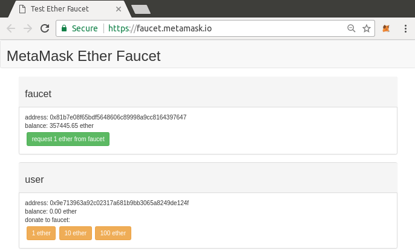
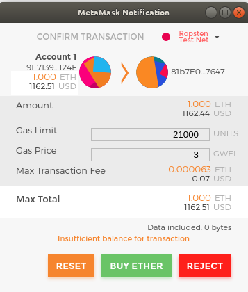
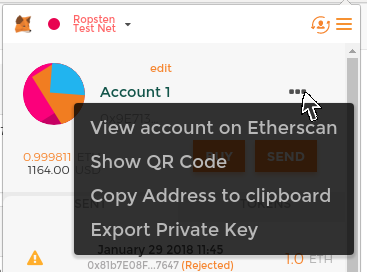
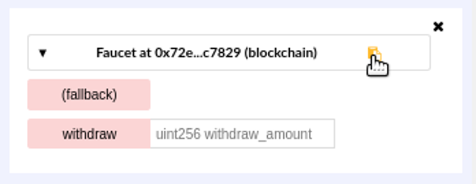
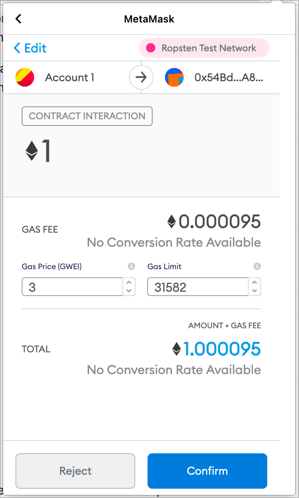

# Основы Ethereum
В этой главе мы начнем знакомство с Ethereum, узнаем, как пользоваться кошельками, как создавать транзакции, а также как запустить базовый смарт-контракт.

## Валютные единицы Эфира
Валютная единица Ethereum называется эфир, обозначается также "ETH" или символами Ξ (от греческой буквы "Xi", которая выглядит как стилизованная заглавная буква E) или, реже, бриллиантами: например, 1 эфир, или 1 ETH, или Ξ1, или бриллианты1.

__Совет__. Используйте символ Юникода U+039E для Ξ и U+2666 для алмазов.

Эфир подразделяется на более мелкие единицы, вплоть до наименьшей возможной единицы, которая называется вэй. Один эфир равен 1 квинтиллиону вэй (1 * 1018 или 1 000 000 000 000 000 000 000 000 000 000 000 000). Вы можете услышать, что люди также называют валюту "Ethereum", но это распространенная ошибка новичков. Ethereum - это система, а эфир - валюта.

Стоимость эфира всегда представлена в Ethereum как целое число без знака, выраженное в вэях. Когда вы совершаете транзакцию с 1 эфиром, транзакция кодирует 100000000000000000000 вей в качестве стоимости.

Различные номиналы Эфира имеют как научное название с использованием Международной системы единиц (СИ), так и разговорное название, которое отдает дань уважения многим великим умам в области вычислительной техники и криптографии.

Деноминации и названия единиц Эфира показывают различные единицы, их разговорные (общепринятые) названия и названия в системе СИ. В соответствии с внутренним представлением стоимости, в таблице все номиналы представлены в вэях (первая строка), при этом эфир показан как 1018 вэев в 7-й строке.

Таблица 1. Обозначения эфира и названия единиц измерения

| Значение (в вэях)                 | Экспонента | Общее название | Название Си           |
|-----------------------------------|------------|----------------|-----------------------|
| 1                                 | 1          | wei            | Wei                   |
| 1,000                             | 10^3       | Babbage        | Киловей или фемтоэфир |
| 1,000,000                         | 10^6       | Lovelace       | Мегавей или пикоэфир  |
| 1,000,000,000                     | 10^9       | Shannon        | Гигавей или наноэфир  |
| 1,000,000,000,000                 | 10^12      | Szabo          | Микроэфир или микро   |
| 1,000,000,000,000,000             | 10^15      | Finney         | Миллиэфир или милли   |
| 1,000,000,000,000,000,000         | 10^18      | Ether          | Эфир                  |
| 1,000,000,000,000,000,000,000     | 10^21      | Grand          | Килоэфир              |
| 1,000,000,000,000,000,000,000,000 | 10^24      |                | Мегаэфир              |

## Выбор кошелька Ethereum
Термин "кошелек" стал означать множество вещей, хотя все они связаны между собой и на повседневной основе сводятся практически к одному и тому же. Мы будем использовать термин "кошелек" для обозначения программного приложения, которое помогает вам управлять своим счетом в Ethereum. Короче говоря, кошелек Ethereum - это ваш вход в систему Ethereum. Он хранит ваши ключи и может создавать и транслировать транзакции от вашего имени. Выбрать кошелек Ethereum может быть непросто, поскольку существует множество вариантов с различными функциями и дизайном. Некоторые из них больше подходят для новичков, а некоторые - для экспертов. Сама платформа Ethereum все еще совершенствуется, и "лучшие" кошельки - это те, которые адаптируются к изменениям, происходящим с обновлением платформы.

Но не волнуйтесь! Если вы выбрали кошелек и вам не нравится, как он работает, или если сначала он вам понравился, но потом вы захотите попробовать что-то другое, вы можете легко сменить кошелек. Все, что вам нужно сделать, это провести транзакцию, которая отправит ваши средства со старого кошелька на новый, или экспортировать ваши закрытые ключи и импортировать их в новый кошелек.

Мы выбрали несколько различных типов кошельков, чтобы использовать их в качестве примеров в этой книге. Некоторые из них предназначены для мобильных устройств, настольных компьютеров, а другие - для веб-сайтов. Мы выбрали разные кошельки, потому что они представляют широкий диапазон сложности и возможностей. Однако выбор этих кошельков не является подтверждением их качества или безопасности. Они просто являются хорошей отправной точкой для демонстрации и тестирования.

Помните, что для работы приложения кошелька оно должно иметь доступ к вашим закрытым ключам, поэтому крайне важно загружать и использовать приложения кошелька только из источников, которым вы доверяете. К счастью, в целом, чем популярнее приложение кошелька, тем больше вероятность того, что ему можно доверять. Тем не менее, хорошей практикой является нежелание "класть все яйца в одну корзину" и распределять свои счета Ethereum между несколькими кошельками.

Ниже перечислены несколько хороших начальных кошельков:

### MetaMask
MetaMask - это кошелек с расширением для браузера, который работает в вашем браузере (Chrome, Firefox, Opera или Brave Browser). Он прост в использовании и удобен для тестирования, поскольку способен подключаться к различным узлам Ethereum и тестировать блокчейн. MetaMask - это веб-кошелек, который также включает мобильные приложения для iOS и Android.

### Jaxx
Jaxx - это мультиплатформенный и мультивалютный кошелек, который работает на различных операционных системах, включая Android, iOS, Windows, macOS и Linux. Он часто является хорошим выбором для новых пользователей, поскольку разработан для простоты и удобства использования. Jaxx - это либо мобильный, либо настольный кошелек, в зависимости от того, где вы его установите.

### MyEtherWallet (MEW)
MyEtherWallet - это в первую очередь веб-кошелек, который работает в любом браузере. Он также доступен на платформах Android и iOS. Он обладает множеством сложных функций, которые мы рассмотрим во многих примерах.

#### Emerald wallet
Emerald Wallet предназначен для работы с блокчейном Ethereum Classic, но совместим и с другими блокчейнами на базе Ethereum. Это настольное приложение с открытым исходным кодом, которое работает под Windows, macOS и Linux. Emerald Wallet может запускать полный узел или подключаться к публичному удаленному узлу, работая в "легком" режиме. У него также есть сопутствующий инструмент для выполнения всех операций из командной строки.

Мы начнем с установки MetaMask на рабочий стол - но сначала мы кратко обсудим контроль и управление ключами.

## Контроль и ответственность
Открытые блокчейны, такие как Ethereum, важны, поскольку они работают как децентрализованная система. Это означает многое, но одним из важнейших аспектов является то, что каждый пользователь Ethereum может - и должен - контролировать свои собственные закрытые ключи, которые контролируют доступ к средствам и смарт-контрактам. Иногда мы называем комбинацию доступа к средствам и смарт-контрактам "счетом" или "кошельком". Эти термины могут быть довольно сложными по своей функциональности, поэтому мы рассмотрим их более подробно позже. Однако фундаментальный принцип прост: один закрытый ключ равен одному "счету". Некоторые пользователи предпочитают отказаться от контроля над своими закрытыми ключами, используя стороннего хранителя, например, онлайн-биржу. В этой книге мы научим вас, как взять под контроль и управлять своими собственными закрытыми ключами.

Вместе с контролем приходит большая ответственность. Если вы потеряете свои закрытые ключи, вы потеряете доступ к своим средствам и контрактам. Никто не сможет помочь вам восстановить доступ - ваши средства будут заблокированы навсегда. Вот несколько советов, которые помогут вам справиться с этой ответственностью:

- Не импровизируйте с безопасностью. Используйте проверенные стандартные подходы.
- Чем важнее счет (например, чем выше стоимость контролируемых средств или чем значительнее доступные смарт-контракты), тем более высокие меры безопасности должны быть приняты.
- Наибольшую безопасность обеспечивает устройство с воздушным затвором, но этот уровень требуется не для каждого аккаунта.
- Никогда не храните свой закрытый ключ в открытом виде, особенно в цифровом. К счастью, большинство пользовательских интерфейсов сегодня не позволяют даже увидеть необработанный закрытый ключ.
- Закрытые ключи можно хранить в зашифрованном виде, в виде цифрового файла "keystore". В зашифрованном виде они требуют пароля для разблокировки. Когда вам будет предложено выбрать пароль, сделайте его надежным (т.е. длинным и случайным), сохраните его и не сообщайте. Если у вас нет менеджера паролей, запишите его и храните в надежном и секретном месте. Чтобы получить доступ к своей учетной записи, вам понадобится как файл хранилища ключей, так и пароль.
- Не храните пароли в цифровых документах, цифровых фотографиях, скриншотах, онлайн-накопителях, зашифрованных PDF-файлах и т.д. Опять же, не импровизируйте с безопасностью. Используйте менеджер паролей или ручку и бумагу.
- Когда вам предлагают создать резервную копию ключа в виде мнемонической последовательности слов, используйте ручку и бумагу, чтобы сделать физическую резервную копию. Не оставляйте эту задачу "на потом" - вы забудете. Эти резервные копии могут быть использованы для восстановления закрытого ключа в случае потери всех данных, сохраненных в системе, или если вы забудете или потеряете пароль. Однако они также могут быть использованы злоумышленниками для получения ваших закрытых ключей, поэтому никогда не храните их в цифровом виде, а физическую копию надежно храните в запертом ящике или сейфе.
- Прежде чем переводить крупные суммы (особенно на новые адреса), сначала проведите небольшую тестовую транзакцию (например, на сумму менее 1 доллара) и дождитесь подтверждения о получении.
- При создании нового счета начните с отправки небольшой тестовой транзакции на новый адрес. Как только вы получите тестовую транзакцию, попробуйте снова отправить с этого аккаунта. Существует множество причин, по которым создание счета может пойти не так, и если оно пошло не так, лучше выяснить это, понеся небольшие потери. Если тесты работают, значит, все в порядке.
- Публичные блокчейны - это простой способ самостоятельно проверить, была ли транзакция принята сетью. Однако это удобство негативно сказывается на вашей конфиденциальности, поскольку вы раскрываете свои адреса блокчейн-исследователям, которые могут отслеживать вас.
- Не отправляйте деньги ни на один из адресов, указанных в этой книге. Закрытые ключи указаны в книге, и кто-то немедленно заберет эти деньги.

Теперь, когда мы рассмотрели некоторые основные передовые методы управления ключами и безопасности, давайте приступим к работе с MetaMask!

## Начало работы с MetaMask
Откройте браузер Google Chrome и перейдите на сайт https://chrome.google.com/webstore/category/extensions.

Найдите "MetaMask" и нажмите на логотип лисы. Вы должны увидеть что-то похожее на результат, показанный на странице подробностей расширения MetaMask Chrome.

Рисунок 1. Детальная страница расширения MetaMask Chrome

Важно убедиться, что вы загружаете настоящее расширение MetaMask, так как иногда людям удается пронести вредоносные расширения мимо фильтров Google. Настоящее:

- Показывает ID nkbihfbeogaeaoehlefnkodbefgpgknn в адресной строке
- Предлагается сайтом https://metamask.io
- Имеет более 1,500 отзывов
- Имеет более 1,000,000 пользователей

Убедившись, что перед вами правильное расширение, нажмите "Добавить в Chrome", чтобы установить его.

### Создание кошелька
После установки MetaMask вы должны увидеть новый значок (голова лисы) на панели инструментов вашего браузера. Нажмите на него, чтобы начать работу. Вам будет предложено принять условия и положения, а затем создать свой новый кошелек Ethereum, введя пароль (см. Страница паролей расширения MetaMask Chrome).

Рисунок 2. Страница паролей расширения MetaMask Chrome

__Совет.__ Пароль контролирует доступ к MetaMask, чтобы им не мог воспользоваться любой человек, имеющий доступ к вашему браузеру.

Как только вы установите пароль, MetaMask сгенерирует для вас кошелек и покажет мнемоническую резервную копию, состоящую из 12 английских слов (см. Мнемоническая резервная копия вашего кошелька, созданная MetaMask). Эти слова могут быть использованы в любом совместимом кошельке для восстановления доступа к вашим средствам, если что-то случится с MetaMask или вашим компьютером. Вам не нужен пароль для такого восстановления; достаточно 12 слов.

__Совет.__ Создайте резервную копию вашей мнемоники (12 слов) на бумаге, дважды. Храните две бумажные резервные копии в двух разных безопасных местах, например, в огнестойком сейфе, запертом ящике или банковской ячейке. Обращайтесь с бумажными резервными копиями как с наличными деньгами, эквивалентными по стоимости тем, что вы храните в своем кошельке Ethereum. Любой человек, имеющий доступ к этим словам, может получить доступ и украсть ваши деньги.

Рисунок 3. Мнемоническая резервная копия вашего кошелька, созданная MetaMask

Как только вы подтвердите, что мнемоника надежно сохранена, вы сможете увидеть детали вашего счета Ethereum, как показано в разделе Ваш счет Ethereum в MetaMask.

Рисунок 4. Ваш Ethereum-счет в MetaMask
На странице вашего счета отображается название вашего счета ("Account 1" по умолчанию), адрес Ethereum (0x9E713... в примере) и цветная иконка, которая поможет вам визуально отличить этот счет от других счетов. В верхней части страницы аккаунта вы можете увидеть, в какой сети Ethereum вы работаете в данный момент ("Основная сеть" в примере).

Поздравляем! Вы создали свой первый кошелек Ethereum.

### Переключение сетей
Как вы можете видеть на странице аккаунта MetaMask, вы можете выбирать между несколькими сетями Ethereum. По умолчанию MetaMask будет пытаться подключиться к основной сети. Другими вариантами являются публичные тестовые сети, любые узлы Ethereum по вашему выбору или узлы, работающие на частных блокчейнах на вашем собственном компьютере (localhost):

#### Основная сеть Ethereum
Основная публичная блокчейн-сеть Ethereum. Реальные ETH, реальная стоимость и реальные последствия.

#### Тестовая сеть Ropsten
Публичный тестовый блокчейн и сеть Ethereum. ETH в этой сети не имеет никакой ценности.

#### Тестовая сеть Кована
Публичный тестовый блокчейн и сеть Ethereum, использующие протокол консенсуса Aura с доказательством полномочий (федеративное подписание). ETH в этой сети не имеет ценности. Тестовая сеть Kovan поддерживается только Parity. Другие клиенты Ethereum используют предложенный позже протокол консенсуса Clique для проверки на основе доказательства полномочий.

#### Тестовая сеть Ринкеби
Публичная тестовая блокчейн-сеть Ethereum, использующая протокол консенсуса Clique с доказательством полномочий (федеративное подписание). ETH в этой сети не имеет ценности.

#### Localhost 8545
Подключается к узлу, работающему на том же компьютере, что и браузер. Узел может быть частью любого публичного блокчейна (основной или тестовой сети) или частной тестовой сети.

#### Пользовательский RPC
Позволяет вам подключить MetaMask к любому узлу с Geth-совместимым интерфейсом удаленного вызова процедур (RPC). Узел может быть частью любого публичного или частного блокчейна.

__Примечание.__ Ваш кошелек MetaMask использует один и тот же закрытый ключ и Ethereum-адрес во всех сетях, к которым он подключается. Однако баланс вашего Ethereum-адреса в каждой сети Ethereum будет разным. Например, ваши ключи могут управлять эфиром и контрактами в сети Ropsten, но не в основной сети.

### Получение пробного эфира
Ваша первая задача - пополнить свой кошелек. Вы не будете делать этого в основной сети, потому что настоящий эфир стоит денег, и работа с ним требует немного больше опыта. Пока что вы загрузите в свой кошелек немного тестового эфира.

Переключите MetaMask на тестовую сеть Ropsten. Нажмите Депозит, затем нажмите Ropsten Test Faucet. MetaMask откроет новую веб-страницу, как показано в MetaMask Ropsten Test Faucet.

Рисунок 5. Тестовый кран MetaMask Ropsten Test Faucet

Вы можете заметить, что веб-страница уже содержит Ethereum-адрес вашего кошелька MetaMask. MetaMask интегрирует веб-страницы с поддержкой Ethereum с вашим кошельком MetaMask и может "видеть" адреса Ethereum на веб-странице, позволяя вам, например, отправить платеж в интернет-магазин, отображающий адрес Ethereum. MetaMask также может заполнить веб-страницу адресом вашего собственного кошелька в качестве адреса получателя, если веб-страница запросит его. На этой странице приложение крана запрашивает у MetaMask адрес кошелька для отправки тестовых эфиров.

Нажмите на зеленую кнопку "запросить 1 эфир из крана". В нижней части страницы появится идентификатор транзакции. Приложение faucet создало транзакцию - платеж в вашу пользу. Идентификатор транзакции выглядит следующим образом:

``0x7c7ad5aaea6474adccf6f5c5d6abed11b70a350fbc6f9590109e099568090c57``

Через несколько секунд новая транзакция будет добыта майнерами Ropsten, и на вашем кошельке MetaMask появится баланс в 1 ETH. Нажмите на идентификатор транзакции, и ваш браузер переведет вас на блокчейн-проводник, который представляет собой веб-сайт, позволяющий визуализировать и исследовать блоки, адреса и транзакции. MetaMask использует блокчейн-проводник Etherscan, один из самых популярных блокчейн-проводников Ethereum. Транзакция, содержащая платеж от тестового крана Ropsten, показана в блокчейн-проводнике Etherscan Ropsten.

Рисунок 6. Проводник блока Etherscan Ropsten

Транзакция была записана в блокчейн Ropsten и может быть просмотрена в любое время любым человеком, просто выполнив поиск по идентификатору транзакции или перейдя по ссылке.

Попробуйте перейти по этой ссылке или ввести хэш транзакции на сайте ropsten.etherscan.io, чтобы увидеть ее своими глазами.

### Отправка эфира из MetaMask
После того как вы получили свой первый пробный эфир из тестового крана Ropsten, вы можете поэкспериментировать с отправкой эфира, попробовав отправить несколько эфиров обратно на кран. Как вы можете видеть на странице тестового крана Ropsten, там есть возможность "пожертвовать" 1 ETH крану. Эта опция доступна для того, чтобы после завершения тестирования вы могли вернуть остаток тестового эфира, чтобы кто-то другой мог воспользоваться им в следующий раз. Несмотря на то, что тестовый эфир не имеет никакой ценности, некоторые люди накапливают его, затрудняя использование тестовых сетей всеми остальными. Накопление тестового эфира не одобряется!

К счастью, мы не являемся хранителями тестового эфира. Нажмите оранжевую кнопку "1 эфир", чтобы дать команду MetaMask создать транзакцию, оплачивающую крану 1 эфир. MetaMask подготовит транзакцию и выведет окно с подтверждением, как показано в разделе "Отправка 1 эфира крану".

Рисунок 7. Отправка 1 эфира на кран

Упс! Вы, наверное, заметили, что не можете завершить транзакцию - MetaMask сообщает, что у вас недостаточный баланс. На первый взгляд это может показаться непонятным: у вас есть 1 ETH, вы хотите отправить 1 ETH, так почему же MetaMask говорит, что у вас недостаточно средств?

Ответ заключается в стоимости газа. Каждая транзакция в Ethereum требует уплаты комиссии, которая взимается майнерами для подтверждения транзакции. Плата в Ethereum взимается в виртуальной валюте под названием газ. Вы платите за газ эфиром, как часть транзакции.

__Примечание:__ Плата требуется и в тестовых сетях. Без платы тестовая сеть будет вести себя иначе, чем основная сеть, что сделает ее неадекватной платформой для тестирования. Плата также защищает тестовые сети от DoS-атак и плохо составленных контрактов (например, бесконечных циклов), точно так же, как она защищает основную сеть.

Когда вы отправили транзакцию, MetaMask рассчитал среднюю цену газа в последних успешных транзакциях на уровне 3 gwei, что означает гигавей. Вей - это наименьшая единица измерения валюты эфира, как мы обсуждали в разделе "Единицы измерения валюты эфира". Лимит газа установлен на уровне стоимости отправки базовой транзакции, которая составляет 21 000 единиц газа. Таким образом, максимальное количество ETH, которое вы потратите, составляет 3 * 21 000 gwei = 63 000 gwei = 0,000063 ETH. (Имейте в виду, что средние цены на газ могут колебаться, поскольку они в основном определяются майнерами. В следующей главе мы рассмотрим, как вы можете увеличить/уменьшить свой лимит газа, чтобы обеспечить приоритет вашей транзакции в случае необходимости).

Все это означает, что транзакция стоимостью 1 ETH стоит 1.000063 ETH. MetaMask непонятным образом округляет эту сумму до 1 ETH, когда показывает общую сумму, но на самом деле вам нужно 1.000063 ETH, а у вас есть только 1 ETH. Нажмите кнопку Отклонить, чтобы отменить транзакцию.

Давайте получим еще немного тестового эфира! Снова нажмите на зеленую кнопку "запросить 1 эфир из крана" и подождите несколько секунд. Не волнуйтесь, у крана должно быть много эфира, и он даст вам еще, если вы попросите.

Как только на вашем балансе будет 2 ETH, вы можете попробовать снова. На этот раз, когда вы нажмете на оранжевую кнопку пожертвования "1 эфир", у вас будет достаточный баланс для завершения транзакции. Нажмите кнопку Отправить, когда MetaMask выведет окно оплаты. После всего этого вы должны увидеть баланс в 0,999937 ETH, потому что вы отправили 1 ETH на кран с 0,000063 ETH в газе.

### Изучение истории транзакций адреса

К этому моменту вы уже стали экспертом в использовании MetaMask для отправки и получения тестовых эфиров. Ваш кошелек получил как минимум два платежа и отправил как минимум один. Вы можете просмотреть все эти транзакции с помощью проводника блоков ropsten.etherscan.io. Вы можете либо скопировать адрес вашего кошелька и вставить его в поисковую строку блокчейн-проводника, либо попросить MetaMask открыть страницу для вас. Рядом со значком вашего аккаунта в MetaMask вы увидите кнопку с тремя точками. Нажмите на нее, чтобы открыть меню опций, связанных с учетной записью (см. контекстное меню учетной записи MetaMask).

Рисунок 8. Контекстное меню аккаунта MetaMask

Выберите "View account on Etherscan", чтобы открыть веб-страницу в блокчейн проводнике, показывающую историю транзакций вашего счета, как показано в разделе Address transaction history on Etherscan.

Рисунок 9. История адресных транзакций на Etherscan

Здесь вы можете просмотреть всю историю транзакций вашего адреса Ethereum. Здесь показаны все транзакции, записанные на блокчейне Ropsten, где ваш адрес является отправителем или получателем. Нажмите на некоторые из этих транзакций, чтобы увидеть более подробную информацию.

Вы можете изучить историю транзакций любого адреса. Взгляните на историю транзакций по адресу тестового крана Ropsten (подсказка: это адрес "отправителя", указанный в самом старом платеже на ваш адрес). Вы можете увидеть все тестовые эфиры, отправленные с этого крана вам и на другие адреса. Каждая транзакция, которую вы видите, может привести вас к большему количеству адресов и большему количеству транзакций. Вскоре вы заблудитесь в лабиринте взаимосвязанных данных. Публичные блокчейны содержат огромное количество информации, которую можно исследовать программно, как мы увидим в будущем. 

## Знакомство с мировым компьютером
Теперь вы создали кошелек, отправили и получили эфир. До сих пор мы рассматривали Ethereum как криптовалюту. Но Ethereum - это гораздо, гораздо больше. На самом деле, функция криптовалюты подчинена функции Ethereum как децентрализованного мирового компьютера. Эфир предназначен для оплаты выполнения смарт-контрактов, которые представляют собой компьютерные программы, работающие на эмулированном компьютере под названием виртуальная машина Ethereum (EVM).

EVM - это глобальный синглтон, то есть он работает так, как если бы это был глобальный компьютер с одним экземпляром, работающий везде. Каждый узел сети Ethereum запускает локальную копию EVM для подтверждения выполнения контрактов, а блокчейн Ethereum фиксирует изменения состояния этого мирового компьютера по мере обработки транзакций и смарт-контрактов. Мы обсудим это более подробно в [evm_chapter].

## Внешнепринадлежащие учетные записи (EOA) и контракты
Тип счета, который вы создали в кошельке MetaMask, называется счетом с внешним владением (EOA). Счета, принадлежащие внешнему владельцу, - это счета, имеющие закрытый ключ; наличие закрытого ключа означает контроль над доступом к средствам или контрактам. Вероятно, вы догадываетесь, что существует и другой тип счетов. Этот другой тип счета - контрактный счет. Контрактный счет имеет код смарт-контракта, чего не может быть у простого EOA. Кроме того, у контрактного счета нет закрытого ключа. Вместо этого он принадлежит (и контролируется) логикой кода смарт-контракта: программой, записанной в блокчейн Ethereum при создании контрактного счета и исполняемой EVM.

Контракты имеют адреса, как и EOA. Контракты также могут отправлять и получать эфир, как и EOA. Однако когда конечным пунктом транзакции является адрес контракта, это вызывает выполнение контракта в EVM, используя транзакцию и данные транзакции в качестве входных данных. В дополнение к эфиру, транзакции могут содержать данные, указывающие, какую конкретную функцию в контракте нужно запустить и какие параметры передать этой функции. Таким образом, транзакции могут вызывать функции внутри контрактов.

Обратите внимание, что поскольку у счета контракта нет закрытого ключа, он не может инициировать транзакцию. Только EOA могут инициировать транзакции, но контракты могут реагировать на транзакции, вызывая другие контракты, создавая сложные пути выполнения. Одним из типичных примеров такого использования является EOA, отправляющий транзакцию запроса в кошелек смарт-контракта с несколькими подписями для отправки некоторого количества ETH на другой адрес. Типичный шаблон программирования DApp заключается в том, что контракт A вызывает контракт B, чтобы поддерживать общее состояние для всех пользователей контракта A.

В следующих нескольких разделах мы напишем наш первый контракт. Затем вы узнаете, как создать, пополнить и использовать этот контракт с кошельком MetaMask и тестировать эфир в тестовой сети Ropsten.

## Простой контракт: тестовый эфириумный кран
В Ethereum существует множество различных языков высокого уровня, каждый из которых можно использовать для написания контракта и создания байткода EVM. Вы можете прочитать о многих наиболее известных и интересных из них в [high_level_languages]. Один язык высокого уровня, безусловно, является доминирующим для программирования смарт-контрактов: Solidity. Solidity был создан доктором Гэвином Вудом, соавтором этой книги, и стал наиболее широко используемым языком в Ethereum (и не только). Мы будем использовать Solidity для написания нашего первого контракта.

Для нашего первого примера (Faucet.sol: контракт Solidity, реализующий кран) мы напишем контракт, который управляет краном. Вы уже использовали кран для получения тестового эфира в тестовой сети Ropsten. Кран - это относительно простая вещь: он выдает эфир по любому адресу, который запрашивает, и может периодически пополняться. Кран можно реализовать в виде кошелька, управляемого человеком или веб-сервером.

Пример 1. Faucet.sol: Контракт Solidity, реализующий кран
``link:code/Solidity/Faucet.sol[]``

__Примечание:__ Все примеры кода для этой книги вы найдете в подкаталоге code репозитория GitHub книги. В частности, наш контракт Faucet.sol находится в: ``code/Solidity/Faucet.sol``

Это очень простой контракт, настолько простой, насколько мы можем его сделать. Это также несовершенный контракт, демонстрирующий ряд плохих практик и уязвимостей безопасности. Мы будем учиться, изучая все его недостатки в последующих разделах. Но пока давайте рассмотрим, что делает этот контракт и как он работает, строка за строкой. Вы быстро заметите, что многие элементы Solidity похожи на существующие языки программирования, такие как JavaScript, Java или C++.

Первая строка - это комментарий:

``// SPDX-License-Identifier: CC-BY-SA-4.0``

Комментарии предназначены для чтения человеком и не включаются в исполняемый байткод EVM. Обычно мы помещаем их в строку перед кодом, который пытаемся объяснить, или иногда в ту же строку. Комментарии начинаются с двух прямых косых черт: //. Все, начиная с первой косой черты и до конца строки, рассматривается как пустая строка и игнорируется.

Несколькими строками позже начинается наш настоящий контракт:

``contract Faucet {``

Эта строка объявляет объект контракта, подобно объявлению класса в других объектно-ориентированных языках. Определение контракта включает все строки между фигурными скобками ({}), которые определяют область видимости, подобно тому, как фигурные скобки используются во многих других языках программирования.

Далее мы позволяем контракту принимать любую входящую сумму:

``receive () external payable {}``

Функция receive вызывается, если транзакция, вызвавшая контракт, не называет ни одну из объявленных в контракте функций, или не содержит данных и, таким образом, является обычным переводом Эфира. Контракты могут иметь одну такую функцию receive (без имени), и она используется для получения эфира. Вот почему она определена как внешняя и оплачиваемая функция, что означает, что она может принимать Эфир в контракт. Она ничего не делает, кроме как принимает эфир, на что указывает пустое определение в фигурных скобках ({}). Если мы совершим транзакцию, которая отправит эфир на адрес контракта, как если бы это был кошелек, эта функция обработает ее.

После этого мы объявляем первую функцию контракта Faucet:

``function withdraw(uint withdraw_amount) public {``

Функция называется withdraw и принимает один беззнаковый целочисленный (uint) аргумент под названием withdraw_amount. Она объявлена как публичная функция, что означает, что ее могут вызывать другие контракты. Далее следует определение функции, заключенное в фигурные скобки. Первая часть функции withdraw устанавливает лимит на снятие средств:

``require(withdraw_amount <= 100000000000000000);``

Она использует встроенную в Solidity функцию require для проверки предварительного условия: сумма_вывода меньше или равна 100,000,000,000,000,000,000,000 вей, что является базовой единицей эфира (см. Деноминации эфира и названия единиц) и эквивалентно 0.1 эфира. Если функция withdraw будет вызвана с суммой withdraw_amount, превышающей эту сумму, функция require здесь приведет к остановке выполнения контракта и отказу с исключением. Обратите внимание, что в Solidity утверждения должны завершаться точкой с запятой.

Эта часть контракта является основной логикой нашего крана. Она контролирует поток средств из контракта, устанавливая лимит на снятие денег. Это очень простое управление, но оно может дать вам представление о силе программируемого блокчейна: децентрализованное программное обеспечение, управляющее деньгами.

Далее происходит само снятие средств:

``msg.sender.transfer(withdraw_amount);``

Здесь происходит несколько интересных вещей. Объект msg - это один из входов, к которому имеют доступ все контракты. Он представляет собой транзакцию, которая вызвала выполнение этого контракта. Атрибут sender - это адрес отправителя транзакции. Функция transfer - это встроенная функция, которая передает эфир из текущего контракта на адрес отправителя. Если читать ее в обратном порядке, это означает передачу отправителю msg, которое вызвало выполнение этого контракта. Функция transfer принимает сумму в качестве единственного аргумента. Мы передаем значение withdraw_amount, которое было параметром функции withdraw, объявленной несколькими строками ранее.

Следующая строка - это закрывающая фигурная скобка, обозначающая конец определения нашей функции withdraw.

Прямо под нашей функцией default находится последняя закрывающая фигурная скобка, которая закрывает определение контракта Faucet. Вот и все!

## Компиляция контракта Faucet
Теперь, когда у нас есть первый пример контракта, нам нужно использовать компилятор Solidity для преобразования кода Solidity в байткод EVM, чтобы он мог быть выполнен EVM на блокчейне.

Компилятор Solidity поставляется в виде отдельного исполняемого файла, в составе различных фреймворков и в комплекте с интегрированными средами разработки (IDE). Для простоты мы будем использовать одну из самых популярных IDE под названием Remix.

Используйте браузер Chrome (с кошельком MetaMask, который вы установили ранее) для перехода к IDE Remix по адресу https://remix.ethereum.org.

Когда вы впервые загрузите Remix, он запустится с образцом контракта под названием ballot.sol. Он нам не нужен, поэтому закройте его, нажав на x в углу вкладки, как показано в разделе Закрыть вкладку с примером по умолчанию.

Рисунок 10. Закрыть вкладку примера по умолчанию

Теперь добавьте новую вкладку, нажав на круглый знак плюс в верхней левой панели инструментов, как показано в разделе Нажмите на знак плюс, чтобы открыть новую вкладку. Назовите новый файл Faucet.sol.

Рисунок 11. Щелкните на знаке плюс, чтобы открыть новую вкладку

Открыв новую вкладку, скопируйте и вставьте код из нашего примера Faucet.sol, как показано в разделе Скопируйте код примера Faucet в новую вкладку.

Рисунок 12. Копирование кода примера Faucet в новую вкладку

После того как вы загрузите контракт Faucet.sol в Remix IDE, IDE автоматически скомпилирует код. Если все пройдет успешно, вы увидите справа, на вкладке Compile, зеленое окошко с надписью "Faucet", подтверждающее успешную компиляцию (см. Remix успешно компилирует контракт Faucet.sol).

Рисунок 13. Remix успешно компилирует контракт Faucet.sol

Если что-то идет не так, наиболее вероятная проблема заключается в том, что в Remix IDE используется версия компилятора Solidity, отличная от 0.6. В этом случае наша директива pragma не позволит Faucet.sol скомпилироваться. Чтобы изменить версию компилятора, перейдите на вкладку Settings, установите версию 0.6.0 и повторите попытку.

Теперь компилятор Solidity скомпилировал наш Faucet.sol в байткод EVM. Если вам интересно, байткод выглядит следующим образом:

``PUSH1 0x80 PUSH1 0x40 MSTORE CALLVALUE DUP1 ISZERO PUSH2 0x10 JUMPI PUSH1 0x0 DUP1 REVERT JUMPDEST POP PUSH1 0xF4 DUP1 PUSH2 0x1F PUSH1 0x0 CODECOPY PUSH1 0x0 RETURN INVALID PUSH1 0x80 PUSH1 0x40 MSTORE PUSH1 0x4 CALLDATASIZE LT PUSH1 0x1F JUMPI PUSH1 0x0 CALLDATALOAD PUSH1 0xE0 SHR DUP1 PUSH4 0x2E1A7D4D EQ PUSH1 0x2A JUMPI PUSH1 0x25 JUMP JUMPDEST CALLDATASIZE PUSH1 0x25 JUMPI STOP JUMPDEST PUSH1 0x0 DUP1 REVERT JUMPDEST CALLVALUE DUP1 ISZERO PUSH1 0x35 JUMPI PUSH1 0x0 DUP1 REVERT JUMPDEST POP PUSH1 0x5F PUSH1 0x4 DUP1 CALLDATASIZE SUB PUSH1 0x20 DUP2 LT ISZERO PUSH1 0x4A JUMPI PUSH1 0x0 DUP1 REVERT JUMPDEST DUP2 ADD SWAP1 DUP1 DUP1 DUP1 CALLDATALOAD SWAP1 PUSH1 0x20 ADD SWAP1 SWAP3 SWAP2 SWAP1 POP POP POP PUSH1 0x61 JUMP JUMPDEST STOP JUMPDEST PUSH8 0x16345785D8A0000 DUP2 GT ISZERO PUSH1 0x75 JUMPI PUSH1 0x0 DUP1 REVERT JUMPDEST CALLER PUSH20 0xFFFFFFFFFFFFFFFFFFFFFFFFFFFFF AND PUSH2 0x8FC DUP3 SWAP1 DUP2 ISZERO MUL SWAP1 PUSH1 0x40 MLOAD PUSH1 0x0 PUSH1 0x40 MLOAD DUP1 DUP4 SUB DUP2 DUP6 DUP9 DUP9 CALL SWAP4 POP POP POP POP POP ISZERO DUP1 ISZERO PUSH1 0xBA JUMPI RETURNDATASIZE PUSH1 0x0 DUP1 RETURNDATACOPY RETURNDATASIZE PUSH1 0x0 REVERT JUMPDEST POP POP JUMP INVALID LOG2 PUSH5 0x6970667358 0x22 SLT KECCAK256 STOP CODECOPY 0xDC DUP16 0xD SGT PUSH6 0xD2245039EDD7 RETURN CALLDATALOAD 0xC2 0xE4 SWAP9 0xF6 0x2C 0xF8 0xB3 OR JUMPDEST 0xAC 0xD8 CREATE2 SSTORE 0x4E SIGNEXTEND PUSH4 0x3164736F PUSH13 0x634300060C00330000000000``

Разве вы не рады, что используете язык высокого уровня, такой как Solidity, вместо того, чтобы программировать непосредственно в байткоде EVM? Я тоже!

## Создание контракта на блокчейне
Итак, у нас есть контракт. Мы скомпилировали его в байткод. Теперь нам нужно "зарегистрировать" контракт на блокчейне Ethereum. Мы будем использовать тестовую сеть Ropsten для тестирования нашего контракта, поэтому именно в этот блокчейн мы хотим его отправить.

Регистрация контракта в блокчейне включает в себя создание специальной транзакции, местом назначения которой является адрес `0x0000000000000000000000000000000000000000000000`, также известный как нулевой адрес. Нулевой адрес - это специальный адрес, который сообщает блокчейну Ethereum, что вы хотите зарегистрировать контракт. К счастью, Remix IDE сделает все это за вас и отправит транзакцию в MetaMask.

Сначала переключитесь на вкладку Run и выберите Injected Web3 в выпадающем окне выбора среды. Это соединит Remix IDE с кошельком MetaMask, а через MetaMask - с тестовой сетью Ropsten. Как только вы это сделаете, вы увидите Ropsten в разделе Environment. Кроме того, в поле выбора аккаунта отображается адрес вашего кошелька (см. вкладку Remix IDE Run, с выбранной средой Injected Web3).

Рисунок 14. Вкладка Remix IDE Run, с выбранной средой Injected Web3

Прямо под настройками Run, которые вы только что подтвердили, находится контракт Faucet, готовый к созданию. Нажмите на кнопку Deploy, показанную на вкладке Remix IDE Run, с выбранной средой Injected Web3.

Remix создаст специальную транзакцию "создания", а MetaMask попросит вас одобрить ее, как показано в MetaMask, показывающем транзакцию создания контракта. Вы заметите, что в транзакции создания контракта нет эфира, но она содержит 275 байт данных (скомпилированный контракт) и потребляет 3 гвэя газа. Нажмите "Подтвердить", чтобы одобрить ее.

Рисунок 15. Метамаска, показывающая транзакцию создания контракта

Теперь вам нужно подождать. Потребуется от 15 до 30 секунд, чтобы контракт был добыт на Ropsten. Кажется, что Remix не делает ничего особенного, но будьте терпеливы.

Как только контракт будет создан, он появится в нижней части вкладки "Выполнить" (см. "Контракт Faucet жив!").

Рисунок 16. Контракт с краном жив!

Обратите внимание, что у контракта Faucet теперь есть свой собственный адрес: Remix показывает его как "Faucet at 0x72e...c7829" (хотя ваш адрес - случайные буквы и цифры - будет другим). Маленький символ буфера обмена справа позволяет скопировать адрес контракта в буфер обмена. Мы будем использовать его в следующем разделе.

## Взаимодействие с контрактом
Давайте подытожим то, что мы узнали до сих пор: Контракты Ethereum - это программы, управляющие деньгами, которые работают внутри виртуальной машины, называемой EVM. Они создаются с помощью специальной транзакции, которая передает их байткод для записи в блокчейн. После создания в блокчейне у них появляется адрес Ethereum, как и у кошельков. Каждый раз, когда кто-то отправляет транзакцию на адрес контракта, это приводит к запуску контракта в EVM с транзакцией в качестве входных данных. Транзакции, отправленные на адреса контрактов, могут содержать эфир, данные или и то, и другое. Если они содержат эфир, он "зачисляется" на баланс контракта. Если они содержат данные, то данные могут указать именованную функцию в контракте и вызвать ее, передав функции аргументы.

### Просмотр адреса контракта в блокчейн-проводнике
Теперь у нас есть контракт, записанный на блокчейне, и мы видим, что у него есть адрес Ethereum. Давайте проверим его в блокчейн-проводнике ropsten.etherscan.io и посмотрим, как выглядит контракт. В Remix IDE скопируйте адрес контракта, нажав на значок буфера обмена рядом с его названием (см. Копирование адреса контракта из Remix).

Рисунок 17. Копирование адреса контракта из Remix

Держите Remix открытым; мы вернемся к нему позже. Теперь перейдите в браузере на ropsten.etherscan.io и вставьте адрес в поисковую строку. Вы должны увидеть историю адресов Ethereum контракта, как показано в разделе Просмотр адреса контракта Faucet в проводнике блоков Etherscan.

Рисунок 18. Просмотр адреса контракта Faucet в блокчейн-проводнике Etherscan

### Финансирование контракта
На данный момент в истории контракта есть только одна транзакция: транзакция создания контракта. Как вы можете видеть, у контракта также нет эфира (нулевой баланс). Это потому, что мы не отправили эфир на контракт в транзакции создания, хотя могли бы.

Нашему крану нужны средства! Нашим первым проектом будет использование MetaMask для отправки эфира на контракт. Адрес контракта должен быть у вас в буфере обмена (если нет, скопируйте его еще раз из Remix). Откройте MetaMask и отправьте на него 1 эфир, точно так же, как и на любой другой адрес Ethereum (см. раздел "Отправить 1 эфир на адрес контракта").

Рисунок 19. Отправка 1 эфира на адрес контракта
Через минуту, если вы перезагрузите блокчейн-проводник Etherscan, он покажет еще одну транзакцию на адрес контракта и обновленный баланс в 1 эфир.

Помните безымянную внешнюю функцию оплаты по умолчанию в нашем коде Faucet.sol? Она выглядела следующим образом:

``receive () external payable {}``
Когда вы отправляли транзакцию на адрес контракта без данных, указывающих, какую функцию следует вызвать, она вызывала эту функцию по умолчанию. Поскольку мы объявили ее как payable, она была принята и внесла 1 эфир на баланс счета контракта. Ваша транзакция вызвала запуск контракта в EVM, обновив его баланс. Вы пополнили свой кран!

### Снятие средств с нашего контракта
Далее давайте выведем часть средств из крана. Чтобы снять средства, мы должны создать транзакцию, которая вызовет функцию withdraw и передаст ей аргумент withdraw_amount. Чтобы не усложнять ситуацию, Remix создаст эту транзакцию за нас, а MetaMask представит ее на утверждение.

Вернитесь на вкладку Remix и посмотрите на контракт на вкладке Run. Вы должны увидеть оранжевое поле с надписью withdraw и поле с надписью uint256 withdraw_amount (см. функцию withdraw в Faucet.sol, в Remix).

.png)
Рисунок 20. Функция withdraw в Faucet.sol, в Remix

Это интерфейс контракта в Remix. Он позволяет нам создавать транзакции, вызывающие функции, определенные в контракте. Мы введем сумму withdraw_amount и нажмем кнопку withdraw, чтобы сгенерировать транзакцию.

Сначала давайте определимся с суммой вывода. Мы хотим попытаться снять 0,1 эфира - это максимальная сумма, разрешенная нашим контрактом. Помните, что все валютные ценности в Ethereum внутренне деноминированы в wei, и наша функция withdraw ожидает, что сумма withdraw_amount также будет деноминирована в wei. Нужная нам сумма равна 0,1 эфира, что составляет 100 000 000 000 000 000 000 000 000 000 вей (единица, за которой следуют 17 нулей).

__Совет:__ Из-за ограничения JavaScript число размером 10^17 не может быть обработано Remix. Вместо этого мы заключаем его в двойные кавычки, чтобы Remix мог получить его как строку и работать с ним как с BigNumber. Если мы не заключим его в кавычки, IDE Remix не сможет его обработать и выдаст сообщение "Error encoding arguments: Error: Assertion failed".

Введите "1000000000000000000000" (с кавычками) в поле withdraw_amount и нажмите на кнопку withdraw (см. Нажмите "withdraw" в Remix для создания транзакции вывода средств).

Рисунок 21. Нажмите кнопку "снять" в Remix для создания транзакции снятия средств

MetaMask выведет окно транзакции для подтверждения. Нажмите "Подтвердить", чтобы отправить запрос на вывод средств в контракт (см. раздел Транзакция MetaMask для вызова функции вывода средств).

Рисунок 22. Транзакция MetaMask для вызова функции withdraw

Подождите минуту, а затем перезагрузите блокчейн-проводник Etherscan, чтобы увидеть транзакцию, отраженную в истории адресов контракта Faucet (см. Etherscan показывает транзакцию, вызывающую функцию вывода средств).

Рисунок 23. Etherscan показывает транзакцию, вызывающую функцию withdraw

Теперь мы видим новую транзакцию с адресом контракта в качестве пункта назначения и значением 0 эфиров. Баланс контракта изменился и теперь составляет 0,9 эфира, поскольку он отправил нам 0,1 эфира, как и было запрошено. Но мы не видим транзакции "OUT" в истории адреса контракта.

Где же исходящий вывод средств? На странице истории адресов контракта появилась новая вкладка "Внутренние транзакции". Поскольку перевод 0,1 эфира исходит из кода контракта, он является внутренней транзакцией (также называемой сообщением). Щелкните на этой вкладке, чтобы увидеть ее (см. Etherscan показывает внутреннюю транзакцию, переводящую эфир из контракта).

Эта "внутренняя транзакция" была отправлена контрактом в этой строке кода (из функции withdraw в Faucet.sol):

``msg.sender.transfer(withdraw_amount);``

Напомним: вы отправили транзакцию из своего кошелька MetaMask, содержащую инструкции по вызову функции withdraw с аргументом withdraw_amount в 0,1 эфира. Эта транзакция вызвала выполнение контракта внутри EVM. Когда EVM запускал функцию withdraw контракта Faucet, сначала он вызывал функцию require и проверял, что запрашиваемая сумма меньше или равна максимально разрешенному выводу в 0,1 эфира. Затем он вызывал функцию transfer, чтобы отправить вам эфир. Запуск функции transfer сгенерировал внутреннюю транзакцию, которая перевела 0,1 эфира на адрес вашего кошелька с баланса контракта. Именно эта транзакция показана на вкладке "Внутренние транзакции" в Etherscan.

Рисунок 24. Etherscan показывает внутреннюю транзакцию, переводящую эфир из контракта

## Выводы
В этой главе вы создали кошелек с помощью MetaMask и пополнили его с помощью крана в тестовой сети Ropsten. Вы получили эфир на Ethereum-адрес вашего кошелька, а затем отправили эфир на Ethereum-адрес крана.

Затем вы написали контракт крана на Solidity. Вы использовали Remix IDE для компиляции контракта в байткод EVM, затем с помощью Remix сформировали транзакцию и создали контракт Faucet на блокчейне Ropsten. После создания у контракта Faucet появился адрес Ethereum, и вы отправили ему немного эфира. Наконец, вы создали транзакцию для вызова функции withdraw и успешно запросили 0,1 эфира. Контракт проверил запрос и отправил вам 0,1 эфира с помощью внутренней транзакции.

Может показаться, что это не так много, но вы только что успешно взаимодействовали с программным обеспечением, которое управляет деньгами на децентрализованном мировом компьютере.

В [smart_contracts_chapter] мы еще много будем заниматься программированием смарт-контрактов, а в [smart_contract_security] узнаем о лучших практиках и соображениях безопасности.