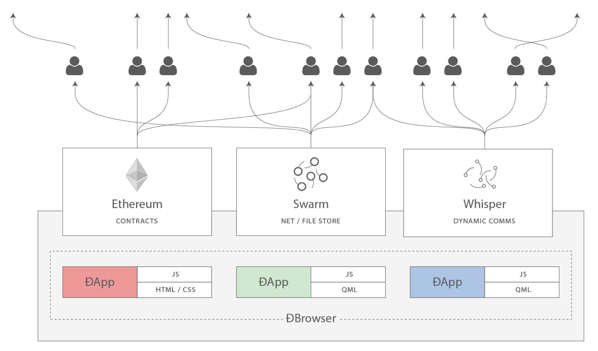
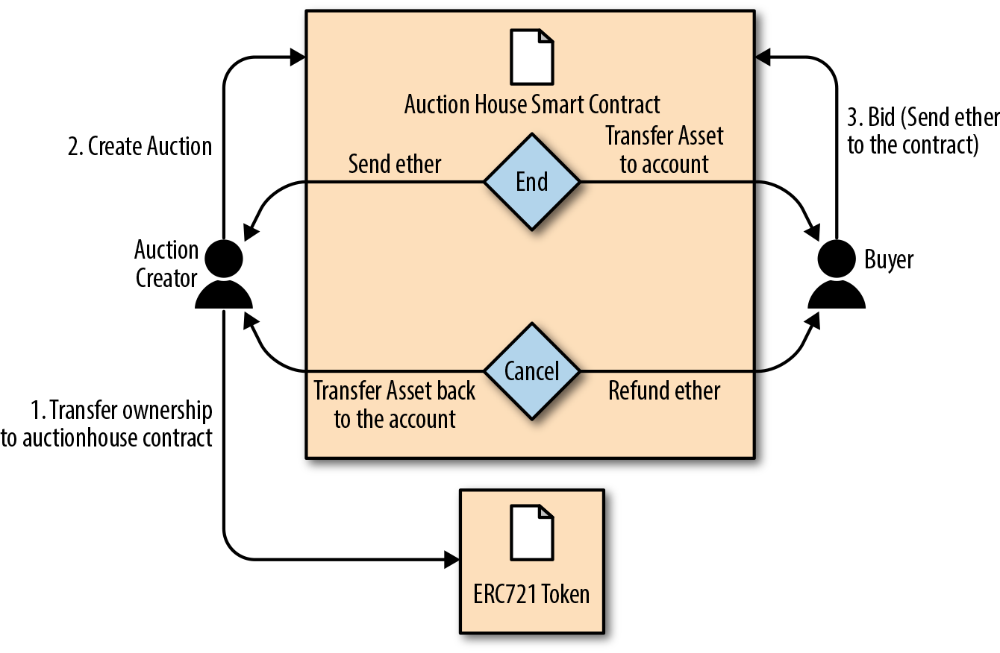
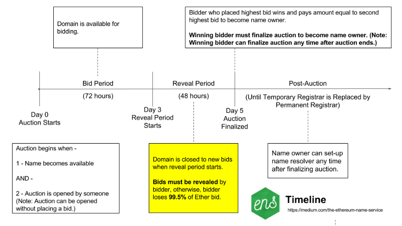
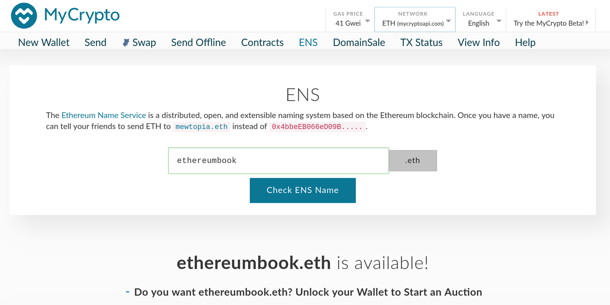
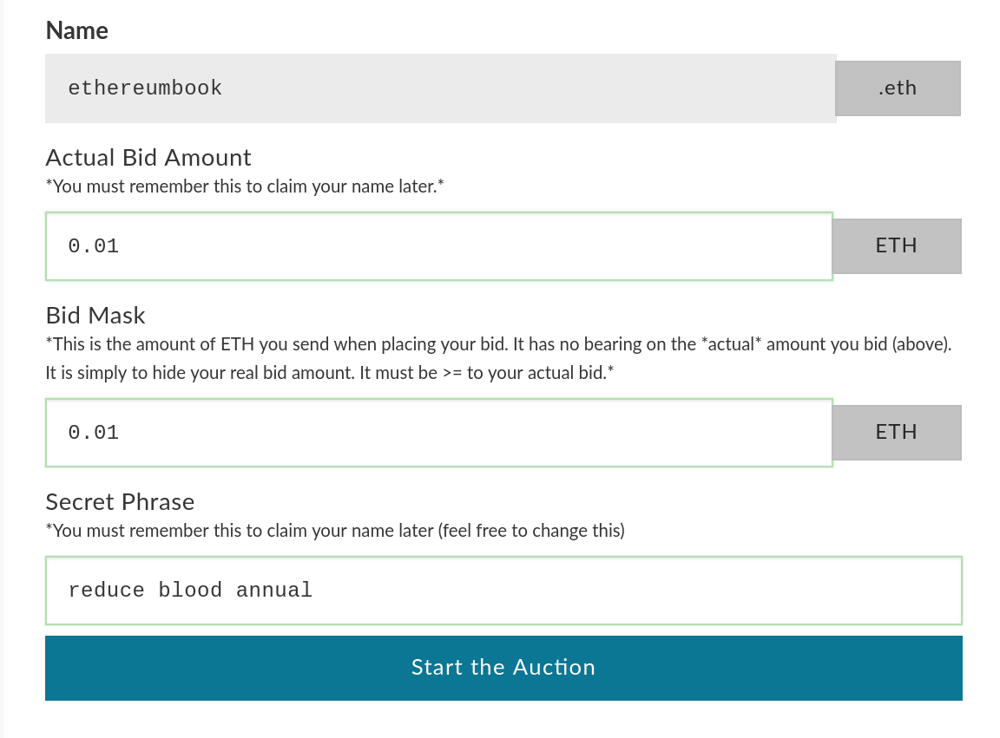
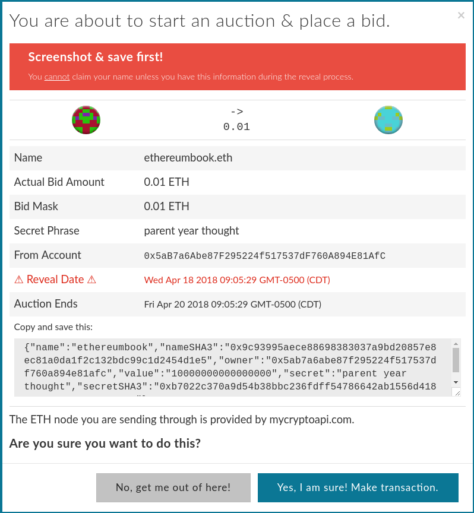
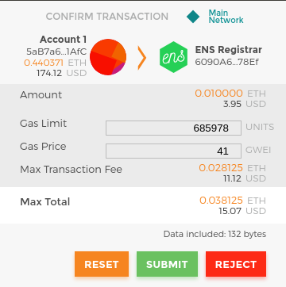
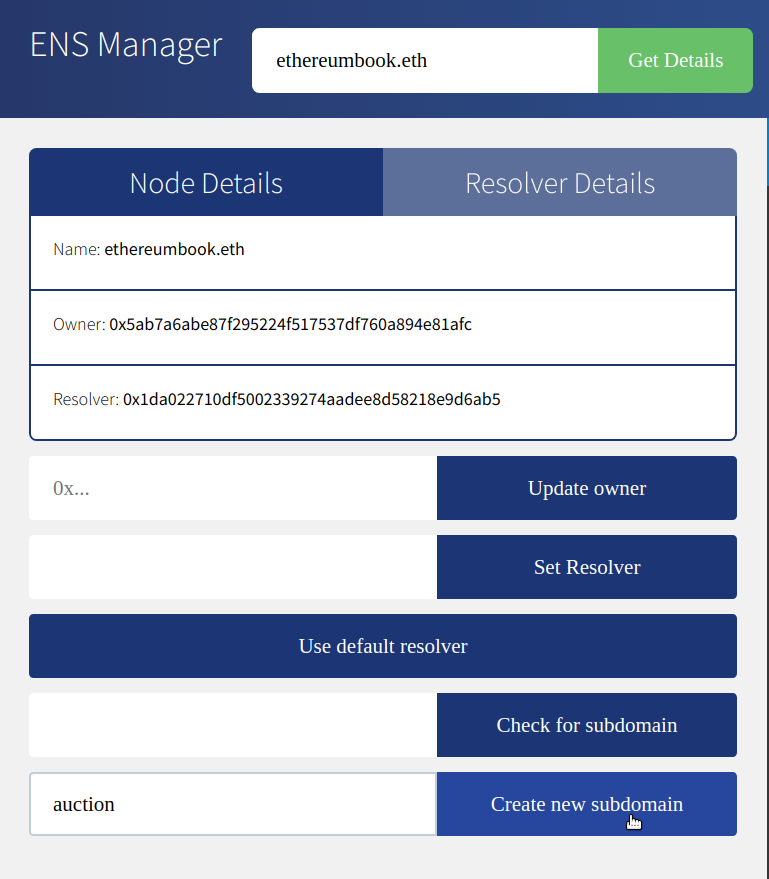
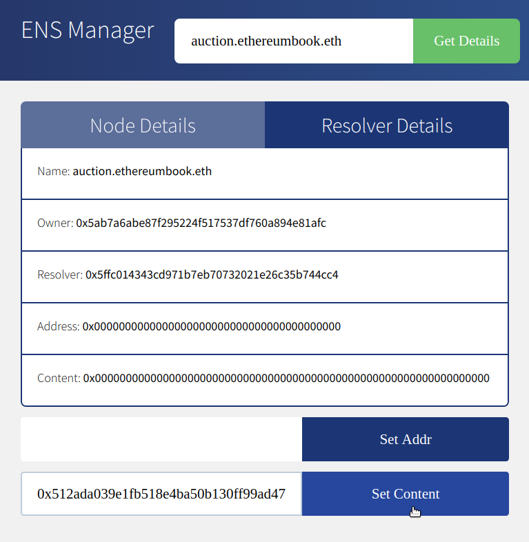
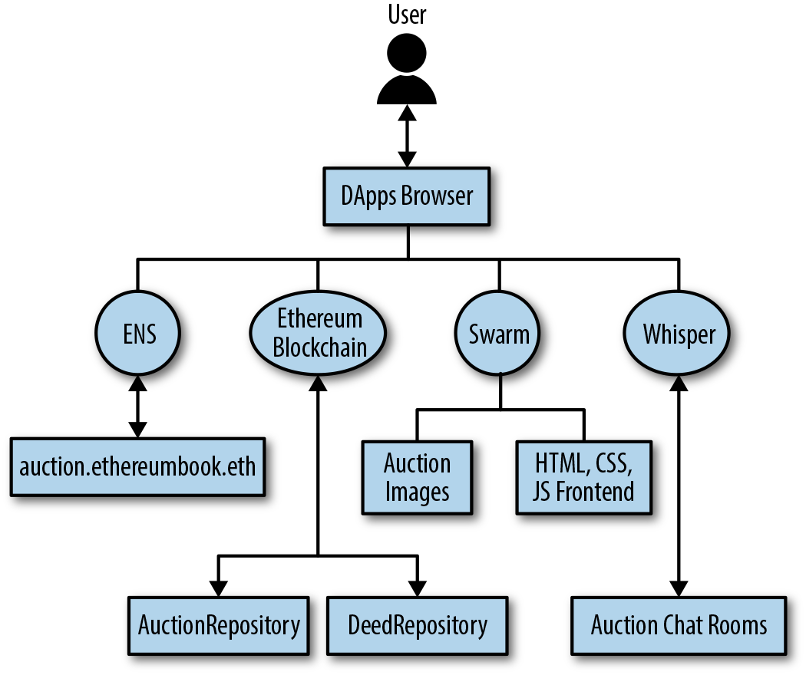

# Децентрализованные приложения

В этой главе мы познакомимся с миром децентрализованных приложений, или DApps. С первых дней создания Ethereum видение основателей было гораздо шире, чем "умные контракты": не менее чем переосмысление Интернета и создание нового мира DApps, метко названного web3. Умные контракты - это способ децентрализации управляющей логики и платежных функций приложений. Web3 DApps - это децентрализация всех остальных аспектов приложения: хранения, обмена сообщениями, именования и т.д. (см. Web3: децентрализованный веб с использованием смарт-контрактов и технологий P2P).


Рисунок 1. Web3: децентрализованный веб с использованием смарт-контрактов и технологий P2P

__Предупреждение:__ Хотя "децентрализованные приложения" - это смелое видение будущего, термин "DApp" часто применяется к любому смарт-контракту с веб-фронтендом. Некоторые из этих так называемых DApps являются высокоцентрализованными приложениями (CApps?). Остерегайтесь ложных DApp!

В этой главе мы разработаем и развернем пример DApp: аукционную платформу. Исходный код можно найти в репозитории книги в разделе code/auction_dapp. Мы рассмотрим каждый аспект аукционного приложения и увидим, как можно максимально децентрализовать приложение. Однако сначала давайте подробнее рассмотрим определяющие характеристики и преимущества DApps.

## Что такое DApp?
DApp - это приложение, которое в основном или полностью децентрализовано.
Рассмотрите все возможные аспекты приложения, которое может быть децентрализовано:
- Программное обеспечение бэкенда (логика приложения)
- Программное обеспечение для фронтенда
- Хранение данных
- Передача сообщений
- Разрешение на имя

Каждый из них может быть в некоторой степени централизованным или в некоторой степени децентрализованным. Например, фронтенд может быть разработан как веб-приложение, работающее на централизованном сервере, или как мобильное приложение, работающее на вашем устройстве. Бэкэнд и хранилище могут находиться на частных серверах и в проприетарных базах данных, или вы можете использовать смарт-контракт и P2P-хранилище.

У создания DApp есть много преимуществ, которые не может обеспечить типичная централизованная архитектура:

#### Устойчивость
Поскольку бизнес-логика контролируется смарт-контрактом, бэкенд DApp полностью распределен и управляется на платформе блокчейн. В отличие от приложения, развернутого на централизованном сервере, DApp не будет иметь времени простоя и будет оставаться доступным до тех пор, пока платформа продолжает работать.

#### Прозрачность
Цепочечная природа DApp позволяет каждому проверить код и быть более уверенным в его функционировании. Любое взаимодействие с DApp будет храниться в блокчейне вечно.

#### Сопротивление цензуре
Пока у пользователя есть доступ к узлу Ethereum (при необходимости - запущенному), он всегда сможет взаимодействовать с DApp без вмешательства какого-либо централизованного управления. Ни один поставщик услуг или даже владелец смарт-контракта не может изменить код после его развертывания в сети.

В экосистеме Ethereum в ее нынешнем виде очень мало по-настоящему децентрализованных приложений - большинство из них по-прежнему полагаются на централизованные службы и серверы для выполнения той или иной части своей работы. В будущем мы ожидаем, что каждая часть любого DApp будет управляться полностью децентрализованно.

### Бэкэнд (смарт-контракт)
В DApp смарт-контракты используются для хранения бизнес-логики (программного кода) и связанного с ней состояния вашего приложения. Можно считать, что смарт-контракт заменяет серверный (он же "бэкэнд") компонент в обычном приложении. Это, конечно, чрезмерное упрощение. Одно из главных отличий заключается в том, что любые вычисления, выполняемые в смарт-контракте, очень дороги, поэтому их следует свести к минимуму. Поэтому важно определить, какие аспекты приложения нуждаются в надежной и децентрализованной платформе исполнения.

Смарт-контракты Ethereum позволяют создавать архитектуры, в которых сеть смарт-контрактов вызывает и передает данные друг другу, читая и записывая свои собственные переменные состояния по ходу дела, при этом их сложность ограничивается только лимитом на газ блока. После того как вы развернете свой смарт-контракт, ваша бизнес-логика вполне может быть использована многими другими разработчиками в будущем.

Одним из основных моментов при разработке архитектуры смарт-контрактов является невозможность изменить код смарт-контракта после его развертывания. Его можно удалить, если он запрограммирован с доступным опкодом SELFDESTRUCT, но кроме полного удаления, код не может быть изменен никаким образом.
Вторым важным моментом при проектировании архитектуры смарт-контрактов является размер DApp. Действительно большой монолитный смарт-контракт может стоить много газа для развертывания и использования. Поэтому некоторые приложения могут предпочесть внецепочечные вычисления и внешний источник данных. Однако следует помнить, что зависимость основной бизнес-логики DApp от внешних данных (например, от централизованного сервера) означает, что пользователи должны будут доверять этим внешним ресурсам.

### Фронтенд (пользовательский веб-интерфейс)
В отличие от бизнес-логики DApp, которая требует от разработчика понимания EVM и новых языков, таких как Solidity, интерфейс DApp на стороне клиента может использовать стандартные веб-технологии (HTML, CSS, JavaScript и т.д.). Это позволяет традиционному веб-разработчику использовать знакомые инструменты, библиотеки и фреймворки. Взаимодействие с Ethereum, такое как подписание сообщений, отправка транзакций и управление ключами, часто осуществляется через веб-браузер с помощью такого расширения, как MetaMask (см. [intro_chapter]).

Хотя можно создать и мобильный DApp, в настоящее время существует мало ресурсов для создания фронтендов мобильных DApp, в основном из-за отсутствия мобильных клиентов, которые могут служить в качестве легкого клиента с функцией управления ключами.

Фронтенд обычно связан с Ethereum с помощью библиотеки web3.js JavaScript, которая поставляется в комплекте с ресурсами фронтенда и обслуживается браузером на веб-сервере.

### Хранение данных
Из-за высокой стоимости газа и низкого на данный момент лимита газа в блокчейне смарт-контракты плохо подходят для хранения и обработки больших объемов данных. Поэтому большинство DApps используют внецепочечные сервисы хранения данных, то есть хранят объемные данные вне цепочки Ethereum, на платформе хранения данных. Эта платформа хранения данных может быть централизованной (например, типичная облачная база данных), или данные могут быть децентрализованными, хранящимися на платформе P2P, такой как IPFS или собственная платформа Ethereum Swarm.

Децентрализованное P2P-хранилище идеально подходит для хранения и распространения больших статических активов, таких как изображения, видео и ресурсы внешнего веб-интерфейса приложения (HTML, CSS, JavaScript и т.д.). Далее мы рассмотрим несколько вариантов.

#### IPFS
Межпланетная файловая система (IPFS) - это децентрализованная система хранения данных с адресацией содержимого, которая распределяет хранимые объекты между пирами в сети P2P. "Адресуемость содержимого" означает, что каждый фрагмент содержимого (файл) хэшируется, и хэш используется для идентификации файла. Вы можете получить любой файл с любого узла IPFS, запросив его по хэшу.

IPFS призвана заменить HTTP в качестве протокола для доставки веб-приложений. Вместо того чтобы хранить веб-приложение на одном сервере, файлы хранятся на IPFS и могут быть получены с любого узла IPFS.

Более подробную информацию об IPFS можно найти на сайте https://ipfs.io.

#### Swarm
Swarm - это еще одна P2P-система хранения данных с возможностью адресации содержимого, аналогичная IPFS. Swarm была создана Ethereum Foundation как часть набора инструментов Go-Ethereum. Как и IPFS, она позволяет хранить файлы, которые распространяются и реплицируются узлами Swarm. Вы можете получить доступ к любому файлу Swarm, обратившись к нему по хэшу. Swarm позволяет вам получить доступ к веб-сайту из децентрализованной P2P-системы, а не с центрального веб-сервера.

Домашняя страница Swarm сама хранится на Swarm и доступна на вашем узле Swarm или шлюзе: https://swarm-gateways.net/bzz:/theswarm.eth/.

### Децентрализованные протоколы передачи сообщений
Еще одним важным компонентом любого приложения является межпроцессное взаимодействие. Это означает возможность обмена сообщениями между приложениями, между различными экземплярами приложения или между пользователями приложения. Традиционно это достигается за счет опоры на централизованный сервер. Однако существует множество децентрализованных альтернатив серверным протоколам, предлагающих обмен сообщениями через сеть P2P. Наиболее известным протоколом обмена сообщениями P2P для DApps является Whisper, который входит в набор инструментов Go-Ethereum от Ethereum Foundation.

Последний аспект приложения, который может быть децентрализован, - это разрешение имен. Мы подробно рассмотрим службу имен Ethereum позже в этой главе, а сейчас давайте рассмотрим пример.

## Пример базового DApp: Аукционный DApp
В этом разделе мы начнем создавать пример DApp, чтобы изучить различные инструменты децентрализации. Наш DApp будет реализовывать децентрализованный аукцион.

Auction DApp позволяет пользователю зарегистрировать токен "deed", который представляет собой некий уникальный актив, например, дом, автомобиль, торговую марку и т.д. После регистрации токена право собственности на него переходит к Auction DApp, что позволяет выставить его на продажу. Auction DApp размещает список всех зарегистрированных токенов, позволяя другим пользователям делать ставки. Во время каждого аукциона пользователи могут присоединиться к чату, созданному специально для этого аукциона. После завершения аукциона право собственности на токен deed переходит к победителю аукциона.

Общий процесс аукциона можно увидеть в Auction DApp: Простой пример аукциона DApp.

Основными компонентами нашего Auction DApp являются:

- Смарт-контракт, реализующий невоспроизводимые токены ERC721 "deed" (DeedRepository)
- Интеллектуальный контракт, реализующий аукцион (AuctionRepository) для продажи имущества
- Веб-фронтенд с использованием JavaScript-фреймворка Vue/Vuetify
- Библиотека web3.js для подключения к цепочкам Ethereum (через MetaMask или другие клиенты)
- Клиент Swarm для хранения ресурсов, таких как изображения
- Клиент Whisper для создания чатов для всех участников аукциона


Рисунок 2. Аукционный DApp: Простой пример аукциона DApp
Исходный код аукционного DApp можно найти в репозитории книги.

### Аукцион DApp: Внутренние смарт-контракты
Наш пример Auction DApp поддерживается двумя смарт-контрактами, которые нам необходимо развернуть на блокчейне Ethereum для поддержки приложения: AuctionRepository и DeedRepository.

Давайте начнем с DeedRepository, показанного в файле DeedRepository.sol: Токен сделки ERC721 для использования на аукционе. Этот контракт является неиграбельным токеном, совместимым с ERC721 (см. [erc721]).

Пример 1. DeedRepository.sol: Токен сделки ERC721 для использования на аукционе
`link:code/auction_dapp/backend/contracts/DeedRepository.sol[]`

Как вы можете видеть, контракт DeedRepository представляет собой простую реализацию токена, совместимого с ERC721.

Наш Auction DApp использует контракт DeedRepository для выпуска и отслеживания токенов для каждого аукциона. Сам аукцион организуется контрактом AuctionRepository. Этот контракт слишком длинный, чтобы приводить его здесь полностью, но AuctionRepository.sol: Основной смарт-контракт Auction DApp показывает основное определение контракта и структуры данных. Весь контракт доступен в репозитории GitHub книги.

Пример 2. AuctionRepository.sol: Основной смарт-контракт Auction DApp

```
contract AuctionRepository {

    // Array with all auctions
    Auction[] public auctions;

    // Mapping from auction index to user bids
    mapping(uint256 => Bid[]) public auctionBids;

    // Mapping from owner to a list of owned auctions
    mapping(address => uint[]) public auctionOwner;

    // Bid struct to hold bidder and amount
    struct Bid {
        address from;
        uint256 amount;
    }

    // Auction struct which holds all the required info
    struct Auction {
        string name;
        uint256 blockDeadline;
        uint256 startPrice;
        string metadata;
        uint256 deedId;
        address deedRepositoryAddress;
        address owner;
        bool active;
        bool finalized;
    }
```


Контракт AuctionRepository управляет всеми аукционами со следующими функциями:

```
getCount()
getBidsCount(uint _auctionId)
getAuctionsOf(address _owner)
getCurrentBid(uint _auctionId)
getAuctionsCountOfOwner(address _owner)
getAuctionById(uint _auctionId)
createAuction(address _deedRepositoryAddress, uint256 _deedId,
              string _auctionTitle, string _metadata, uint256 _startPrice,
              uint _blockDeadline)
approveAndTransfer(address _from, address _to, address _deedRepositoryAddress,
                   uint256 _deedId)
cancelAuction(uint _auctionId)
finalizeAuction(uint _auctionId)
bidOnAuction(uint _auctionId)
```

Вы можете развернуть эти контракты на блокчейне Ethereum по вашему выбору (например, Ropsten) с помощью Truffle в репозитории книги:

```
$ cd code/auction_dapp/backend
$ truffle init
$ truffle compile
$ truffle migrate --network ropsten
```

#### Управление DApp
Если вы прочитаете два смарт-контракта Auction DApp, то заметите кое-что важное: нет никакой специальной учетной записи или роли, которая имела бы особые привилегии над DApp. У каждого аукциона есть владелец с некоторыми специальными возможностями, но у самого Auction DApp нет привилегированного пользователя.

Это сознательный выбор в пользу децентрализации управления DApp и отказа от любого контроля после его развертывания. Некоторые DApp, для сравнения, имеют одну или несколько привилегированных учетных записей со специальными возможностями, такими как возможность расторгнуть контракт с DApp, отменить или изменить его конфигурацию, или наложить "вето" на определенные операции. Обычно эти функции управления вводятся в DApp для того, чтобы избежать неизвестных проблем, которые могут возникнуть из-за ошибки.

Вопрос управления является особенно сложным для решения, поскольку он представляет собой обоюдоострый меч. С одной стороны, привилегированные учетные записи опасны; если их взломать, они могут подорвать безопасность DApp. С другой стороны, без привилегированных учетных записей нет никаких вариантов восстановления в случае обнаружения ошибки. Мы видели, как оба этих риска проявляются в DApps Ethereum. В случае с The DAO ([real_world_example_the_dao] и [ethereum_fork_history]) существовали некоторые привилегированные учетные записи, называемые "кураторами", но их возможности были очень ограничены. Эти учетные записи не могли отменить вывод средств злоумышленником DAO. В более недавнем случае децентрализованная биржа Bancor пережила массовую кражу из-за взлома привилегированной учетной записи управления. Оказалось, что Bancor была не настолько децентрализованной, как предполагалось вначале.

При создании DApp вы должны решить, хотите ли вы сделать смарт-контракты действительно независимыми, запуская их и не имея никакого контроля, или создать привилегированные учетные записи и подвергнуться риску их взлома. Любой из этих вариантов связан с риском, но в долгосрочной перспективе настоящие DApp не могут иметь специализированный доступ для привилегированных учетных записей - это не децентрализовано.

### Аукционный DApp: Пользовательский интерфейс фронтенда
После развертывания контрактов Auction DApp вы можете взаимодействовать с ними с помощью вашей любимой консоли JavaScript и web3.js или другой библиотеки web3. Однако большинству пользователей понадобится простой в использовании интерфейс. Наш пользовательский интерфейс Auction DApp построен с использованием JavaScript-фреймворка Vue2/Vuetify от Google.

Код пользовательского интерфейса можно найти в папке code/auction_dapp/frontend в репозитории книги. Эта папка имеет следующую структуру и содержимое:

```
frontend/
|-- build
|   |-- build.js
|   |-- check-versions.js
|   |-- logo.png
|   |-- utils.js
|   |-- vue-loader.conf.js
|   |-- webpack.base.conf.js
|   |-- webpack.dev.conf.js
|   `-- webpack.prod.conf.js
|-- config
|   |-- dev.env.js
|   |-- index.js
|   `-- prod.env.js
|-- index.html
|-- package.json
|-- package-lock.json
|-- README.md
|-- src
|   |-- App.vue
|   |-- components
|   |   |-- Auction.vue
|   |   `-- Home.vue
|   |-- config.js
|   |-- contracts
|   |   |-- AuctionRepository.json
|   |   `-- DeedRepository.json
|   |-- main.js
|   |-- models
|   |   |-- AuctionRepository.js
|   |   |-- ChatRoom.js
|   |   `-- DeedRepository.js
|   `-- router
|       `-- index.js
```

После развертывания контрактов отредактируйте конфигурацию фронтенда в файле frontend/src/config.js и введите адреса контрактов DeedRepository и AuctionRepository, как они были развернуты. Внешнему приложению также необходим доступ к узлу Ethereum, предлагающему интерфейс JSON-RPC и WebSockets. После настройки фронтенда запустите его с помощью веб-сервера на локальной машине:

```
$ npm install
$ npm run dev
```

Фронтенд Auction DApp будет запущен и будет доступен через любой веб-браузер по адресу http://localhost:8080.

Если все идет хорошо, вы должны увидеть экран, показанный в пользовательском интерфейсе Auction DApp, который иллюстрирует Auction DApp, запущенный в веб-браузере.


Рисунок 3. Пользовательский интерфейс Auction DApp

## Дальнейшая децентрализация Auction DApp
Наш DApp уже достаточно децентрализован, но мы можем многое улучшить.

Контракт AuctionRepository работает независимо от любого надзора и открыт для всех. После развертывания его нельзя остановить, равно как и контролировать любой аукцион. Каждый аукцион имеет отдельный чат, который позволяет любому желающему общаться об аукционе без цензуры и идентификации. Различные активы аукциона, такие как описание и соответствующее изображение, хранятся на Swarm, что затрудняет их цензуру или блокировку.

Любой желающий может взаимодействовать с DApp, создавая транзакции вручную или запуская фронтенд Vue на своей локальной машине. Сам код DApp является открытым исходным кодом и разрабатывается совместно в публичном репозитории.

Есть две вещи, которые мы можем сделать, чтобы сделать этот DApp децентрализованным и устойчивым:
- Храните весь код приложения на Swarm или IPFS.
- Доступ к DApp по ссылке на имя, используя службу имен Ethereum.

Первый вариант мы рассмотрим в следующем разделе, а второй - в разделе "Служба имен Ethereum (ENS)".

## Хранение Auction DApp на Swarm
Мы представили Swarm в разделе Swarm, ранее в этой главе. Наш Auction DApp уже использует Swarm для хранения изображения иконки для каждого аукциона. Это гораздо более эффективное решение, чем попытка хранить данные на Ethereum, что дорого. Оно также гораздо более устойчиво, чем если бы эти изображения хранились в централизованной службе, такой как веб-сервер или файловый сервер.

Но мы можем сделать еще один шаг вперед. Мы можем хранить весь фронтенд самого DApp в Swarm и запускать его непосредственно с узла Swarm, вместо того чтобы запускать веб-сервер.

### Подготовка роя
Чтобы начать работу, необходимо установить Swarm и инициализировать узел Swarm. Swarm является частью набора инструментов Go-Ethereum от Ethereum Foundation. Обратитесь к инструкциям по установке Go-Ethereum в [go_ethereum_geth], или для установки бинарного релиза Swarm следуйте инструкциям в документации Swarm.

После установки Swarm вы можете проверить его работоспособность, запустив его с помощью команды version:

```
$ swarm version
Version: 0.3
Git Commit: 37685930d953bcbe023f9bc65b135a8d8b8f1488
Go Version: go1.10.1
OS: linux
```
 
Чтобы запустить Swarm, вы должны указать ему, как подключиться к экземпляру Geth, чтобы получить доступ к API JSON-RPC. Запустите его, следуя инструкциям в руководстве по началу работы.

Когда вы запустите Swarm, вы должны увидеть что-то вроде этого:

```
Maximum peer count                       ETH=25 LES=0 total=25
Starting peer-to-peer node               instance=swarm/v0.3.1-225171a4/linux...
connecting to ENS API                    url=http://127.0.0.1:8545
swarm[5955]: [189B blob data]
Starting P2P networking
UDP listener up                          self=enode://f50c8e19ff841bcd5ce7d2d...
Updated bzz local addr                   oaddr=9c40be8b83e648d50f40ad3... uaddr=e
Starting Swarm service
9c40be8b hive starting
detected an existing store. trying to load peers
hive 9c40be8b: peers loaded
Swarm network started on bzz address: 9c40be8b83e648d50f40ad3d35f...
Pss started
Streamer started
IPC endpoint opened                      url=/home/ubuntu/.ethereum/bzzd.ipc
RLPx listener up                         self=enode://f50c8e19ff841bcd5ce7d2d...
```

Вы можете убедиться, что ваш узел Swarm работает правильно, подключившись к локальному веб-интерфейсу шлюза Swarm: http://localhost:8500.

Вы должны увидеть экран, подобный экрану шлюза Swarm на localhost, и иметь возможность запросить любой хэш Swarm или имя ENS.


Рисунок 4. Шлюз Swarm на localhost

### Загрузка файлов в Swarm
После запуска локального узла Swarm и шлюза можно загружать файлы в Swarm, и они будут доступны на любом узле Swarm просто по ссылке на хэш файла.
Давайте проверим это, загрузив файл:

```
$ swarm up code/auction_dapp/README.md
ec13042c83ffc2fb5cb0aa8c53f770d36c9b3b35d0468a0c0a77c97016bb8d7c
```
 
Swarm загрузил файл README.md и вернул хэш, который вы можете использовать для доступа к файлу с любого узла Swarm. Например, вы можете использовать публичный шлюз Swarm.

Если загрузка одного файла относительно проста, то загрузка всего фронтенда DApp несколько сложнее. Это связано с тем, что различные ресурсы DApp (HTML, CSS, JavaScript, библиотеки и т.д.) имеют встроенные ссылки друг на друга. Обычно веб-сервер переводит URL-адреса в локальные файлы и передает нужные ресурсы. Мы можем добиться того же для Swarm, упаковав наш DApp.

В Auction DApp есть скрипт для упаковки всех ресурсов:

```
$ cd code/auction_dapp/frontend
$ npm run build

> frontend@1.0.0 build /home/aantonop/Dev/ethereumbook/code/auction_dapp/frontend
> node build/build.js

Hash: 9ee134d8db3c44dd574d
Version: webpack 3.10.0
Time: 25665ms
Asset     Size
static/js/vendor.77913f316aaf102cec11.js  1.25 MB
static/js/app.5396ead17892922422d4.js   502 kB
static/js/manifest.87447dd4f5e60a5f9652.js  1.54 kB
static/css/app.0e50d6a1d2b1ed4daa03d306ced779cc.css  1.13 kB
static/css/app.0e50d6a1d2b1ed4daa03d306ced779cc.css.map  2.54 kB
static/js/vendor.77913f316aaf102cec11.js.map  4.74 MB
static/js/app.5396ead17892922422d4.js.map   893 kB
static/js/manifest.87447dd4f5e60a5f9652.js.map  7.86 kB
index.html  1.15 kB

Build complete.
```
 
Результатом этой команды будет новый каталог code/auction_dapp/frontend/dist, который содержит весь фронтенд Auction DApp, упакованный вместе:

```
dist/
|-- index.html
`-- static
    |-- css
    |   |-- app.0e50d6a1d2b1ed4daa03d306ced779cc.css
    |   `-- app.0e50d6a1d2b1ed4daa03d306ced779cc.css.map
    `-- js
        |-- app.5396ead17892922422d4.js
        |-- app.5396ead17892922422d4.js.map
        |-- manifest.87447dd4f5e60a5f9652.js
        |-- manifest.87447dd4f5e60a5f9652.js.map
        |-- vendor.77913f316aaf102cec11.js
        `-- vendor.77913f316aaf102cec11.js.map
```

Теперь вы можете загрузить весь DApp в Swarm, используя команду up и параметр --recursive. Здесь мы также указываем Swarm, что index.html - это путь по умолчанию для загрузки этого DApp:

```
$ swarm --bzzapi http://localhost:8500 --recursive \
  --defaultpath dist/index.html up dist/

ab164cf37dc10647e43a233486cdeffa8334b026e32a480dd9cbd020c12d4581
```

Теперь весь наш Auction DApp размещен на Swarm и доступен по URL Swarm:
- bzz://ab164cf37dc10647e43a233486cdeffa8334b026e32a480dd9cbd020c12d4581

Мы достигли некоторого прогресса в децентрализации нашего DApp, но мы сделали его более сложным для использования. Такой URL-адрес гораздо менее удобен для пользователя, чем такое красивое название, как auction_dapp.com. Приходится ли нам жертвовать удобством использования, чтобы добиться децентрализации? Не обязательно. В следующем разделе мы рассмотрим службу имен Ethereum, которая позволяет нам использовать легко читаемые имена, но при этом сохраняет децентрализованный характер нашего приложения.

## Служба имен Ethereum (ENS)
Вы можете разработать самый лучший в мире смарт-контракт, но если вы не обеспечите хороший интерфейс для пользователей, они не смогут получить к нему доступ.

В традиционном Интернете система доменных имен (DNS) позволяет нам использовать человекочитаемые имена в браузере и одновременно разрешать эти имена в IP-адреса или другие идентификаторы за кулисами. В блокчейне Ethereum система имен Ethereum (ENS) решает ту же проблему, но децентрализованным образом.

Например, адрес пожертвований Ethereum Foundation - 0xfB6916095ca1df60bB79Ce92cE3Ea74c37c5d359; в кошельке, поддерживающем ENS, это просто ethereum.eth.

ENS - это больше, чем смарт-контракт; это фундаментальный DApp, предлагающий децентрализованную службу имен. Более того, ENS поддерживается рядом DApps для регистрации, управления и аукционов зарегистрированных имен. ENS демонстрирует, как DApps могут работать вместе: это DApp, созданный для обслуживания других DApps, поддерживаемый экосистемой DApps, встроенный в другие DApps и так далее.

В этом разделе мы рассмотрим, как работает ENS. Мы продемонстрируем, как можно задать собственное имя и связать его с кошельком или адресом Ethereum, как можно встроить ENS в другой DApp и как можно использовать ENS для присвоения имен ресурсам DApp, чтобы ими было легче пользоваться.

### История службы имен Ethereum
Регистрация имен была первым невалютным применением блокчейн, пионером которого стал Namecoin. В "Белой книге" Ethereum в качестве одного из примеров применения приводится двухстрочная система регистрации, подобная Namecoin.

Ранние версии Geth и клиента Ethereum на C++ имели встроенный контракт namereg (больше не используется), и было сделано много предложений и ERC по сервисам имен, но только когда Ник Джонсон начал работать в Ethereum Foundation в 2016 году и взял проект под свое крыло, началась серьезная работа над регистратором.

ENS был запущен в День звездных войн, 4 мая 2017 года (после неудачной попытки запустить его в День Пи, 15 марта).

### Спецификация ENS
ENS указана в основном в трех предложениях по усовершенствованию Ethereum: EIP-137, которое определяет основные функции ENS; EIP-162, которое описывает систему аукциона для корня .eth; и EIP-181, которое определяет обратное разрешение адресов.

ENS следует философии дизайна "сэндвича": очень простой нижний слой, за которым следуют слои более сложного, но заменяемого кода, с очень простым верхним слоем, который хранит все средства на отдельных счетах.

### Нижний слой: Владельцы и решатели имен
ENS оперирует "узлами" вместо человекочитаемых имен: человекочитаемое имя преобразуется в узел с помощью алгоритма "Namehash".

Базовый уровень ENS - это умно простой контракт (менее 50 строк кода), определенный ERC137, который позволяет только владельцам узлов задавать информацию о своих именах и создавать подузлы (эквивалент поддоменов DNS в ENS).

Единственными функциями на базовом уровне являются те, которые позволяют владельцу узла устанавливать информацию о своем узле (в частности, резольвер, время жизни или передачу прав собственности) и создавать владельцев новых подузлов.

#### Алгоритм Namehash

Namehash - это рекурсивный алгоритм, который может преобразовать любое имя в хэш, идентифицирующий это имя.

"Рекурсивный" означает, что мы решаем проблему путем решения подпроблемы, которая является меньшей проблемой того же типа, а затем используем решение подпроблемы для решения исходной проблемы.

Namehash рекурсивно хэширует компоненты имени, создавая уникальную строку фиксированной длины (или "узел") для любого допустимого входного домена. Например, узел Namehash для subdomain.example.eth - это keccak('<example.eth>' узел) + keccak('<subdomain>'). Подзадача, которую мы должны решить, заключается в вычислении узла для example.eth, который является keccak('<.eth>' узел) + keccak('<example>'). Для начала мы должны вычислить узел для eth, который равен keccak(<корневой узел>) + keccak('<eth>').

Корневой узел - это то, что мы называем "базовым случаем" нашей рекурсии, и мы, очевидно, не можем определить его рекурсивно, иначе алгоритм никогда не завершится! Корневой узел определяется как 0x0000000000000000000000000000000000000000000000000000000000000000000000000000000000000000000000000000000000000000000000000000000000000000000000000000000000000000000000000000000000000000000000000000000000000000000000 (32 нулевых байта).

Если сложить все это вместе, то узел subdomain.example.eth будет иметь вид keccak(keccak(keccak(keccak(0x0...0 + keccak('eth'))) + keccak('example')) + keccak('subdomain')).

Обобщая, мы можем определить функцию Namehash следующим образом (базовый случай для корневого узла или пустого имени, затем следует рекурсивный шаг):
```
namehash([]) = 0x0000000000000000000000000000000000000000000000000000000000000000
namehash([label, ...]) = keccak256(namehash(...) + keccak256(label))
```

В Python это выглядит так:

```
def namehash(name):
  if name == '':
    return '\0' * 32
  else:
    label, _, remainder = name.partition('.')
    return sha3(namehash(remainder) + sha3(label))
```

Таким образом, mastering-ethereum.eth будет обрабатываться следующим образом:

```
namehash('mastering-ethereum.eth')
⇒ sha3(namehash('eth') + sha3('mastering-ethereum'))
⇒ sha3(sha3(namehash('') + sha3('eth')) + sha3('mastering-ethereum'))
⇒ sha3(sha3(('\0' * 32) + sha3('eth')) + sha3('mastering-ethereum'))
```

Конечно, поддомены могут сами иметь поддомены: после subdomain.example.eth может быть sub.subdomain.example.eth, затем sub.sub.subdomain.example.eth и так далее. Чтобы избежать дорогостоящих повторных вычислений, поскольку Namehash зависит только от самого имени, узел для данного имени может быть предварительно вычислен и вставлен в контракт, что устраняет необходимость манипулирования строками и позволяет немедленно искать записи ENS независимо от количества компонентов в исходном имени.

#### Как выбрать правильное имя
Имена состоят из серии меток, разделенных точками. Хотя разрешены прописные и строчные буквы, все метки должны следовать процессу нормализации UTS #46, который преобразует метки в регистр перед их хэшированием, поэтому имена с разным регистром, но одинаковым написанием будут иметь одинаковый Namehash.

Вы можете использовать метки и домены любой длины, но для совместимости со старым DNS рекомендуется использовать следующие правила:
- Этикетки должны содержать не более 64 символов каждая.
- Полные имена ENS должны содержать не более 255 символов.
- Этикетки не должны начинаться или заканчиваться дефисами или начинаться с цифр.

#### Владение корневым узлом
Одним из результатов этой иерархической системы является то, что она полагается на владельцев корневого узла, которые могут создавать домены верхнего уровня (ДВУ).

Хотя конечной целью является принятие децентрализованного процесса принятия решений для новых ДВУ, на момент написания статьи корневой узел контролируется мультисигом 4 из 7, принадлежащим людям из разных стран (созданным как отражение 7 ключевых участников системы DNS). В результате для внесения любых изменений требуется большинство, по крайней мере, 4 из 7 ключевых участников.

В настоящее время целью и задачей этих ключевых лиц является работа на основе консенсуса с сообществом для:

- Миграция и переход временного права собственности на ДВУ .eth на более постоянный контракт после оценки системы.
- Разрешить добавление новых ДВУ, если сообщество согласится с их необходимостью.
- Перенести право собственности на корневую мультисигу на более децентрализованный контракт, когда такая система будет согласована, протестирована и внедрена.
- Служит в качестве последнего средства для устранения любых ошибок или уязвимостей в реестрах верхнего уровня.

#### Резольверы
Базовый контракт ENS не может добавлять метаданные к именам; этим занимаются так называемые "контракты-резольверы". Это созданные пользователем контракты, которые могут отвечать на вопросы об имени, например, какой адрес Swarm связан с приложением, какой адрес получает платежи для приложения (в эфире или токенах) или каков хэш приложения (для проверки его целостности).

### Средний уровень: Узлы .eth
На момент написания статьи единственным доменом верхнего уровня, который можно однозначно зарегистрировать в смарт-контракте, является домен .eth.

__Примечание:__ В настоящее время ведется работа над тем, чтобы владельцы доменов традиционных DNS могли претендовать на владение ENS. Теоретически это может работать и для домена .com, но пока это реализовано только для домена .xyz, и только в тестовой сети Ropsten.

Домены .eth распределяются через аукционную систему. Не существует резервного списка или приоритета, и единственный способ приобрести имя - это воспользоваться системой. Система аукциона представляет собой сложный кусок кода (более 500 строк); большинство ранних разработок (и ошибок!) в ENS были связаны именно с этой частью системы. Однако ее можно заменять и обновлять без риска для фондов - подробнее об этом позже.

#### Аукционы Викри
Имена распределяются с помощью модифицированного аукциона Викри. В традиционном аукционе Викри каждый участник подает закрытую заявку, и все они раскрываются одновременно, после чего аукцион выигрывает тот, кто предложил наибольшую цену, но платит только вторую по величине ставку. Поэтому у участников аукциона есть стимул не предлагать цену меньше, чем истинная стоимость имени для них, поскольку предложение истинной стоимости увеличивает шансы на победу, но не влияет на цену, которую они в итоге заплатят.

В блокчейне требуются некоторые изменения:

- Для того чтобы участники торгов не подавали заявки, которые они не намерены оплачивать, они должны заранее зафиксировать стоимость, равную или превышающую их ставку, чтобы гарантировать, что заявка действительна.
- Поскольку в блокчейне невозможно скрыть секреты, участники торгов должны выполнить как минимум две транзакции (процесс фиксации-раскрытия), чтобы скрыть первоначальную стоимость и имя, на которое они сделали ставку.
- Поскольку в децентрализованной системе невозможно раскрыть все предложения одновременно, участники торгов должны сами раскрыть свои предложения; если они этого не сделают, то потеряют свои заблокированные средства. Без этой неустойки можно было бы сделать много заявок, а раскрыть только одну или две, превратив аукцион с закрытыми ставками в традиционный аукцион с растущей ценой.

Таким образом, аукцион представляет собой четырехэтапный процесс:
1. Начать аукцион. Это необходимо для передачи информации о намерении зарегистрировать имя. Это создает все сроки аукциона. Имена хэшируются, так что только те, у кого это имя есть в словаре, узнают, какой аукцион был открыт. Это обеспечивает некоторую конфиденциальность, что полезно, если вы создаете новый проект и не хотите делиться подробностями о нем. Вы можете открыть несколько фиктивных аукционов одновременно, поэтому если кто-то следит за вами, он не сможет просто сделать ставки на всех открытых вами аукционах.
2. Сделайте закрытую ставку. Вы должны сделать это до истечения срока торгов, привязав определенное количество эфира к хэшу секретного сообщения (содержащего, помимо прочего, хэш имени, фактическую сумму ставки и соль). Вы можете заблокировать больше эфира, чем вы на самом деле предлагаете, чтобы скрыть свою истинную оценку.
3. Раскрыть ставку. В период раскрытия ставки вы должны совершить транзакцию, раскрывающую ставку, которая затем вычислит самую высокую ставку и вторую по величине ставку и отправит эфир обратно проигравшим участникам торгов. Каждый раз, когда ставка раскрывается, текущий победитель пересчитывается; таким образом, последний, кто был установлен до истечения срока раскрытия, становится общим победителем.
4. Уберите за собой. Если вы стали победителем, вы можете завершить аукцион, чтобы вернуть разницу между вашей ставкой и второй по величине ставкой. Если вы забыли объявить, вы можете сделать позднее объявление и вернуть часть своей ставки.

### Верхний слой: Поступки
Верхний слой ENS - это еще один сверхпростой контракт с единственной целью: хранить средства.

Когда вы выигрываете имя, средства фактически никуда не отправляются, а просто блокируются на период, в течение которого вы хотите держать имя (не менее года). Это работает как гарантированный выкуп: если владельцу имя больше не нужно, он может продать его обратно системе и вернуть свой эфир (таким образом, стоимость хранения имени - это альтернативная стоимость того, чтобы сделать что-то с доходностью больше нуля).

Конечно, держать в одном контракте миллионы долларов в эфире оказалось очень рискованно, поэтому вместо этого ENS создаёт контракт на продажу для каждого нового имени. Договор дарения очень прост (около 50 строк кода), и он позволяет переводить средства только на один счет (владельцу договора) и вызывать только одну организацию (договор регистратора). Такой подход значительно уменьшает поверхность атаки, где ошибки могут подвергнуть средства риску.

### Регистрация имени
Регистрация имени в ENS - это четырехэтапный процесс, как мы видели на аукционах Vickrey. Сначала мы делаем ставку на любое доступное имя, затем через 48 часов раскрываем нашу ставку, чтобы закрепить за собой имя. График регистрации в ENS - это диаграмма, показывающая график регистрации.

Давайте зарегистрируем свое имя!

Мы будем использовать один из нескольких доступных удобных интерфейсов для поиска доступных имен, сделаем ставку на имя ethereumbook.eth, раскроем ставку и закрепим имя.

Существует ряд веб-интерфейсов ENS, которые позволяют нам взаимодействовать с ENS DApp. В данном примере мы будем использовать интерфейс MyCrypto в сочетании с MetaMask в качестве нашего кошелька.


Рисунок 5. График регистрации в ENS

Во-первых, мы должны убедиться, что нужное нам имя доступно. Во время написания этой книги мы очень хотели зарегистрировать имя mastering.eth, но, увы, поиск имен ENS на MyCrypto.com показал, что оно уже занято! Поскольку регистрация ENS длится всего один год, возможно, в будущем появится возможность получить это имя. А пока давайте поищем ethereumbook.eth (Поиск имен ENS на MyCrypto.com).


Рисунок 6. Поиск имен ENS на MyCrypto.com

Отлично! Имя доступно. Чтобы зарегистрировать его, нам необходимо начать аукцион на имя ENS. Давайте разблокируем MetaMask и начнем аукцион для ethereumbook.eth.


Рисунок 7. Начало аукциона на имя ENS
Давайте сделаем наше предложение. Для этого нам нужно выполнить шаги, описанные в разделе Размещение заявки на имя ENS.


Рисунок 8. Размещение заявки на имя ENS

__Предупреждение:__ Как уже упоминалось в аукционах Vickrey, вы должны раскрыть свою ставку в течение 48 часов после завершения аукциона, иначе вы потеряете средства, вложенные в вашу ставку. Забыли ли мы это сделать и потеряли 0,01 ETH? Еще как забыли.
Сделайте скриншот, сохраните секретную фразу (как резервную копию вашей ставки) и добавьте напоминание в календарь о дате и времени раскрытия, чтобы не забыть и не потерять свои средства.

Наконец, мы подтверждаем сделку, нажав на большую зеленую кнопку отправки, показанную в транзакции MetaMask, содержащей вашу ставку.


Рисунок 9. Транзакция MetaMask, содержащая вашу ставку

Если все пойдет хорошо, то после совершения сделки таким образом вы сможете вернуться и раскрыть заявку через 48 часов, и запрошенное вами имя будет зарегистрировано на ваш адрес Ethereum.

### Управление своим именем ENS
После регистрации имени ENS вы можете управлять им с помощью другого удобного интерфейса: ENS Manager.

После этого введите имя, которым вы хотите управлять, в поле поиска (см. веб-интерфейс ENS Manager). Вам необходимо, чтобы ваш кошелек Ethereum (например, MetaMask) был разблокирован, чтобы DApp ENS Manager мог управлять именем от вашего имени.


Рисунок 10. Веб-интерфейс ENS Manager

Из этого интерфейса мы можем создавать поддомены, устанавливать контракт с резолвером (подробнее об этом позже) и подключать каждое имя к соответствующему ресурсу, например, к адресу Swarm фронтенда DApp.

#### Создание поддомена ENS
Сначала создадим поддомен для нашего примера Auction DApp (см. раздел Добавление поддомена auction.ethereumbook.eth). Мы назовем поддомен auction, поэтому полное имя будет auction.ethereumbook.eth.


Рисунок 11. Добавление поддомена auction.ethereumbook.eth
После создания поддомена мы можем ввести auction.ethereumbook.eth в поисковой строке и управлять им так же, как ранее управляли доменом ethereumbook.eth.

### Резольверы ENS
В ENS разрешение имени - это двухэтапный процесс:
1. Реестр ENS вызывается с именем для разрешения после его хэширования. Если запись существует, реестр возвращает адрес ее разрешителя.
2. Вызывается резольвер, используя метод, соответствующий запрашиваемому ресурсу. Резольвер возвращает желаемый результат.

Этот двухэтапный процесс имеет несколько преимуществ. Отделение функциональности резолверов от самой системы именования дает нам гораздо больше гибкости. Владельцы имен могут использовать пользовательские резольверы для разрешения любого типа или ресурса, расширяя функциональность ENS. Например, если в будущем вы захотите связать геолокационный ресурс (долгота/широта) с именем ENS, вы можете создать новый резолвер, отвечающий на геолокационный запрос. Кто знает, какие приложения могут пригодиться в будущем? При использовании пользовательских резольверов единственным ограничением является ваше воображение.

Для удобства существует публичный резолвер по умолчанию, который может разрешать различные ресурсы, включая адрес (для кошельков или контрактов) и содержимое (хэш Swarm для DApps или исходный код контракта).

Поскольку мы хотим связать наш Auction DApp с хэшем Swarm, мы можем использовать публичный резолвер, который поддерживает разрешение содержимого, как показано в разделе Установка публичного резолвера по умолчанию для auction.ethereumbook.eth; нам не нужно кодировать или развертывать пользовательский резолвер.


Рисунок 12. Установка публичного резольвера по умолчанию для auction.ethereumbook.eth

### Разрешение имени в хэш Swarm (содержание)
После того как резолвер для auction.ethereumbook.eth будет установлен в качестве публичного резолвера, мы можем настроить его на возврат хэша Swarm в качестве содержимого нашего имени (см. раздел Настройка возвращаемого "содержимого" для auction.ethereumbook.eth).


Рисунок 13. Установка "содержимого" для возврата для auction.ethereumbook.eth

Подождав некоторое время, пока наша транзакция будет подтверждена, мы сможем правильно определить имя. Прежде чем задать имя, наш Auction DApp можно было найти на шлюзе Swarm по его хэшу:
- https://swarm-gateways.net/bzz:/ab164cf37dc10647e43a233486cdeffa8334b026e32a480dd9cbd020c12d4581

или путем поиска в браузере DApp или шлюзе Swarm по URL Swarm:
- bzz://ab164cf37dc10647e43a233486cdeffa8334b026e32a480dd9cbd020c12d4581

Теперь, когда мы привязали его к имени, это стало намного проще:
- http://swarm-gateways.net/bzz:/auction.ethereumbook.eth/

Мы также можем найти его по поиску "auction.ethereumbook.eth" в любом ENS-совместимом кошельке или DApp-браузере (например, Mist).

## От приложения к DApp
За последние несколько разделов мы постепенно создали децентрализованное приложение. Мы начали с пары смарт-контрактов для проведения аукциона по продаже дериватов ERC721. Эти контракты были разработаны таким образом, чтобы не иметь управляющих или привилегированных учетных записей, поэтому их работа действительно децентрализована. Мы добавили фронтенд, реализованный на JavaScript, который предлагает удобный и дружественный интерфейс к нашему DApp. Аукцион DApp использует децентрализованную систему хранения Swarm для хранения ресурсов приложения, таких как изображения. DApp также использует децентрализованный коммуникационный протокол Whisper, чтобы предложить зашифрованный чат для каждого аукциона, без каких-либо центральных серверов.

Мы загрузили весь фронтенд в Swarm, чтобы наш DApp не зависел от веб-серверов для обслуживания файлов. Наконец, мы присвоили имя нашему DApp с помощью ENS, связав его с хэшем фронтенда в Swarm, чтобы пользователи могли обращаться к нему с простым и легко запоминающимся человеческим именем.

С каждым из этих шагов мы увеличивали децентрализацию нашего приложения. Конечным результатом является DApp, который не имеет центральной точки управления, центральной точки отказа и выражает видение "web3".

Архитектура Auction DApp показывает полную архитектуру Auction DApp.


Рисунок 14. Архитектура аукционного DApp

## Выводы
Децентрализованные приложения - это кульминация видения Ethereum, выраженного основателями с самых ранних замыслов. Хотя сегодня многие приложения называют себя "DApps", большинство из них не являются полностью децентрализованными. Однако уже сейчас можно создавать приложения, которые почти полностью децентрализованы. Со временем, по мере дальнейшего развития технологии, все больше и больше наших приложений могут быть децентрализованы, что приведет к созданию более жизнеспособного, устойчивого к цензуре и свободного Интернета.

