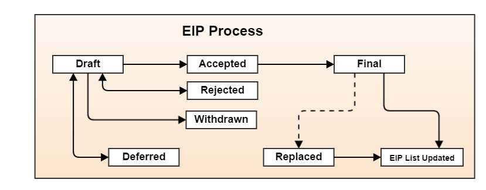

# Доп 2. Стандарты EIP, ERC

## Предложения по усовершенствованию Ethereum (EIPs)

Репозиторий Ethereum Improvement Proposal находится по адресу [github.com/ethereum/EIPs](https://github.com/ethereum/EIPs/). Рабочий процесс проиллюстрирован в документе "Рабочий процесс предложения по улучшению Ethereum".

__Из EIP-1:__ EIP расшифровывается как Ethereum Improvement Proposal. EIP - это проектный документ, предоставляющий информацию сообществу Ethereum или описывающий новую функцию для Ethereum, его процессов или среды. EIP должен содержать краткую техническую спецификацию функции и ее обоснование. Автор EIP отвечает за достижение консенсуса в сообществе и документирование особых мнений.

Рисунок 1. Рабочий процесс предложения по улучшению Ethereum

## Таблица наиболее важных EIP и ERC
Таблица 1. Важные EIP и ERC

| EIP/ERC # | Title/Description |Слой | Статус |
|-----------|-------------------|-------|--------|
| [EIP-1](http://bit.ly/2OVq6qa) | Цель и руководящие принципы EIP |  Meta | Final |
| [EIP-2](http://bit.ly/2yJtTNa) | Изменения, связанные с хард-форком | Ядро | Final |
| [EIP-5](http://bit.ly/2Jrx93V) | Gas Usage for `RETURN` and `CALL*` | Ядро | Черновик |
| [EIP-6](http://bit.ly/2OYbc2t) | Renaming +SUICIDE+ Opcode |  Interface | Final |
| [EIP-7](http://bit.ly/2JxdBeN) | `DELEGATECALL` | Ядро | Final |
| [EIP-8](http://bit.ly/2Q6Oly6) | devp2p Forward Compatibility Requirements for Homestead |  Networking | Final |
| [EIP-20](http://bit.ly/2CUf7WG) | ERC-20 Token Standard. Describes standard functions a token contract may implement to allow DApps and wallets to handle tokens across multiple interfaces/DApps. Methods include: `totalSupply`, +balanceOf(address)+, `transfer`, `transferFrom`, `approve`, `allowance`. Events include: `Transfer` (triggered when tokens are transferred), pass:[<code>Approval</code>] (triggered when `approve` is called). | ERC | Final |
| [EIP-55](http://bit.ly/2Q6R4YB)| Кодирование адреса контрольной суммы в смешанном регистре |  ERC | Final |
| [EIP-86](http://bit.ly/2OgE5la)| Абстракция происхождения и подписи транзакций. Закладывает основу для "абстрагирования" безопасности аккаунта и позволяет пользователям создавать "контракты аккаунта", двигаясь к модели, в которой в долгосрочной перспективе все счета являются контрактами, которые могут оплачивать газ, и пользователи могут свободно определять свои собственные модели безопасности, которые выполняют любую желаемую проверку подписи и проверку nonce (вместо использования внутрипротокольного механизма, где ECDSA и схема nonce по умолчанию являются единственным "стандартным" способом защиты аккаунта, который в настоящее время жестко закодирован в обработке транзакций). |  Ядро | Отложено (будет заменено) | Константинополь |
| [EIP-96](http://bit.ly/2QedSFC)| Изменения корня блокхэша и состояния. Хранит блокхеши в состоянии, чтобы уменьшить сложность протокола и необходимость в сложных клиентских реализациях для обработки опкода `BLOCKHASH`. Расширяет диапазон того, как далеко назад может уходить проверка блокчейна, с побочным эффектом создания прямых связей между блоками с очень удаленными номерами блоков для более эффективной начальной синхронизации клиентов. |  Ядро | Отложено | Константинополь
|[EIP-100](http://bit.ly/2AC05DM) | Изменить настройку сложности на целевое среднее время блока и включение дядек. |  Ядро | Final | Metropolis Byzantinium
|[EIP-101](http://bit.ly/2Jr1zDv) | Валюта спокойствия и криптовалюта абстракции. Абстрагирует эфир на более высокий уровень, позволяя эфиру и субтокенам одинаково обращаться с контрактами, снижает уровень косвенности, необходимый для пользовательских политик, таких как мультисиги, и очищает основной протокол Ethereum, снижая минимальную сложность реализации консенсуса. |  Active | Serenity feature | Serenity Casper
|[EIP-105](http://bit.ly/2Q5sdEv) | Бинарный шардинг плюс семантика вызова контрактов. "Лесенка для шардинга" EIP, позволяющая распараллеливать транзакции Ethereum с помощью механизма шардинга двоичного дерева и создающая основу для последующей схемы шардинга. Исследования в процессе; см. https://github.com/ethereum/sharding[]. |  Активный | Serenity feature | Serenity Casper
|[EIP-137](http://bit.ly/2yG2Dzi) | Служба доменных имен Ethereum - спецификация |  ERC | Final |
|[EIP-140](http://bit.ly/2yJtWZm) | Новый опкод: +REVERT+. Добавляет опкод `REVERT`, который останавливает выполнение и откатывает изменения состояния выполнения EVM без потребления всего предоставленного газа (вместо этого контракт должен платить только за память) или потери логов, и возвращает вызывающей стороне указатель на участок памяти с кодом ошибки или сообщением. | Ядро | Final | Metropolis Byzantinium |
|[EIP-141](http://bit.ly/2CQMXfe) | Designated invalid EVM instruction | Ядро | Final | Окончательный вариант.
|[EIP-145](http://bit.ly/2qhKz9Y) | Инструкции побитового сдвига в EVM | Ядро | Отложено |
|[EIP-150](http://bit.ly/2qhxflQ) | Изменение стоимости газа для операций с большим объемом ввода-вывода |  Ядро | Final | Final |
|[EIP-155](http://bit.ly/2CQUgne) | Простая защита от атаки повторного воспроизведения. Атака повторного воспроизведения позволяет любой транзакции, использующей узел или клиент Ethereum до EIP-155, стать подписанной, чтобы она была действительной и выполнялась как в цепочке Ethereum, так и в Ethereum Classic. |  Ядро | Final | Homestead
|[EIP-158](http://bit.ly/2JryBmT) | Государственный клиринг |  Ядро | Заменено | Заменено
|[EIP-160](http://bit.ly/2CR6VGY) | Увеличение стоимости EXP |  Ядро | Final |
|[EIP-161](http://bit.ly/2OfU96M) | Расчистка тройки штатов (инвариантно-сохраняющая альтернатива) | Ядро | Окончательный |
|[EIP-162](http://bit.ly/2JxdKil)| Начальный регистратор хэша ENS | ERC | Final |
|[EIP-165](http://bit.ly/2OgsOkO) | Обнаружение стандартного интерфейса ERC-165 | Интерфейс | Черновик |
|[EIP-170](http://bit.ly/2OgCWu1) | Ограничение размера кода контракта |  Ядро | Окончательный |
|[EIP-181](http://bit.ly/2ERNv7g)| Поддержка ENS для обратного разрешения адресов Ethereum |  ERC | Final |
|[EIP-190](http://bit.ly/2P0wPz5)| Стандарт упаковки смарт-контрактов Ethereum | ERC | Final |
|[EIP-196](http://bit.ly/2SwNQiz) | Предварительно скомпилированные контракты для сложения и скалярного умножения на эллиптической кривой +alt_bn128+. Требуется для выполнения верификации zkSNARK в пределах лимита блочного газа.|  Ядро | Final | Metropolis Byzantinium |
|[EIP-197](http://bit.ly/2ETDC9a) | Предварительно скомпилированные контракты для оптимальной проверки парности на эллиптической кривой +alt_bn128+. Объединен с EIP-196. | Ядро | Final | Metropolis Byzantinium |
|[EIP-198](http://bit.ly/2DdTCRN) | Большая целочисленная модульная экспоненция. Прекомпиляция, позволяющая проверять подпись RSA и другие криптографические приложения. |  Ядро | Final | Metropolis Byzantinium
|[EIP-211](http://bit.ly/2qjYJr3) | Новые опкоды: `RETURNDATASIZE` и `RETURNDATACOPY`. Добавляет поддержку возврата значений переменной длины внутри EVM с простым газовым зарядом и минимальными изменениями в вызывающих опкодах, используя новые опкоды `RETURNDATASIZE` и `RETURNDATACOPY`. Обработка аналогична существующей `calldata`, при которой после вызова возвращаемые данные сохраняются в виртуальном буфере, из которого вызывающая сторона может скопировать их (или их части) в память, а при следующем вызове буфер перезаписывается. | Ядро | Final | Metropolis Byzantinium |
|[EIP-214](http://bit.ly/2OgV0Eb) | Новый опкод: `STATICCALL`. Разрешает не изменяющие состояние вызовы самого себя или других контрактов, запрещая любые изменения состояния во время вызова (и его подвызовов, если они есть), чтобы повысить безопасность смарт-контракта и гарантировать разработчикам, что ошибки реентерабельности не могут возникнуть в результате вызова. Вызывает дочерний контракт с флагом `STATIC`, установленным в `true` для выполнения дочернего контракта, вызывая исключение при любых попытках выполнить операции по изменению состояния внутри экземпляра выполнения, где `STATIC` равен `true`, и сбрасывает флаг после возвращения вызова.| Ядро | Final | Metropolis Byzantinium
|[EIP-225](http://bit.ly/2JssHlJ) | Rinkeby testnet, использующий доказательство полномочий, где блоки добываются только доверенными подписчиками.    Петер Силадьи | | | | Homestead
|[EIP-234](http://bit.ly/2yPBavd)| Добавить `blockHash` в опции фильтра JSON-RPC |  Интерфейс | Черновик | | Черновик
|[EIP-615](http://bit.ly/2yKrBNM) | Подпрограммы и статические переходы для EVM | Ядро | Черновик | Черновик |
|[EIP-616](http://bit.ly/2AzGX99) | SIMD-операции для EVM | Ядро | Черновик | Черновик |
|[EIP-681](http://bit.ly/2qjYX1n) | Формат URL для транзакционных запросов | Интерфейс | Проект | http://bit.ly/2qjYX1n[EIP-681] | Формат URL для транзакционных запросов. |
|[EIP-649](http://bit.ly/2OYgE5n) | Metropolis Задержка бомбы сложности и уменьшение награды за блок. Задержка Ледникового периода (он же Бомба сложности) на 1 год и снижение награды за блок с 5 до 3 эфиров. | Ядро | Final | Metropolis Byzantinium
|[EIP-658](http://bit.ly/2RoGCvH) | Встраивание кода статуса транзакции в квитанции. Находит и встраивает поле статуса, указывающее на состояние успеха или неудачи, в квитанции транзакции для вызывающих, так как больше нельзя считать, что транзакция не удалась, если и только если она израсходовала весь газ после введения опкода `REVERT` в EIP-140.|  Ядро | Final | Metropolis Byzantinium
|[EIP-706](http://bit.ly/2Ogwpzs) | DEVp2p snappy compression | Networking | Final | Окончательный вариант.
|[EIP-721](http://bit.ly/2AAkCIP) | ERC-721 Non-Fungible Token Standard. Стандартный API, позволяющий смарт-контрактам работать в качестве уникальных торгуемых нефункциональных токенов (NFT), которые можно отслеживать в стандартизированных кошельках и торговать на биржах как ценные активы, аналогично ERC20. CryptoKitties стал первой популярной реализацией цифрового NFT в экосистеме Ethereum.| Стандарт | Черновик |.
| [EIP-758](http://bit.ly/2qmuDmJ) | Подписки и фильтры для завершенных транзакций |  Интерфейс | Черновик | http://bit.ly/2qmuDmJ.
| [EIP-801](http://bit.ly/2RnqlHy) | ERC-801 Canary Standard | Interface | Черновик |
| [EIP-827](http://bit.ly/2DdTKkf) | ERC827 Token Standard. Расширение стандартного интерфейса ERC20 для токенов с методами, позволяющими выполнять вызовы внутри +передача+ и утверждения. Этот стандарт предоставляет базовую функциональность для передачи токенов, а также позволяет одобрить токены, чтобы они могли быть потрачены другой третьей стороной на цепочке. Кроме того, он позволяет разработчику выполнять вызовы по переводам и утверждениям. | ERC | Черновик | Черновик.
| [EIP-930](http://bit.ly/2Jq2hAM) | ERC930 Вечное хранение. Контракт ES (Eternal Storage) принадлежит адресу, который имеет права на запись. Хранилище является общедоступным, что означает, что все имеют права на чтение. Оно хранит данные в отображениях, используя одно отображение для каждого типа переменных. Использование этого контракта позволяет разработчику при необходимости легко перенести хранилище на другой контракт. | ERC | Черновик |.
