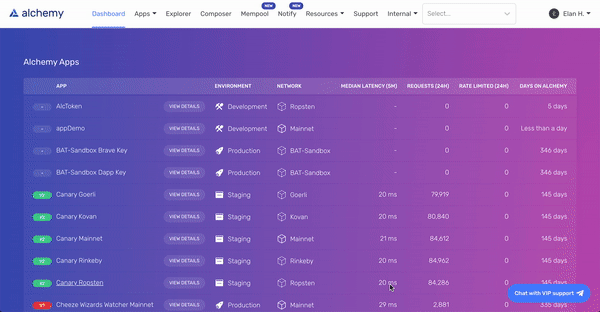
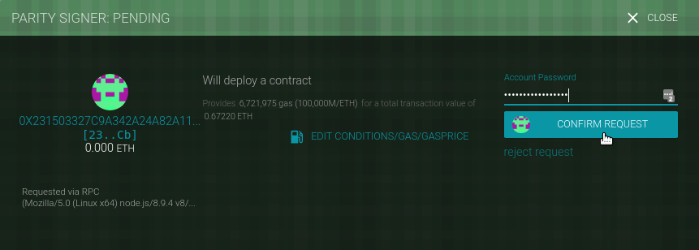

# Доп 4. Инструменты разработчика

## Инструменты разработки

### Alchemy

- Страница: [alchemyapi.io](https://alchemyapi.io)
- Документация: [docs.alchemyapi.io](https://docs.alchemyapi.io)


Для осуществления транзакций в сети Ethereum разработчикам необходимо либо запустить собственные узлы Geth / Parity для обслуживания запросов, либо использовать инфраструктурную платформу, которая управляет узлами для них и получает запросы JSON-RPC через пользовательскую конечную точку API.

Развертывание самостоятельного узла может быть сопряжено с рядом проблем: это может быть трудоемким и дорогостоящим процессом, требующим значительного инженерного времени для управления, порядка ~7 тыс. долларов США в год на сервер AWS для каждого узла. Кроме того, эти узлы могут быть ненадежными, что чревато такими проблемами, как скачки процессора, сбои в работе пиринга и проблемы с согласованностью, когда узлы не синхронизируются с сетью. Кроме того, определение согласованного состояния сети может стать сложной задачей при масштабировании на несколько узлов, которые в любой момент времени могут видеть несколько разные версии блокчейна.

Провайдер инфраструктуры блокчейна инкапсулирует все сложности управления узлами Ethereum с помощью интерфейса запросов JSON-RPC, который расширяет web3.js. Направляя запросы узлов в конечную точку пользовательского API, разработчики получают доступ ко всему необходимому для взаимодействия с блокчейном Ethereum, гарантируя при этом, что их запросы обслуживаются надежно, с полной корректностью данных и могут быть масштабированы до любого необходимого размера.

Alchemy является одним из таких поставщиков инфраструктуры. Помимо этих гарантий, он также предоставляет дополнительные инструменты для разработчиков, такие как:

#### API Explorer
Браузерный инструмент, позволяющий разработчикам осуществлять поиск и анализ всех исторических запросов API, отправленных через Alchemy, для отслеживания закономерностей, поиска ошибок и упрощения отладки.

#### Mempool Visualizer
Браузерный инструмент, позволяющий разработчикам просматривать и искать добытые, ожидающие и отложенные транзакции в мемпуле Alchemy, чтобы они могли отслеживать статус своих транзакций.

#### Composer
Браузерный инструмент, позволяющий разработчикам выполнять вызовы JSON-RPC непосредственно из приборной панели для создания прототипов и исправления неудачных запросов или изучения поведения новых методов.

#### Расширенные API
Набор дополнительных API, предоставляющих инструменты более высокого уровня для помощи разработчикам, такие как возврат баланса токенов, получение метаданных токенов или получение исторических транзакций для любого адреса без необходимости сканирования всего блокчейна.

#### Notify
Инструмент, использующий веб-крючки, позволяющий разработчикам получать уведомления всякий раз, когда они видят активность на определенном адресе Ethereum, когда транзакции в их mempool добываются или сбрасываются, или когда цены на газ Ethereum падают ниже определенной суммы.

#### Настройка
Чтобы использовать продукты Alchemy, вам необходим ключ API для аутентификации ваших запросов. Создайте учетную запись Alchemy, создайте свое первое приложение и выберите "Просмотр ключа" на приборной панели выбранного приложения, чтобы получить новый ключ.



#### Выполнение запросов
Для ручных запросов мы рекомендуем взаимодействовать с JSON-RPC через POST-запросы. Просто передайте заголовок `Content-Type: application/json` и ваш запрос в качестве тела POST со следующими полями.
`jsonrpc`: Версия JSON-RPC - в настоящее время поддерживается только 2.0.
`method`: Метод API ETH. См. справку по API.
`params`: Список параметров для передачи в метод.
`id`: Идентификатор вашего запроса. Будет возвращен ответом, чтобы вы могли отслеживать, к какому запросу относится ответ.

Вот пример, который вы можете запустить из командной строки для получения текущей цены на газ, заменив demo на свой собственный ключ API.

```
curl https://eth-mainnet.alchemyapi.io/v2/demo \
-X POST \
-H "Content-Type: application/json" \
-d '{"jsonrpc":"2.0","method":"eth_gasPrice","params":[],"id":73}
```
 
Результаты:

```
{ "id": 73,
  "jsonrpc": "2.0",
  "result": "0x09184e72a000" // 10000000000000 
}
```
 
#### Настройка Alchemy в качестве клиента

Мы рекомендуем использовать `AlchemyWeb3.js`, расширенную версию `web3.js`, которая также включает Alchemy Enhanced APIs. Для получения дополнительной информации обратитесь к руководству по [Alchemy Web3](https://docs.alchemyapi.io/documentation/alchemy-web3).

Чтобы установить `AlchemyWeb3.js`, выполните в командной строке:
С yarn: `yarn add @alch/alchemy-web3`
С NPM: `npm install @alch/alchemy-web3`
Чтобы использовать инфраструктуру узлов Alchemy, запустите в NodeJS или добавьте это в файл JavaScript:

```
const { createAlchemyWeb3 } = require("@alch/alchemy-web3");
const web3 = createAlchemyWeb3("https://eth-mainnet.alchemyapi.io/v2/your-api-key");
```
 
В качестве альтернативы вы можете использовать стандартный `web3.js`, запустив `npm install web3` и выполнив приведенный ниже фрагмент кода для использования инфраструктуры Alchemy без расширенных API:

```
// JavaScript: web3.js
const Web3 = require('web3');
const web3 = new Web3("https://eth-mainnet.alchemyapi.io/v2/your-api-key");
```
 
## Frameworks

Для облегчения разработки смарт-контрактов Ethereum можно использовать фреймворки. Делая все самостоятельно, вы лучше понимаете, как все сочетается друг с другом, но это очень утомительная, повторяющаяся работа. Фреймворки, описанные в этом разделе, могут автоматизировать некоторые задачи и облегчить разработку.

### Truffle
- GitHub: [github.com/trufflesuite/truffle](https://github.com/trufflesuite/truffle)
- Веб-сайт: [trufflesuite.com](https://trufflesuite.com)
- Документация: [trufflesuite.com/docs](https://trufflesuite.com/docs)
- Коробки с трюфелями: [trufflesuite.com/boxes/](http://trufflesuite.com/boxes/)
- Репозиторий пакетов npm: [www.npmjs.com/package/truffle](https://www.npmjs.com/package/truffle)

#### Установка фреймворка Truffle
Фреймворк Truffle включает в себя несколько пакетов Node.js. Перед установкой Truffle вам необходимо иметь актуальную и рабочую установку Node.js и менеджера пакетов Node (npm).

Рекомендуемый способ установки Node.js и npm - это использование менеджера версий Node (nvm). Как только вы установите nvm, он будет обрабатывать все зависимости и обновления за вас. Следуйте инструкциям, приведенным на сайте [http://nvm.sh](http://nvm.sh/).

После установки nvm на вашу операционную систему установка Node.js проста. Используйте флаг --lts, чтобы указать nvm, что вам нужна самая последняя версия Node.js с "долгосрочной поддержкой" (LTS):

`$ nvm install --lts`
 
Убедитесь, что у вас установлены node и npm:

```
$ node -v
v12.16.1
$ npm -v
6.13.4
```
 
Далее создайте скрытый файл .nvmrc, содержащий версию Node.js, поддерживаемую вашим DApp, чтобы разработчикам достаточно было запустить `nvm install` в корне каталога проекта, и он автоматически установится и переключится на использование этой версии:

```
$ node -v > .nvmrc
$ nvm install
```
 
Выглядит хорошо. Теперь нужно установить Truffle:
```
$ npm -g install truffle

+ truffle@5.1.20
added 26 packages from 438 contributors and updated 1 package in 24.229s
```
 
#### Интеграция готового проекта Truffle (Truffle Box)
Если вы хотите использовать или создать DApp, который строится на основе готовых шаблонов, зайдите на сайт Truffle Boxes, выберите существующий проект Truffle, а затем выполните следующую команду, чтобы загрузить и извлечь его:

`$ truffle unbox BOX_NAME`
 
#### Создание каталога проекта Truffle

Для каждого проекта, в котором вы будете использовать Truffle, создайте каталог проекта и инициализируйте Truffle в этом каталоге. Truffle создаст необходимую структуру каталогов внутри каталога проекта. Обычно принято давать каталогу проекта имя, которое описывает проект. В этом примере мы будем использовать Truffle для развертывания нашего контракта Faucet из [simple_contract_example], поэтому мы назовем папку проекта Faucet:

```
$ mkdir Faucet
$ cd Faucet
Faucet $
```
 
Попав в каталог Faucet, мы инициализируем Truffle:

`Faucet $ truffle init`
 
Truffle создает структуру каталогов и некоторые файлы по умолчанию:

```
Faucet
+---- contracts
|   `---- Migrations.sol
+---- migrations
|   `---- 1_initial_migration.js
+---- test
`---- truffle-config.js
```

Помимо самого Truffle мы будем использовать ряд пакетов поддержки JavaScript (Node.js). Мы можем установить их с помощью npm. Мы инициализируем структуру каталогов npm и принимаем значения по умолчанию, предложенные npm:

```
$ npm init

package name: (faucet)
version: (1.0.0)
description:
entry point: (truffle-config.js)
test command:
git repository:
keywords:
author:
license: (ISC)
About to write to Faucet/package.json:

{
  "name": "faucet",
  "version": "1.0.0",
  "description": "",
  "main": "truffle-config.js",
  "directories": {
    "test": "test"
  },
  "scripts": {
    "test": "echo \"Error: no test specified\" && exit 1"
  },
  "author": "",
  "license": "ISC"
}


Is this ok? (yes)
```
 
Теперь мы можем установить зависимости, которые мы будем использовать для облегчения работы с Truffle:

`$ npm install dotenv truffle-wallet-provider ethereumjs-wallet`
 
Теперь у нас есть каталог node_modules с несколькими тысячами файлов внутри нашего каталога Faucet.
Перед развертыванием DApp в облачной производственной среде или среде непрерывной интеграции важно указать поле engines, чтобы ваш DApp был собран с правильной версией Node.js и были установлены связанные с ним зависимости. Подробнее о настройке этого поля см. в [документации](https://docs.npmjs.com/cli/v8/configuring-npm/package-json).

#### Конфигурирование трюфеля

Truffle создает пустой файл конфигурации, truffle-config.js. Теперь мы отредактируем truffle-config.js и заменим его содержимое примером конфигурации, показанным здесь:

```
module.exports = {
  networks: {
    localnode: { // Whatever network our local node connects to
      network_id: "*", // Match any network ID
      host: "localhost",
      port: 8545,
    }
  }
};
```

Эта конфигурация является хорошей отправной точкой. Она устанавливает одну сеть Ethereum по умолчанию (с именем localnode), которая предполагает, что мы запускаем клиент Ethereum, такой как Parity, либо как полный узел, либо как легкий клиент. Эта конфигурация предписывает Truffle взаимодействовать с локальным узлом через RPC на порту 8545. Truffle будет использовать любую сеть Ethereum, к которой подключен локальный узел, например, основную сеть Ethereum или тестовую сеть, такую как Ropsten. Локальный узел также будет обеспечивать функциональность кошелька.

В следующих разделах мы настроим дополнительные сети для использования Truffle, такие как локальный тестовый блокчейн ganache и Infura, поставщик хостинговых сетей. По мере добавления новых сетей конфигурационный файл будет становиться все сложнее, но это также даст нам больше возможностей для рабочего процесса тестирования и разработки.

#### Использование Truffle для развертывания контракта

Теперь у нас есть основной рабочий каталог для нашего проекта Faucet, и мы настроили Truffle и его зависимости. Контракты находятся в подкаталоге contracts нашего проекта. В каталоге уже содержится "вспомогательный" контракт Migrations.sol, который управляет обновлением контрактов за нас. Мы рассмотрим использование Migrations.sol в следующем разделе.

Давайте скопируем контракт Faucet.sol (из [solidity_faucet_example]) в подкаталог contracts, чтобы каталог проекта выглядел следующим образом:

```
Faucet
+---- contracts
|   +---- Faucet.sol
|   `---- Migrations.sol
...
```

Теперь мы можем попросить Truffle составить для нас договор:

```
$ truffle compile
Compiling ./contracts/Faucet.sol...
Compiling ./contracts/Migrations.sol...
Writing artifacts to ./build/contracts
```
 
#### Миграции Truffle - понимание сценариев развертывания

Truffle предлагает систему развертывания, называемую миграцией. Если вы работали с другими фреймворками, вы могли видеть нечто подобное: Ruby on Rails, Python Django и многие другие языки и фреймворки имеют команду migrate.

Во всех этих системах цель миграции заключается в обработке изменений в схеме данных между различными версиями программного обеспечения. Цель миграций в Ethereum несколько иная. Поскольку контракты Ethereum неизменяемы и требуют больших затрат на развертывание, Truffle предлагает механизм миграции для отслеживания того, какие контракты (и какие версии) уже были развернуты. В сложном проекте с десятками контрактов и сложными зависимостями вы не захотите платить за повторное развертывание контрактов, которые не изменились. Вы также не захотите вручную отслеживать, какие версии каких контрактов уже были развернуты. Механизм миграции Truffle делает все это путем развертывания интеллектуального контракта Migrations.sol, который затем отслеживает все остальные развертывания контрактов.

У нас только один контракт, Faucet.sol, что означает, что система миграции, мягко говоря, излишняя. К сожалению, мы вынуждены ее использовать. Но, научившись использовать ее для одного контракта, мы можем начать практиковать некоторые хорошие привычки для нашего рабочего процесса разработки. Усилия окупятся, когда все усложнится.

Каталог migrations в Truffle - это место, где находятся скрипты миграции. В настоящее время существует только один скрипт, 1_initial_migration.js, который сам развертывает контракт Migrations.sol:

`link:code/truffle/Faucet/migrations/1_initial_migration.js[]`

Нам нужен второй сценарий миграции, чтобы развернуть Faucet.sol. Назовем его 2_deploy_contracts.js. Он очень прост, как и 1_initial_migration.js, только с несколькими небольшими изменениями. Фактически, вы можете скопировать содержимое 1_initial_migration.j и просто заменить все экземпляры Migrations на Faucet:

`link:code/truffle/Faucet/migrations/2_deploy_contracts.js[]`

Сценарий инициализирует переменную Faucet, определяя исходный код Faucet.sol Solidity как артефакт, определяющий Faucet. Затем он вызывает функцию deploy для развертывания этого контракта.

Все готово. Давайте используем truffle migrate для его развертывания. Мы должны указать, в какой сети развернуть контракт, используя аргумент --network. В конфигурационном файле у нас указана только одна сеть, которую мы назвали localnode. Убедитесь, что ваш локальный клиент Ethereum запущен, а затем введите:

`Faucet $ truffle migrate --network localnode`
 
Поскольку мы используем локальный узел для подключения к сети Ethereum и управления нашим кошельком, нам необходимо авторизовать транзакцию, которую создает Truffle. Мы запускаем Parity, подключенный к тестовому блокчейну Ropsten, поэтому во время миграции мы увидим всплывающее окно, подобное тому, что есть в Parity, с просьбой подтвердить развертывание Faucet на веб-консоли Parity.


Рисунок 1. Паритет запрашивает подтверждение для развертывания Faucet

Всего существует четыре транзакции: одна для развертывания Migrations, одна для обновления счетчика развертываний до 1, одна для развертывания Faucet и одна для обновления счетчика развертываний до 2.

Truffle покажет завершение миграции, покажет каждую транзакцию и адреса контрактов:

```
$ truffle migrate --network localnode
Using network 'localnode'.

Running migration: 1_initial_migration.js
  Deploying Migrations...
  ... 0xfa090db179d023d2abae543b4a21a1479e70ca7d35a469a5d1a98bfc6bd80fe8
  Migrations: 0x8861c27715550bed8362c0345add158489df6db0
Saving successful migration to network...
  ... 0x985c4a32716826ddbe4eae284104bef8bc69e959899f62246a1b27c9dfcd6c03
Saving artifacts...
Running migration: 2_deploy_contracts.js
  Deploying Faucet...
  ... 0xecdbeef77f0558edc689440e34b7bba0a3ba7a45e4b680b071b47c30a930e9d6
  Faucet: 0xd01cd8e7bd29e4bff8c1693f59eee46137a9f300
Saving successful migration to network...
  ... 0x11f376bd7307edddfd40dc4a14c3f7cb84b6c921ac2465602060b67d08f9fd8a
Saving artifacts...
```
 
#### Использование консоли Truffle
Truffle предлагает консоль JavaScript, которую мы можем использовать для взаимодействия с сетью Ethereum (через локальный узел), взаимодействия с развернутыми контрактами и взаимодействия с провайдером кошелька. В нашей текущей конфигурации (localnode) узел и провайдер кошелька - это наш локальный клиент Parity.

Давайте запустим консоль Truffle и попробуем выполнить несколько команд:

```
$ truffle console --network localnode
truffle(localnode)>
```
 
Truffle выдает подсказку, показывающую выбранную конфигурацию сети (localnode).

__Совет:__ Важно помнить и осознавать, какую сеть вы используете. Вы же не хотите случайно развернуть тестовый контракт или провести транзакцию в основной сети Ethereum. Это может стать дорогостоящей ошибкой!

Консоль Truffle предлагает функцию автозавершения, которая облегчает нам изучение среды. Если после частично выполненной команды нажать Tab, Truffle выполнит команду за нас. Нажатие Tab дважды покажет все возможные варианты завершения, если более одной команды соответствует введенным нами данным. На самом деле, если мы дважды нажмем Tab в пустой строке, Truffle выведет список всех доступных команд:


```
truffle(localnode)>
Array Boolean Date Error EvalError Function Infinity JSON Math NaN Number Object RangeError ReferenceError RegExp String SyntaxError TypeError URIError decodeURI decodeURIComponent encodeURI encodeURIComponent eval isFinite isNaN parseFloat parseInt undefined

ArrayBuffer Buffer DataView Faucet Float32Array Float64Array GLOBAL Int16Array Int32Array Int8Array Intl Map Migrations Promise Proxy Reflect Set StateManager Symbol Uint16Array Uint32Array Uint8Array Uint8ClampedArray WeakMap WeakSet WebAssembly XMLHttpRequest _ assert async_hooks buffer child_process clearImmediate clearInterval clearTimeout cluster console crypto dgram dns domain escape events fs global http http2 https module net os path perf_hooks process punycode querystring readline repl require root setImmediate setInterval setTimeout stream string_decoder tls tty unescape url util v8 vm web3 zlib

__defineGetter__ __defineSetter__ __lookupGetter__ __lookupSetter__ __proto__ constructor hasOwnProperty isPrototypeOf propertyIsEnumerable toLocaleString toString valueOf
```
 
Подавляющее большинство функций, связанных с кошельком и узлом, обеспечивается объектом web3, который является экземпляром библиотеки web3.js. Объект web3 абстрагирует интерфейс RPC для нашего узла Parity. Вы также заметите два объекта со знакомыми именами: Migrations и Faucet. Они представляют контракты, которые мы только что развернули. Мы будем использовать консоль Truffle для взаимодействия с контрактом. Сначала проверим наш кошелек через объект web3:

```
truffle(localnode)> web3.eth.accounts
[ '0x9e713963a92c02317a681b9bb3065a8249de124f',
  '0xdb5dc1a13e3a55cf3b4587cd8d1e5fdeb6738145' ]
  ```
 
Наш клиент Parity имеет два кошелька, с некоторым количеством тестового эфира на Ropsten. Атрибут web3.eth.accounts содержит список всех счетов. Мы можем проверить баланс первого счета с помощью функции getBalance:

```
truffle(localnode)> web3.eth.getBalance(web3.eth.accounts[0]).toNumber()
191198572800000000
truffle(localnode)>
```
 
web3.js - это большая библиотека JavaScript, которая предлагает комплексный интерфейс к системе Ethereum через провайдера, например, локальный клиент. Более подробно мы рассмотрим web3.js в [web3js_tutorial]. Теперь давайте попробуем взаимодействовать с нашими контрактами:

```
truffle(localnode)> Faucet.address
'0xd01cd8e7bd29e4bff8c1693f59eee46137a9f300'
truffle(localnode)> web3.eth.getBalance(Faucet.address).toNumber()
0
truffle(localnode)>
 ```

Далее мы используем sendTransaction, чтобы отправить немного тестового эфира для финансирования контракта Faucet. Обратите внимание на использование web3.utils.toWei для конвертации единиц эфира. Ввести 18 нулей без ошибки сложно и опасно, поэтому всегда лучше использовать конвертер единиц измерения. Вот как мы отправляем транзакцию:

```
truffle(localnode)> web3.eth.sendTransaction({from:web3.eth.accounts[0],
                    to:Faucet.address, value:web3.utils.toWei(0.5, 'ether')});
'0xf134c75b985dc0e0c27c2f0412251e0860eb530a5055e660f21e7483ab336808'
 ```

Если мы переключимся на веб-интерфейс Parity, то увидим всплывающее окно с просьбой подтвердить эту транзакцию. Как только транзакция будет добыта, мы сможем увидеть баланс нашего контракта Faucet:

```
truffle(localnode)> web3.eth.getBalance(Faucet.address).toNumber()
500000000000000000
 ```
Теперь вызовем функцию withdraw, чтобы вывести из контракта тестовый эфир:

```
truffle(localnode)> Faucet.deployed().then(instance =>
                       {instance.withdraw(web3.utils.toWei(0.1,
                       'ether'))}).then(console.log)
```
 
Опять же, нам нужно будет одобрить транзакцию в веб-интерфейсе Parity. Если мы проверим еще раз, то увидим, что баланс контракта Faucet уменьшился, а на наш тестовый кошелек поступило 0,1 эфира:

```
truffle(localnode)> web3.eth.getBalance(Faucet.address).toNumber()
400000000000000000
truffle(localnode)> Faucet.deployed().then(instance =>
                    {instance.withdraw(web3.utils.toWei(1, 'ether'))})
StatusError: Transaction: 0xe147ae9e3610334...8612b92d3f9c
  exited with an error (status 0).
```
 
### Embark
- GitHub: [github.com/embark-framework/embark](https://github.com/embark-framework/embark/)
- Документация: [embark.status.im/docs](https://embark.status.im/docs/)
- Репозиторий пакетов npm: [npmjs.com/package/embark](https://www.npmjs.com/package/embark)

Embark - это фреймворк, созданный для того, чтобы разработчики могли легко разрабатывать и внедрять децентрализованные приложения. Embark интегрируется с Ethereum, IPFS, Whisper и Swarm и предлагает следующие возможности:

- Автоматически развертывайте контракты и делайте их доступными в JS-коде.
- Следите за изменениями и при необходимости обновляйте контракты для перераспределения.
- Управление и взаимодействие с различными сетями (например, testnet, local, mainnet).
- Управлять сложными системами взаимозависимых контрактов.
- Хранить и извлекать данные, включая загрузку и извлечение файлов, размещенных в IPFS.
- Облегчает процесс развертывания полного приложения на IPFS или Swarm.
- Отправляйте и получайте сообщения через Whisper.

Вы можете установить его с помощью npm:

```
$ npm -g install embark
```

### OpenZeppelin

- GitHub: [github.com/OpenZeppelin/openzeppelin-contracts](https://github.com/OpenZeppelin/openzeppelin-contracts)
- Страница: [openzeppelin.org](https://openzeppelin.org/)
- Документация: [docs.openzeppelin.com](https://docs.openzeppelin.com/)

OpenZeppelin - это открытая структура многократно используемых и безопасных смарт-контрактов на языке Solidity.
Он создан на базе сообщества, возглавляемого командой Zeppelin и имеющего более сотни внешних участников. Основное внимание в фреймворке уделяется безопасности, которая достигается путем применения стандартных для отрасли моделей безопасности контрактов и лучших практик, опираясь на весь опыт разработчиков Zeppelin, полученный в ходе аудита огромного количества контрактов, а также путем постоянного тестирования и аудита со стороны сообщества, которое использует фреймворк в качестве основы для своих реальных приложений.

Фреймворк OpenZeppelin является наиболее распространенным решением для смарт-контрактов Ethereum. В настоящее время фреймворк имеет обширную библиотеку контрактов, включая реализацию токенов ERC20 и ERC721, множество вариантов моделей краудсейла, а также простые модели поведения, обычно встречающиеся в таких контрактах, как Ownable, Pausable или LimitBalance. Контракты в этом репозитории в некоторых случаях функционируют как де-факто стандартные реализации.

Фреймворк лицензирован под лицензией MIT, а все контракты были разработаны с использованием модульного подхода, чтобы гарантировать простоту повторного использования и расширения. Это чистые и базовые строительные блоки, готовые к использованию в вашем следующем проекте Ethereum. Давайте настроим фреймворк и создадим простой краудсейл с использованием контрактов OpenZeppelin, чтобы продемонстрировать, насколько он прост в использовании. Этот пример также подчеркивает важность повторного использования безопасных компонентов вместо их самостоятельного написания.

Во-первых, нам нужно установить библиотеку openzeppelin-solidity в наше рабочее пространство. Последняя версия на момент написания этой статьи - v1.9.0, поэтому мы будем использовать именно ее:

```
$ mkdir sample-crowdsale
$ cd sample-crowdsale
$ npm install openzeppelin-solidity@1.9.0
$ mkdir contracts
```
 
На момент написания статьи OpenZeppelin включает в себя несколько базовых контрактов с токенами, которые соответствуют стандартам ERC20, ERC721 и ERC827, с различными характеристиками для эмиссии, лимитов, наделения, жизненного цикла и т.д.

Давайте создадим токен ERC20, который можно майнить, то есть первоначальное предложение начинается с 0, а новые токены могут быть созданы владельцем токена (в нашем случае - контрактом краудсейла) и проданы покупателям. Для этого мы создадим файл contracts/SampleToken.sol со следующим содержимым:

`link:code/OpenZeppelin/contracts/SampleToken.sol[]`

OpenZeppelin уже предоставляет контракт MintableToken, который мы можем использовать в качестве основы для нашего токена, поэтому мы определяем только детали, специфичные для нашего случая. Далее, давайте создадим контракт краудсейла. Как и в случае с токенами, OpenZeppelin уже предоставляет широкий выбор вариантов краудсейла. В настоящее время вы найдете контракты для различных сценариев, связанных с распределением, эмиссией, ценой и проверкой. Итак, допустим, вы хотите установить цель для вашего краудсейла, и если она не будет достигнута к моменту завершения продажи, вы хотите вернуть деньги всем своим инвесторам. Для этого вы можете использовать контракт [RefundableCrowdsale](https://github.com/OpenZeppelin/openzeppelin-contracts/blob/v1.9.0/contracts/crowdsale/distribution/RefundableCrowdsale.sol). Или, возможно, вы хотите организовать краудсейл с растущей ценой, чтобы стимулировать ранних покупателей; для этого существует контракт [IncreasingPriceCrowdsale](https://github.com/OpenZeppelin/openzeppelin-contracts/blob/v1.9.0/contracts/crowdsale/price/IncreasingPriceCrowdsale.sol). Вы также можете завершить краудсейл, когда контракт получит определенное количество эфира ([CappedCrowdsale](https://github.com/OpenZeppelin/openzeppelin-contracts/blob/v1.9.0/contracts/crowdsale/validation/CappedCrowdsale.sol)), или установить время окончания с помощью контракта [TimedCrowdsale](https://github.com/OpenZeppelin/openzeppelin-contracts/blob/v1.9.0/contracts/crowdsale/validation/TimedCrowdsale.sol), или создать белый список покупателей с помощью контракта [WhitelistedCrowdsale](https://github.com/OpenZeppelin/openzeppelin-contracts/blob/v1.9.0/contracts/crowdsale/validation/WhitelistedCrowdsale.sol).

Как мы уже говорили, контракты OpenZeppelin - это базовые строительные блоки. Эти контракты краудсейла были разработаны для комбинирования; просто прочитайте исходный код базового контракта [Crowdsale](https://github.com/OpenZeppelin/openzeppelin-contracts/blob/v1.9.0/contracts/crowdsale/Crowdsale.sol), чтобы узнать, как его расширить. Для краудсейла нашего токена нам нужно чеканить токены, когда эфир поступает на контракт краудсейла, поэтому в качестве основы возьмем [MintedCrowdsale](https://github.com/OpenZeppelin/openzeppelin-contracts/blob/v1.9.0/contracts/crowdsale/emission/MintedCrowdsale.sol). А чтобы сделать его более интересным, давайте также сделаем его [PostDeliveryCrowdsale](https://github.com/OpenZeppelin/openzeppelin-contracts/blob/v1.9.0/contracts/crowdsale/distribution/PostDeliveryCrowdsale.sol), чтобы токены можно было вывести только после окончания краудсейла. Для этого мы напишем следующее в файле contracts/SampleCrowdsale.sol:

`link:code/OpenZeppelin/contracts/SampleCrowdsale.sol[]`

Опять же, нам почти не пришлось писать никакого кода; мы просто повторно использовали проверенный в боях код, который предоставило сообщество OpenZeppelin. Однако важно отметить, что этот случай отличается от случая с нашим контрактом SampleToken. Если вы обратитесь к [автоматизированным тестам Crowdsale](https://github.com/OpenZeppelin/openzeppelin-contracts/tree/v1.9.0/test/crowdsale), то увидите, что они тестируются изолированно. Когда вы интегрируете различные части кода в более крупный компонент, недостаточно тестировать все части отдельно, потому что взаимодействие между ними может вызвать поведение, которого вы не ожидали. В частности, вы увидите, что здесь мы ввели множественное наследование, что может удивить разработчика, если он не понимает деталей Solidity. Наш контракт SampleCrowdsale прост, и он будет работать так, как мы ожидаем, потому что фреймворк был разработан для того, чтобы сделать такие случаи простыми; но не ослабляйте бдительность из-за простоты, которую привносит этот фреймворк. Каждый раз, когда вы интегрируете части фреймворка OpenZeppelin для создания более сложного решения, вы должны полностью протестировать каждый аспект вашего решения, чтобы убедиться, что все взаимодействия модулей работают так, как вы задумали.

Наконец, когда мы довольны нашим решением и тщательно его протестировали, нам нужно развернуть его. OpenZeppelin хорошо интегрируется с Truffle, поэтому мы можем просто написать файл миграций, подобный следующему (migrations/2_deploy_contracts.js), как объясняется в разделе Миграции Truffle - понимание сценариев развертывания:

`link:code/OpenZeppelin/migrations/2_deploy_contracts.js[]`

__Примечание:__ Это был лишь краткий обзор нескольких контрактов, которые являются частью фреймворка OpenZeppelin. Приглашаем вас присоединиться к сообществу разработчиков OpenZeppelin, чтобы учиться и вносить свой вклад.

### ZeppelinOS

- GitHub: [github.com/zeppelinos](https://github.com/zeppelinos)
- Страница: [zeppelinos.org](https://zeppelinos.org)
- Блог: [blog.zeppelinos.org](https://blog.zeppelinos.org)


[ZeppelinOS](https://github.com/zeppelinos) - это "распределенная платформа инструментов и сервисов с открытым исходным кодом поверх EVM для безопасной разработки и управления приложениями смарт-контрактов".

В отличие от кода OpenZeppelin, который необходимо развертывать с каждым приложением при каждом использовании, код ZeppelinOS живет на цепочке. Приложениям, которым нужна определенная функциональность - например, токен ERC20 - не только не нужно переделывать и перепроверять его реализацию (то, что решает OpenZeppelin), но даже не нужно его развертывать. В ZeppelinOS приложение взаимодействует с реализацией токена на цепочке напрямую, примерно так же, как настольное приложение взаимодействует с компонентами своей базовой ОС.

В основе ZeppelinOS лежит очень умный контракт, известный как прокси. Прокси - это контракт, который способен обернуть любой другой контракт, раскрыть его интерфейс без необходимости вручную реализовывать для него сеттеры и геттеры, и может обновлять его без потери состояния. В терминах Solidity это можно рассматривать как обычный контракт, бизнес-логика которого содержится в библиотеке, которую в любой момент можно поменять на новую библиотеку без потери состояния. Способ, которым прокси связывается со своей реализацией, полностью автоматизирован и инкапсулирован для разработчика. Практически любой контракт можно сделать обновляемым практически без изменений в его коде. Подробнее о механизме прокси в ZeppelinOS можно прочитать в [блоге](https://blog.openzeppelin.com/upgradeability-using-unstructured-storage/), а пример его использования можно найти на GitHub.

Разработка приложений с помощью ZeppelinOS похожа на разработку приложений JavaScript с помощью npm. AppManager обрабатывает пакет приложения для каждой версии приложения. Пакет - это просто каталог контрактов, каждый из которых может иметь один или несколько обновляемых прокси. AppManager не только предоставляет прокси для контрактов, специфичных для приложения, но и делает это для реализаций ZeppelinOS в виде стандартной библиотеки. Чтобы увидеть полный пример этого, пожалуйста, посетите examples/complex.

Хотя в настоящее время ZeppelinOS находится в стадии разработки, она стремится предоставить широкий набор дополнительных функций, таких как инструменты разработчика, планировщик, автоматизирующий фоновые операции в рамках контрактов, вознаграждения за разработку, рынок, облегчающий общение и обмен ценностями между приложениями, и многое другое. Все это описано в техническом документе ZeppelinOS.

## Утилиты

### EthereumJS helpeth: Утилита командной строки

- GitHub: [github.com/ethereumjs/helpeth](https://github.com/ethereumjs/helpeth)


helpeth - это инструмент командной строки для работы с ключами и транзакциями, который значительно облегчает работу разработчика.
Он является частью коллекции библиотек и инструментов EthereumJS на базе JavaScript:

```
Usage: helpeth [command]

Commands:
  signMessage <message>                     Sign a message
  verifySig <hash> <sig>                    Verify signature
  verifySigParams <hash> <r> <s> <v>        Verify signature parameters
  createTx <nonce> <to> <value> <data>      Sign a transaction
  <gasLimit> <gasPrice>
  assembleTx <nonce> <to> <value> <data>    Assemble a transaction from its
  <gasLimit> <gasPrice> <v> <r> <s>         components
  parseTx <tx>                              Parse raw transaction
  keyGenerate [format] [icapdirect]         Generate new key
  keyConvert                                Convert a key to V3 keystore format
  keyDetails                                Print key details
  bip32Details <path>                       Print key details for a given path
  addressDetails <address>                  Print details about an address
  unitConvert <value> <from> <to>           Convert between Ethereum units

Options:
  -p, --private      Private key as a hex string                        [string]
  --password         Password for the private key                       [string]
  --password-prompt  Prompt for the private key password               [boolean]
  -k, --keyfile      Encoded key file                                   [string]
  --show-private     Show private key details                          [boolean]
  --mnemonic         Mnemonic for HD key derivation                     [string]
  --version          Show version number                               [boolean]
  --help             Show help                                         [boolean]
```

### dapp.tools

- Страница: [dapp.tools/](https://dapp.tools/)

dapp.tools - это полный набор инструментов для разработчиков блокчейна, созданный в духе философии Unix. В него входят следующие инструменты:

#### Dapp

Dapp - это основной пользовательский инструмент для создания новых DApps, запуска модульных тестов Solidity, отладки и развертывания контрактов, запуска тестовых сетей и многого другого.

#### Seth

Seth используется для составления транзакций, запросов к блокчейну, конвертации между форматами данных, выполнения удаленных вызовов и подобных повседневных задач.

#### Hevm

Hevm - это реализация EVM на языке Haskell с удобным терминальным отладчиком Solidity. Он используется для тестирования и отладки DApps.

#### evmdis

evmdis - это дизассемблер EVM; он выполняет статический анализ байткода для обеспечения более высокого уровня абстракции, чем необработанные операции EVM.

### SputnikVM

[SputnikVM](https://github.com/etcdevteam/sputnikvm) - это автономная подключаемая виртуальная машина для различных блокчейнов на базе Ethereum. Она написана на языке Rust и может использоваться как двоичный файл, карго-крейт, общая библиотека или интегрироваться через интерфейсы FFI, Protobuf и JSON. У него есть отдельный бинарник, sputnikvm-dev, предназначенный для тестирования, который эмулирует большую часть JSON-RPC API и блокчейн.

## Библиотеки

### web3.js

web3.js - это совместимый с Ethereum JavaScript API для связи с клиентами через JSON-RPC, разработанный Ethereum Foundation.

- GitHub: [github.com/ethereum/web3.js](https://github.com/ethereum/web3.js)
- Репозиторий пакетов npm: [npmjs.com/package/web3](https://www.npmjs.com/package/web3)
- Документация для web3.js API 0.2x.x: [github.com/ethereum/wiki/wiki/JavaScript-API](https://github.com/ethereum/wiki/wiki/JavaScript-API)
- Документация для web3.js API 1.0.0-beta.xx: [web3js.readthedocs.io/en/v1.7.5/](https://web3js.readthedocs.io/en/v1.7.5/).

### web3.py
web3.py - это библиотека Python для взаимодействия с блокчейном Ethereum, поддерживаемая Ethereum Foundation.
- GitHub: [github.com/ethereum/web3.py](https://github.com/ethereum/web3.py)
- PyPi: [pypi.python.org/pypi/web3/4.0.0b9](https://pypi.python.org/pypi/web3/4.0.0b9)
- Документация: [web3py.readthedocs.io/](https://web3py.readthedocs.io/)

### EthereumJS
EthereumJS - это коллекция библиотек и утилит для Ethereum.
- GitHub: [github.com/ethereumjs](https://github.com/ethereumjs)
- Страница: [ethereumjs.github.io/](https://ethereumjs.github.io/)

### web3j
web3j - это библиотека для Java и Android для интеграции с клиентами Ethereum и работы со смарт-контрактами.

- GitHub: [github.com/web3j/web3j](https://github.com/web3j/web3j)
- Страница: [web3j.io](https://web3j.io)
- Документация: [docs.web3j.io](https://docs.web3j.io)

### EtherJar
EtherJar - это еще одна библиотека Java для интеграции с Ethereum и работы со смарт-контрактами. Она предназначена для серверных проектов на базе Java 8+ и обеспечивает низкоуровневый доступ и высокоуровневую обертку вокруг RPC, структур данных Ethereum и доступа к смарт-контрактам.

- GitHub: [github.com/infinitape/etherjar](https://github.com/infinitape/etherjar)

### Nethereum
Nethereum - это библиотека интеграции .Net для Ethereum.

- GitHub: [github.com/Nethereum/Nethereum](https://github.com/Nethereum/Nethereum)
- Страница: [nethereum.com/](http://nethereum.com/)
- Документация: [nethereum.readthedocs.io/en/latest/](https://nethereum.readthedocs.io/en/latest/)

### ethers.js
Библиотека ethers.js - это компактная, полная, полнофункциональная, тщательно протестированная библиотека Ethereum с лицензией MIT, которая получила грант DevEx от Ethereum Foundation на ее расширение и поддержку.

- GitHub: [github.com/ethers-io/ethers.js](https://github.com/ethers-io/ethers.js)
- Документация: [docs.ethers.io](https://docs.ethers.io)

### Изумрудная платформа
Emerald Platform предоставляет библиотеки и компоненты пользовательского интерфейса для создания DApps поверх Ethereum. Emerald JS и Emerald JS UI предоставляют наборы модулей и компонентов React для создания приложений и веб-сайтов на JavaScript; Emerald SVG Icons - набор иконок, связанных с блокчейном. В дополнение к библиотекам JavaScript Emerald имеет библиотеку Rust для работы с закрытыми ключами и подписями транзакций. Все библиотеки и компоненты Emerald лицензированы по лицензии Apache License, версия 2.0.

- GitHub: [github.com/etcdevteam/emerald-platform](https://github.com/etcdevteam/emerald-platform)
- Документация: [docs.etcdevteam.com](https://docs.etcdevteam.com)

## Тестирование смарт-контрактов
Для разработки смарт-контрактов существует несколько широко используемых тестовых фреймворков, которые приведены в кратком обзоре тестовых фреймворков для смарт-контрактов:

Таблица 1. Сводная информация о механизмах тестирования смарт-контрактов

| Framework  | Языки тестирования  | Система тестирования | Эмулятор цепи | Страница |
:-------:|:------:|----------|:---:|:-----:|
| Truffle | JavaScript/Solidity | Mocha | TestRPC/Ganache |  [trufflesuite.com/](https://trufflesuite.com/) |
|Embark|JavaScript|Mocha|TestRPC/Ganache|[embark.status.im/docs/](https://embark.status.im/docs/)|
|Dapp|Solidity|ds-test (custom)|ethrun (Parity)|[dapp.tools/dapp/](https://dapp.tools/dapp/)|
|Populus|Python|pytest|Python chain emulator|[populus.readthedocs.io](https://populus.readthedocs.io)|

#### Трюфель
Truffle позволяет писать модульные тесты на JavaScript (на основе Mocha) или Solidity. Эти тесты запускаются на Ganache.

#### Embark
Embark интегрируется с Mocha для запуска модульных тестов, написанных на JavaScript. Тесты, в свою очередь, запускаются против контрактов, развернутых на Ganache (ранее называвшемся TestRPC). Фреймворк Embark автоматически развертывает смарт-контракты и автоматически перераспределяет контракты при их изменении. Он также отслеживает развернутые контракты и развертывает их только тогда, когда это действительно необходимо. Embark включает библиотеку тестирования для быстрого запуска и проверки ваших контрактов в EVM, с такими функциями, как assert.equal. Команда embark test запустит все тестовые файлы в каталоге test.

#### Dapp
Dapp использует собственный код Solidity (библиотека под названием ds-test) и созданную Parity библиотеку Rust под названием ethrun для выполнения байткода Ethereum и последующего подтверждения корректности. Библиотека ds-test предоставляет функции assertion для проверки корректности и события для регистрации данных в консоли.

Функции утверждения включают:

```
assert(bool condition)
assertEq(адрес a, адрес b)
assertEq(bytes32 a, bytes32 b)
assertEq(int a, int b)
assertEq(uint a, uint b)
assertEq0(байт a, байт b)
expectEventsExact(address target)
```

Команды протоколирования выводят информацию на консоль, что делает их полезными для отладки:


```
logs(bytes)
log_bytes32(bytes32)
log_named_bytes32(bytes32 key, bytes32 val)
log_named_address(bytes32 key, address val)
log_named_int(bytes32 key, int val)
log_named_uint(bytes32 key, uint val)
log_named_decimal_int(bytes32 key, int val, uint decimals)
log_named_decimal_uint(bytes32 key, uint val, uint decimals)
```

#### Populus
Populus использует Python и собственный эмулятор цепочки для выполнения контрактов, написанных на Solidity. Юнит-тесты пишутся на Python с помощью библиотеки pytest. Populus поддерживает написание контрактов специально для тестирования. Имена этих контрактов должны соответствовать шаблону glob Test*.sol и располагаться в любом месте каталога тестов проекта, tests.

### Тестирование на блокчейне
Хотя большинство тестов не должно проводиться на развернутых контрактах, поведение контракта можно проверить с помощью клиентов Ethereum. Для оценки состояния смарт-контракта можно использовать следующие команды. Эти команды следует набирать в терминале geth, хотя любая консоль web3 также поддерживает их.

Чтобы получить адрес контракта в txhash, используйте:

`web3.eth.getTransactionReceipt(txhash);`
 
Эта команда получает код контракта, развернутого по адресу contractaddress; его можно использовать для проверки правильности развертывания:

`web3.eth.getCode(contractaddress)` 

Это позволяет получить полный журнал контракта, расположенного по адресу, указанному в опциях, что полезно для просмотра истории вызовов контракта:

`web3.eth.getPastLogs(options)`
 
Наконец, эта команда получает хранилище, расположенное по адресу со смещением позиции:

`web3.eth.getStorageAt(address, position)` 

### Ганаш: локальный тестовый блокчейн
Ganache - это локальный тестовый блокчейн, который можно использовать для развертывания контрактов, разработки приложений и проведения тестов. Он доступен в виде настольного приложения (с графическим интерфейсом пользователя) для Windows, macOS и Linux. Он также доступен в виде утилиты командной строки под названием ganache-cli. Более подробную информацию и инструкции по установке настольного приложения Ganache можно найти на сайте [trufflesuite.com/ganache](https://trufflesuite.com/ganache).
Код ganache-cli можно найти по адресу [github.com/trufflesuite/ganache-cli/](https://github.com/trufflesuite/ganache-cli/).
Чтобы установить ganache-cli из командной строки, используйте npm:

```
$ npm install -g ganache-cli
```
 
Вы можете использовать ganache-cli для запуска локального блокчейна для тестирования следующим образом:

```
$ ganache-cli \
  --networkId=3 \
  --port="8545" \
  --verbose \
  --gasLimit=8000000 \
  --gasPrice=4000000000;
```

Несколько замечаний по этой командной строке:
- Проверьте, что значения флагов --networkId и --port соответствуют вашей конфигурации в файле truffle-config.js.
- Убедитесь, что значение флага --gasLimit соответствует последнему лимиту газа в сети (например, 8,000,000 газа), показанному на сайте [ethstats.net](https://ethstats.net), чтобы избежать ненужных исключений "закончился газ". Обратите внимание, что значение --gasPrice 4000000000 означает цену газа в 4 гвея.
- При желании можно ввести значение флага --mnemonic, чтобы восстановить предыдущий кошелек HD и связанные с ним адреса.

