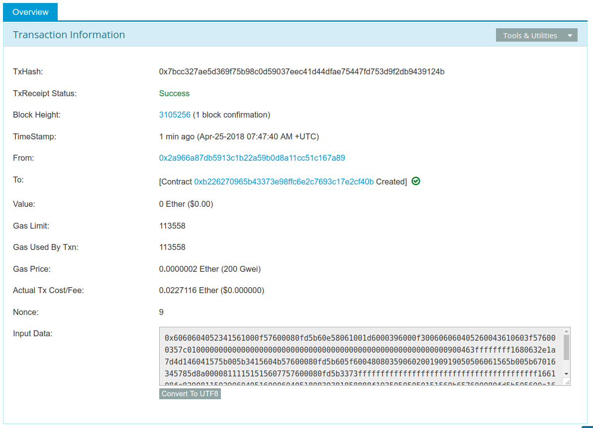

# Транзакции

Транзакции - это подписанные сообщения, созданные внешним аккаунтом (EOA), переданные сетью Ethereum и записанные в блокчейн Ethereum. За этим базовым определением скрывается множество удивительных и захватывающих деталей. Другой способ взглянуть на транзакции заключается в том, что они - единственное, что может вызвать изменение состояния или привести к исполнению контракта в EVM. Ethereum - это глобальная единая машина состояний, а транзакции - это то, что заставляет эту машину состояний "тикать", изменяя ее состояние. Контракты не выполняются сами по себе. Ethereum не работает автономно. Все начинается с транзакции.

В этой главе мы разберем транзакции, покажем, как они работают, и рассмотрим детали. Обратите внимание, что большая часть этой главы адресована тем, кто заинтересован в управлении собственными транзакциями на низком уровне, возможно, потому что пишет приложение для кошелька; вам не нужно беспокоиться об этом, если вы довольны использованием существующих приложений для кошельков, хотя детали могут показаться вам интересными!

## Структура транзакции

Сначала давайте рассмотрим базовую структуру транзакции, как она сериализуется и передается в сети Ethereum. Каждый клиент и приложение, получающее сериализованную транзакцию, будет хранить ее в памяти, используя свою собственную внутреннюю структуру данных, возможно, дополненную метаданными, которых нет в самой сериализованной транзакции. Сетевая сериализация - это единственная стандартная форма транзакции.
Транзакция - это сериализованное двоичное сообщение, содержащее следующие данные:

### Nonce
Порядковый номер, выдаваемый отправляющим EOA, используемый для предотвращения повторного воспроизведения сообщения.

### Цена на газ
Количество эфира (в вэях), которое оригинатор готов заплатить за каждую единицу газа

### Предел газа
Максимальное количество газа, которое оригинатор готов купить для данной сделки

### Получатель
Адрес назначения Ethereum

### Значение
Количество эфира (в вэй) для отправки в пункт назначения

### Данные
Полезная нагрузка двоичных данных переменной длины

### v, r, s
Три компонента цифровой подписи ECDSA создающего EOA


Структура сообщения транзакции сериализуется с помощью схемы кодирования Recursive Length Prefix (RLP), которая была создана специально для простой, байтовой сериализации данных в Ethereum. Все числа в Ethereum кодируются как большие целые числа, длина которых кратна 8 битам.

Обратите внимание, что метки полей (до, предел газа и т.д.) показаны здесь для наглядности, но не являются частью сериализованных данных транзакции, которые содержат значения полей в RLP-кодировке. В целом, RLP не содержит никаких разделителей или меток полей. Префикс длины RLP используется для определения длины каждого поля. Все, что превышает определенную длину, относится к следующему полю в структуре.

Хотя это фактическая структура передаваемой транзакции, большинство внутренних представлений и визуализаций пользовательского интерфейса украшают ее дополнительной информацией, полученной из транзакции или из блокчейна.

Например, вы можете заметить, что в адресе, идентифицирующем EOA отправителя, нет данных "from". Это потому, что открытый ключ EOA может быть получен из компонентов v,r,s подписи ECDSA. Адрес, в свою очередь, может быть получен из открытого ключа. Когда вы видите транзакцию с полем "от", это поле было добавлено программным обеспечением, используемым для визуализации транзакции. Другие метаданные, часто добавляемые к транзакции клиентским программным обеспечением, включают номер блока (когда он добыт и включен в блокчейн) и идентификатор транзакции (вычисленный хэш). Опять же, эти данные получены из транзакции и не являются частью самого сообщения о транзакции.

## Нонс транзакции
Nonce является одним из наиболее важных и наименее понятных компонентов транзакции. Определение в Желтой книге (см. [ссылки]) гласит:

nonce: Скалярное значение, равное количеству транзакций, отправленных с этого адреса, или, в случае счетов с ассоциированным кодом, количеству контрактов-созданий, выполненных этим счетом.

Строго говоря, nonce является атрибутом адреса отправителя; то есть он имеет значение только в контексте адреса отправителя. Однако nonce не хранится в явном виде как часть состояния счета в блокчейне. Вместо этого он вычисляется динамически, путем подсчета количества подтвержденных транзакций, которые исходили от адреса.

Есть два сценария, в которых существование неса для подсчета транзакций важно: удобство использования, когда транзакции включаются в порядок создания, и жизненно важная функция защиты от дублирования транзакций. Давайте рассмотрим пример каждого из этих сценариев:

1. Представьте, что вы хотите совершить две транзакции. Вам нужно совершить важный платеж в размере 6 эфиров, а также другой платеж в размере 8 эфиров. Вы подписываете и транслируете сначала транзакцию на 6 эфиров, потому что она важнее, а затем подписываете и транслируете вторую, на 8 эфиров. К сожалению, вы упустили из виду тот факт, что на вашем счету всего 10 эфиров, поэтому сеть не может принять обе транзакции: одна из них не пройдет. Поскольку вы отправили сначала более важную транзакцию на 6 эфиров, вы, понятно, ожидаете, что она пройдет, а транзакция на 8 эфиров будет отклонена. Однако в такой децентрализованной системе, как Ethereum, узлы могут получать транзакции в любом порядке; нет никакой гарантии, что конкретный узел получит одну транзакцию раньше другой. Поэтому почти наверняка некоторые узлы получат сначала транзакцию на 6 эфиров, а другие - на 8 эфиров. Если не включать nonce, то будет случайным, какая транзакция будет принята, а какая отклонена. Однако с включенным nonce первая отправленная вами транзакция будет иметь nonce, допустим, 3, в то время как транзакция на 8 эфиров будет иметь следующее значение nonce (т.е. 4). Таким образом, эта транзакция будет игнорироваться до тех пор, пока не будут обработаны транзакции с кодами от 0 до 3, даже если она будет получена первой. Фух!

2. Теперь представьте, что у вас есть счет со 100 эфирами. Фантастика! Вы находите в Интернете человека, который принимает оплату в эфирах за макгаффин-виджет, который вы очень хотите купить. Вы посылаете им 2 эфира, и они высылают вам макгаффин-виджет. Прекрасно. Чтобы осуществить этот платеж в 2 эфира, вы подписали транзакцию, отправив 2 эфира со своего счета на их счет, а затем передали ее в сеть Ethereum для проверки и включения в блокчейн. Теперь, без значения nonce в транзакции, вторая транзакция, отправляющая 2 эфира на тот же адрес во второй раз, будет выглядеть точно так же, как и первая. Это означает, что любой, кто увидит вашу транзакцию в сети Ethereum (а это значит, что каждый, включая получателя или ваших врагов), может "воспроизвести" транзакцию снова, снова и снова, пока все ваши эфиры не исчезнут, просто скопировав и вставив вашу оригинальную транзакцию и повторно отправив ее в сеть. Однако благодаря значению nonce, включенному в данные транзакции, каждая транзакция уникальна, даже при многократной отправке одного и того же количества эфира на один и тот же адрес получателя. Таким образом, благодаря тому, что увеличивающееся значение nonce является частью транзакции, никто не сможет "продублировать" совершенный вами платеж.

Подводя итог, важно отметить, что использование nonce фактически жизненно необходимо для протокола, основанного на счетах, в отличие от механизма "выхода неизрасходованных транзакций" (UTXO) протокола Bitcoin.

### Отслеживание нецелочисленных данных
С практической точки зрения, nonce - это актуальный подсчет количества подтвержденных (т.е. находящихся на цепи) транзакций, которые были произведены со счета. Чтобы узнать значение nonce, вы можете опросить блокчейн, например, через интерфейс web3. Откройте консоль JavaScript в Geth (или предпочитаемом вами интерфейсе web3) в тестовой сети Ropsten, затем введите:

```
> web3.eth.getTransactionCount("0x9e713963a92c02317a681b9bb3065a8249de124f")
40
```
 
__Совет:__ Nonce - это счетчик, основанный на нуле, то есть первая транзакция имеет nonce 0. В нашем примере количество транзакций равно 40, то есть были просмотрены nonce с 0 по 39. Nonce следующей транзакции должен быть равен 40.

Ваш кошелек будет отслеживать несы для каждого адреса, которым он управляет. Это довольно просто сделать, если вы проводите транзакции только из одной точки. Допустим, вы пишете собственное программное обеспечение для кошелька или какое-то другое приложение, создающее транзакции. Как вы отслеживаете несы?

Когда вы создаете новую транзакцию, вы назначаете следующий nonce в последовательности. Но пока она не подтверждена, она не будет учитываться при подсчете getTransactionCount.

__Предупреждение:__ Будьте осторожны при использовании функции getTransactionCount для подсчета отложенных транзакций, поскольку вы можете столкнуться с некоторыми проблемами, если отправите несколько транзакций подряд.

Давайте рассмотрим пример:

```
> web3.eth.getTransactionCount("0x9e713963a92c02317a681b9bb3065a8249de124f", \
"pending")
40
> web3.eth.sendTransaction({from: web3.eth.accounts[0], to: \
"0xB0920c523d582040f2BCB1bD7FB1c7C1ECEbdB34", value: web3.utils.toWei(0.01, "ether")});
> web3.eth.getTransactionCount("0x9e713963a92c02317a681b9bb3065a8249de124f", \
"pending")
41
> web3.eth.sendTransaction({from: web3.eth.accounts[0], to: \
"0xB0920c523d582040f2BCB1bD7FB1c7C1ECEbdB34", value: web3.utils.toWei(0.01, "ether")});
> web3.eth.getTransactionCount("0x9e713963a92c02317a681b9bb3065a8249de124f", \
"pending")
41
> web3.eth.sendTransaction({from: web3.eth.accounts[0], to: \
"0xB0920c523d582040f2BCB1bD7FB1c7C1ECEbdB34", value: web3.utils.toWei(0.01, "ether")});
> web3.eth.getTransactionCount("0x9e713963a92c02317a681b9bb3065a8249de124f", \
"pending")
41
```
 
__Совет:__ Если вы пытаетесь самостоятельно воссоздать эти примеры кода в javascript-консоли Geth, вам следует использовать web3.toWei() вместо web3.utils.toWei(). Это связано с тем, что в Geth используется более старая версия библиотеки web3.

Как вы можете видеть, первая отправленная нами транзакция увеличила счетчик транзакций до 41, показывая ожидающую транзакцию. Но когда мы быстро отправили еще три транзакции, вызов getTransactionCount не засчитал их. Он посчитал только одну, хотя можно было бы ожидать, что в пуле mempool ожидают три транзакции. Если мы подождем несколько секунд, чтобы сетевые коммуникации успокоились, вызов getTransactionCount вернет ожидаемое число. Но в промежутке, пока ожидает выполнения более одной транзакции, это может нам не помочь.

Когда вы создаете приложение, которое конструирует транзакции, оно не может полагаться на getTransactionCount для отложенных транзакций. Только когда количество ожидающих и подтвержденных транзакций равно (все незавершенные транзакции подтверждены), вы можете доверять результату getTransactionCount для запуска вашего счетчика nonce. После этого отслеживайте nonce в своем приложении до тех пор, пока каждая транзакция не подтвердится.

JSON RPC-интерфейс Parity предлагает функцию parity_nextNonce, которая возвращает следующий nonce, который должен быть использован в транзакции. Функция parity_nextNonce корректно подсчитывает несы, даже если вы создаете несколько транзакций в быстрой последовательности без их подтверждения:

```
$ curl --data '{"method": "parity_nextNonce", \
  "params":["0x9e713963a92c02317a681b9bb3065a8249de124f"],\
  "id":1,"jsonrpc":"2.0"}' -H "Content-Type: application/json" -X POST \
  localhost:8545

{"jsonrpc":"2.0","result":"0x32","id":1}
```

__Совет:__ У Parity есть веб-консоль для доступа к интерфейсу JSON RPC, но здесь мы используем HTTP-клиент командной строки для доступа к нему.

### Пробелы в неписях, дублирование неписей и подтверждение

Важно отслеживать несы, если вы создаете транзакции программно, особенно если вы делаете это из нескольких независимых процессов одновременно.

Сеть Ethereum обрабатывает транзакции последовательно, на основе nonce. Это означает, что если вы передадите транзакцию с nonce 0, а затем передадите транзакцию с nonce 2, вторая транзакция не будет включена ни в один блок. Она будет храниться в mempool, в то время как сеть Ethereum будет ждать появления недостающего nonce. Все узлы будут считать, что недостающий nonce просто задержался и что транзакция с nonce 2 была получена не по порядку.

Если вы затем передадите транзакцию с отсутствующим nonce 1, обе транзакции (nonces 1 и 2) будут обработаны и включены (если они действительны, конечно). Как только вы заполните пробел, сеть сможет добыть транзакцию, не соответствующую последовательности, которую она хранила в mempool.

Это означает, что если вы последовательно создадите несколько транзакций и одна из них не будет официально включена ни в один блок, все последующие транзакции "застрянут", ожидая недостающий nonce. Транзакция может создать непреднамеренный "пробел" в последовательности nonce, потому что она недействительна или имеет недостаточное количество газа. Чтобы возобновить работу, необходимо передать действительную транзакцию с недостающим nonce. Следует также помнить, что как только транзакция с "недостающим" nonce будет подтверждена сетью, все транзакции с последующими nonce будут постепенно становиться действительными; "отозвать" транзакцию невозможно!

С другой стороны, если вы случайно продублируете nonce, например, передадите две транзакции с одинаковым nonce, но разными получателями или значениями, то одна из них будет подтверждена, а другая отклонена. Какая из них будет подтверждена, определяется последовательностью, в которой они приходят на первый проверяющий узел, который их получает - т.е. это будет достаточно случайным.

Как вы видите, учет несов необходим, и если ваше приложение не будет правильно управлять этим процессом, вы столкнетесь с проблемами. К сожалению, все становится еще сложнее, если вы пытаетесь делать это одновременно, как мы увидим в следующем разделе.

#### Параллельность, возникновение транзакций и нераспространенные данные

Параллелизм - сложный аспект компьютерной науки, и иногда он возникает неожиданно, особенно в децентрализованных и распределенных системах реального времени, таких как Ethereum.

Проще говоря, параллелизм - это одновременное выполнение вычислений несколькими независимыми системами. Они могут быть в одной программе (например, многопоточность), на одном процессоре (например, многопроцессорность) или на разных компьютерах (т.е. распределенные системы). Ethereum, по определению, является системой, допускающей параллельность операций (узлы, клиенты, DApps), но обеспечивающей единое состояние посредством консенсуса.

Теперь представьте, что у вас есть несколько независимых приложений кошельков, которые генерируют транзакции с одного и того же адреса или адресов. Одним из примеров такой ситуации может быть биржа, обрабатывающая снятие средств с горячего кошелька биржи (кошелек, ключи которого хранятся онлайн, в отличие от холодного кошелька, где ключи никогда не находятся онлайн). В идеале необходимо иметь несколько компьютеров, обрабатывающих снятие средств, чтобы они не стали узким местом или единой точкой отказа. Однако это быстро становится проблематичным, поскольку наличие более одного компьютера, производящего изъятия, приведет к некоторым сложным проблемам параллелизма, не последней из которых является выбор несов. Как координируются несколько компьютеров, генерирующих, подписывающих и транслирующих транзакции с одного и того же счета "горячего" кошелька?

Вы можете использовать один компьютер для назначения несов в порядке очереди компьютерам, подписывающим транзакции. Однако теперь этот компьютер является единой точкой отказа. Хуже того, если назначено несколько несов и один из них никогда не будет использован (из-за сбоя в компьютере, обрабатывающем транзакцию с этим несом), все последующие транзакции застревают.

Другой подход заключается в том, чтобы генерировать транзакции, но не присваивать им nonce (и, следовательно, оставлять их неподписанными - помните, что nonce является неотъемлемой частью данных транзакции и поэтому должен быть включен в цифровую подпись, подтверждающую подлинность транзакции). Затем их можно поставить в очередь на один узел, который подписывает их, а также отслеживает несы. Хотя, опять же, это было бы узким местом в процессе: подписание и отслеживание несов - это та часть вашей операции, которая, скорее всего, будет перегружена под нагрузкой, в то время как генерация неподписанной транзакции - это та часть, которую вам не нужно распараллеливать. У вас будет некоторый параллелизм, но он будет отсутствовать в критической части процесса.

В конечном итоге, эти проблемы параллелизма, а также сложность отслеживания баланса счетов и подтверждения транзакций в независимых процессах, заставляют большинство реализаций избегать параллелизма и создавать узкие места, такие как единый процесс, обрабатывающий все транзакции вывода средств на бирже, или создание нескольких горячих кошельков, которые могут работать совершенно независимо для вывода средств и нуждаются только в периодической ребалансировке.

## Транзакционный газ
Мы немного говорили о газе в предыдущих главах, а более подробно обсуждаем его в [gas]. Однако давайте рассмотрим некоторые основы роли компонентов gasPrice и gasLimit в транзакции.

Газ - это топливо для Ethereum. Газ не является эфиром - это отдельная виртуальная валюта со своим собственным курсом по отношению к эфиру. Ethereum использует газ для контроля количества ресурсов, которые может использовать транзакция, поскольку она будет обрабатываться на тысячах компьютеров по всему миру. Модель бессрочных (по Тьюрингу) вычислений требует определенной формы учета, чтобы избежать атак типа "отказ в обслуживании" или непреднамеренных транзакций, истощающих ресурсы.

Газ отделен от эфира, чтобы защитить систему от волатильности, которая может возникнуть при быстрых изменениях стоимости эфира, а также как способ управления важными и чувствительными соотношениями между стоимостью различных ресурсов, за которые платит газ (а именно, вычислений, памяти и хранения).

Поле gasPrice в транзакции позволяет инициатору транзакции установить цену, которую он готов заплатить в обмен на газ. Цена измеряется в вэй за единицу газа. Например, в примере транзакции в [intro_chapter] ваш кошелек установил gasPrice равным 3 gwei (3 гигавея или 3 миллиарда вэев).

__Совет:__ Популярный сайт ETH Gas Station предоставляет информацию о текущих ценах на газ и другие актуальные метрики газа для основной сети Ethereum.

Кошельки могут регулировать цену gasPrice в транзакциях, которые они инициируют, чтобы добиться более быстрого подтверждения транзакций. Чем выше цена gasPrice, тем быстрее транзакция будет подтверждена. И наоборот, транзакции с более низким приоритетом могут иметь более низкую цену, что приведет к более медленному подтверждению. Минимальное значение, на которое можно установить gasPrice, равно нулю, что означает транзакцию без комиссии. В периоды низкого спроса на место в блоке такие транзакции вполне могут быть добыты.

__Примечание:__ Минимально допустимая цена gasPrice равна нулю. Это означает, что кошельки могут генерировать совершенно бесплатные транзакции. В зависимости от мощности, они могут никогда не быть подтверждены, но в протоколе нет ничего, что запрещало бы бесплатные транзакции. Вы можете найти несколько примеров таких транзакций, успешно включенных в блокчейн Ethereum.

Интерфейс web3 предлагает предложение gasPrice, вычисляя медианную цену по нескольким кварталам (для этого можно использовать консоль truffle или любую консоль JavaScript web3):

```
> web3.eth.getGasPrice(console.log)
> null BigNumber { s: 1, e: 10, c: [ 10000000000 ] }
```
 
Второе важное поле, связанное с газом, - это gasLimit. Проще говоря, gasLimit - это максимальное количество единиц газа, которое инициатор транзакции готов купить для завершения транзакции. Для простых платежей, то есть транзакций, которые переводят эфир с одного EOA на другой EOA, необходимое количество газа установлено на уровне 21 000 единиц газа. Чтобы рассчитать, сколько эфира это будет стоить, умножьте 21 000 на цену газа, которую вы готовы заплатить. Например:

```
> web3.eth.getGasPrice(function(err, res) {console.log(res*21000)} )
> 210000000000000
```
 
Если конечным адресом вашей сделки является контракт, то количество необходимого газа можно оценить, но нельзя определить с точностью. Это связано с тем, что контракт может оценивать различные условия, которые приводят к различным путям выполнения, с различными общими затратами на газ. Контракт может выполнить только простой расчет или более сложный, в зависимости от условий, которые находятся вне вашего контроля и не могут быть предсказаны. Чтобы продемонстрировать это, давайте рассмотрим пример: мы можем написать умный контракт, который увеличивает счетчик при каждом вызове и выполняет определенный цикл количество раз, равное количеству вызовов. Возможно, на 100-м вызове он выдает специальный приз, как в лотерее, но для вычисления приза необходимо произвести дополнительные вычисления. Если вы вызовете контракт 99 раз, произойдет одно, но на 100-м вызове произойдет нечто совсем другое. Количество газа, которое вы заплатите за это, зависит от того, сколько других транзакций вызвали эту функцию до того, как ваша транзакция будет включена в блок. Возможно, ваша оценка основана на том, чтобы быть 99-й транзакцией, но прямо перед подтверждением вашей транзакции кто-то другой вызывает контракт в 99-й раз. Теперь вы - 100-я вызванная транзакция, и вычислительные усилия (и стоимость газа) намного выше.

Если воспользоваться распространенной аналогией, используемой в Ethereum, можно представить, что gasLimit - это емкость топливного бака вашего автомобиля (ваш автомобиль - это транзакция). Вы заливаете в бак столько бензина, сколько, по вашему мнению, потребуется для поездки (вычислений, необходимых для подтверждения вашей транзакции). Вы можете в какой-то степени оценить это количество, но могут произойти неожиданные изменения в вашем путешествии, например, отклонение (более сложный путь выполнения), которые увеличат расход топлива.

Однако аналогия с топливным баком несколько обманчива. На самом деле это больше похоже на кредитный счет на заправке компании, где вы платите после завершения поездки, исходя из того, сколько бензина вы фактически использовали. Когда вы передаете транзакцию, одним из первых шагов проверки является проверка того, что на счете, с которого она была произведена, достаточно эфира для оплаты gasPrice * gasLimit. Но сумма фактически не списывается с вашего счета до завершения транзакции. Счет выставляется только за газ, фактически потребленный вашей транзакцией, но перед отправкой транзакции у вас должен быть достаточный баланс для максимальной суммы, которую вы готовы заплатить.

## Получатель транзакции

Получатель транзакции указывается в поле to. Оно содержит 20-байтовый адрес Ethereum. Адрес может быть адресом EOA или адресом контракта.
Ethereum не проводит дополнительной проверки этого поля. Любое 20-байтовое значение считается действительным. Если 20-байтовое значение соответствует адресу без соответствующего закрытого ключа или без соответствующего контракта, транзакция все равно считается действительной. Ethereum не имеет возможности узнать, был ли адрес правильно получен из существующего открытого ключа (и, следовательно, из закрытого ключа).

__Предупреждение:__ Протокол Ethereum не проверяет адреса получателей в транзакциях. Вы можете отправить на адрес, не имеющий соответствующего закрытого ключа или контракта, и тем самым "сжечь" эфир, навсегда лишив его возможности расходования. Валидация должна осуществляться на уровне пользовательского интерфейса.

Отправка транзакции на неправильный адрес, вероятно, сожжет отправленный эфир, сделав его навсегда недоступным (неизрасходованным), поскольку большинство адресов не имеют известного закрытого ключа, и поэтому невозможно сгенерировать подпись для его расходования. Предполагается, что проверка адреса происходит на уровне пользовательского интерфейса (см. [EIP55]). На самом деле, существует ряд веских причин для сжигания эфира - например, в качестве сдерживающего фактора для мошенничества в платежных каналах и других смарт-контрактах - и поскольку количество эфира ограничено, сжигание эфира эффективно распределяет сжигаемую стоимость между всеми держателями эфира (пропорционально количеству имеющегося у них эфира).

## Стоимость сделки и данные

Основная "полезная нагрузка" транзакции содержится в двух полях: значение и данные. Транзакции могут иметь как значение, так и данные, только значение, только данные или ни значение, ни данные. Все четыре комбинации являются допустимыми.

Транзакция, содержащая только стоимость, - это платеж. Транзакция, содержащая только данные, является вызовом. Транзакция, содержащая и стоимость, и данные, является и платежом, и вызовом. Транзакция, не содержащая ни ценности, ни данных - ну, это, вероятно, просто пустая трата газа! Но это все еще возможно.

Давайте попробуем все эти комбинации. Сначала мы зададим адреса источника и назначения из нашего кошелька, просто чтобы демонстрацию было легче читать:

```
src = web3.eth.accounts[0];
dst = web3.eth.accounts[1];
```

Наша первая транзакция содержит только значение (платеж) и не содержит никакой полезной нагрузки в виде данных:

```
web3.eth.sendTransaction({from: src, to: dst, value: web3.utils.toWei(0.01, "эфир"), data: ""});
```

Наш кошелек показывает экран подтверждения с указанием значения для отправки, как показано в кошельке Parity, показывающем транзакцию со значением, но без данных.


Рисунок 1. Кошелек Parity, показывающий транзакцию с ценностью, но без данных

В следующем примере указывается как значение, так и полезная нагрузка данных:

```
web3.eth.sendTransaction({from: src, to: dst, value: web3.utils.toWei(0.01, "ether"), data: "0x1234"});
```

Наш кошелек показывает экран подтверждения с указанием значения для отправки, а также полезного груза данных, как показано в кошельке Parity, где показана транзакция со значением и данными.


Рисунок 2. Кошелек Parity, показывающий транзакцию с ценностью и данными

Следующая транзакция включает полезную нагрузку данных, но указывает значение ноль:
```web3.eth.sendTransaction({from: src, to: dst, value: 0, data: "0x1234"});```

Наш кошелек показывает экран подтверждения с указанием нулевой стоимости и данных, как показано в кошельке Parity, где показана транзакция без стоимости, только данные.


Рисунок 3. Кошелек Parity, показывающий транзакцию без стоимости, только данные

Наконец, последняя транзакция не содержит ни значения для отправки, ни полезной нагрузки в виде данных:

```web3.eth.sendTransaction({from: src, to: dst, value: 0, data: ""}));```

Наш кошелек показывает экран подтверждения с нулевой стоимостью, как показано в кошельке Parity, показывающем транзакцию без стоимости и без данных.


Рисунок 4. Кошелек Parity, показывающий транзакцию без стоимости и без данных

### Передача стоимости в ЭОА и контракты
Когда вы создаете транзакцию Ethereum, содержащую значение, это эквивалент платежа. Такие транзакции ведут себя по-разному в зависимости от того, является ли адрес назначения контрактом или нет.

Для адресов EOA, а точнее для любого адреса, который не отмечен на блокчейне как контракт, Ethereum зафиксирует изменение состояния, добавив отправленное вами значение к балансу адреса. Если адрес не был замечен ранее, он будет добавлен во внутреннее представление состояния клиента, а его баланс будет инициализирован значением вашего платежа.

Если адрес назначения (to) является контрактом, то EVM выполнит контракт и попытается вызвать функцию, названную в полезной нагрузке данных вашей транзакции. Если в вашей транзакции нет данных, EVM вызовет резервную функцию и, если эта функция является платной, выполнит ее, чтобы определить, что делать дальше. Если в функции отката нет кода, то эффектом транзакции будет увеличение баланса контракта, в точности как при платеже на кошелек. Если запасной функции нет или она не оплачивается, то транзакция будет отменена.

Контракт может отклонять входящие платежи, выбрасывая исключение непосредственно при вызове функции или в соответствии с условиями, закодированными в функции. Если функция завершается успешно (без исключения), то состояние контракта обновляется, чтобы отразить увеличение баланса эфира контракта.

### Передача полезной нагрузки данных в EOA или контракт
Когда ваша транзакция содержит данные, они, скорее всего, адресованы на адрес контракта. Это не означает, что вы не можете отправить полезную нагрузку в виде данных на EOA - это вполне допустимо в протоколе Ethereum. Однако в этом случае интерпретация данных зависит от кошелька, который вы используете для доступа к EOA. Протокол Ethereum их игнорирует. Большинство кошельков также игнорируют любые данные, полученные при транзакции к EOA, которую они контролируют. В будущем, возможно, появятся стандарты, которые позволят кошелькам интерпретировать данные так же, как это делают контракты, что позволит транзакциям вызывать функции, работающие внутри пользовательских кошельков. Критическое различие заключается в том, что любая интерпретация полезной нагрузки данных со стороны EOA не подчиняется правилам консенсуса Ethereum, в отличие от исполнения контракта.

Пока предположим, что ваша транзакция доставляет данные по адресу контракта. В этом случае данные будут интерпретированы EVM как вызов контракта. Большинство контрактов используют эти данные более конкретно, как вызов функции, вызывая именованную функцию и передавая ей любые закодированные аргументы.

Полезная нагрузка данных, отправляемая в ABI-совместимый контракт (можно предположить, что все контракты являются таковыми), представляет собой шестнадцатеричную кодировку:

#### Селектор функций
Первые 4 байта хэша Keccak-256 прототипа функции. Это позволяет контракту однозначно определить, какую функцию вы хотите вызвать.

#### Аргументы функции
Аргументы функции, закодированные в соответствии с правилами для различных элементарных типов, определенных в спецификации ABI.

В [solidity_faucet_example] мы определили функцию для снятия денег:

`function withdraw(uint withdraw_amount) public {`

Прототип функции определяется как строка, содержащая имя функции, за которым следуют типы данных каждого из ее аргументов, заключенные в круглые скобки и разделенные запятыми. Имя функции здесь - withdraw, и она принимает один аргумент, который является uint (это псевдоним uint256), поэтому прототипом функции withdraw будет:

`withdraw(uint256)`

Давайте вычислим хэш Keccak-256 этой строки:
```
> web3.utils.sha3("withdraw(uint256)");
'0x2e1a7d4d13322e7b96f9a57413e1525c250fb7a9021cf91d1540d5b69f16a49f'
```

Первые 4 байта хэша - 0x2e1a7d4d. Это наше значение "function selector", которое сообщит контракту, какую функцию мы хотим вызвать.

Далее вычислим значение, которое будет передано в качестве аргумента withdraw_amount. Мы хотим снять 0,01 эфира. Закодируем это в шестнадцатеричную последовательность big-endian беззнакового 256-битного целого числа, обозначаемого в wei:

```
> withdraw_amount = web3.utils.toWei(0.01, "эфир");
'10000000000000000'
> withdraw_amount_hex = web3.utils.toHex(withdraw_amount);
'0x2386f26fc10000'
```
 
Теперь мы добавляем селектор функции к сумме (заполненной до 32 байт):
`2e1a7d4d000000000000000000000000000000000000000000000000002386f26fc10000`

Это полезная нагрузка данных для нашей транзакции, вызывающей функцию withdraw и запрашивающей 0,01 эфира в качестве суммы withdraw_amount.

## Специальная транзакция: Создание контракта

Особый случай, о котором следует упомянуть, - это транзакция, создающая новый контракт на блокчейне, развертывая его для будущего использования. Транзакции создания контракта отправляются на специальный адрес назначения, называемый нулевым адресом; поле to в транзакции регистрации контракта содержит адрес 0x0. Этот адрес не представляет ни EOA (нет соответствующей пары закрытый-публичный ключ), ни контракт. Он не может тратить эфир или инициировать транзакцию. Он используется только в качестве адресата, со специальным значением "создать этот контракт".

Хотя нулевой адрес предназначен только для создания контрактов, на него иногда поступают платежи с различных адресов. Этому есть два объяснения: либо это случайность, приводящая к потере эфира, либо это намеренное сжигание эфира (преднамеренное уничтожение эфира путем отправки его на адрес, с которого он никогда не сможет быть потрачен). Однако если вы хотите произвести преднамеренное сжигание эфира, вам следует сообщить о своем намерении сети и вместо этого использовать специально выделенный адрес для сжигания:

`0x000000000000000000000000000000000000dEaD`

__Предупреждение:__ Любой эфир, отправленный на указанный адрес для сжигания, станет нерасходуемым и будет потерян навсегда.

Транзакция создания контракта должна содержать только полезную нагрузку данных, содержащую скомпилированный байткод, который создаст контракт. Единственный эффект этой транзакции - создание контракта. Вы можете включить сумму эфира в поле значения, если хотите установить новый контракт с начальным балансом, но это совершенно необязательно. Если вы отправляете значение (эфир) на адрес создания контракта без полезной нагрузки данных (без контракта), то эффект будет таким же, как и при отправке на адрес сгорания - нет контракта для зачисления, поэтому эфир теряется.

В качестве примера мы можем создать контракт Faucet.sol, использованный в [intro_chapter], вручную создав транзакцию на нулевой адрес с контрактом в полезной нагрузке данных. Контракт необходимо скомпилировать в представление байткода. Это можно сделать с помощью компилятора Solidity:

```
$ solc --bin Faucet.sol

Binary:
6060604052341561000f57600080fd5b60e58061001d6000396000f30060606040526004361060...
```
 
Эту же информацию можно получить из онлайн-компилятора Remix.

Теперь мы можем создать транзакцию:

```
> src = web3.eth.accounts[0];
> faucet_code = \
  "0x6060604052341561000f57600080fd5b60e58061001d6000396000f300606...f0029";
> web3.eth.sendTransaction({from: src, to: 0, data: faucet_code, \
  gas: 113558, gasPrice: 200000000000});

"0x7bcc327ae5d369f75b98c0d59037eec41d44dfae75447fd753d9f2db9439124b"
```
 
Хорошей практикой является всегда указывать параметр to, даже в случае создания контракта с нулевым адресом, поскольку цена случайной отправки эфира на 0x0 и его потери навсегда слишком велика. Также следует указать gasPrice и gasLimit.

Как только контракт будет добыт, мы сможем увидеть его в блокчейн-проводнике Etherscan, как показано в Etherscan, где контракт успешно добыт.


Рисунок 5. Эфирскан, показывающий успешно добытый контракт

Мы можем посмотреть на квитанцию о сделке, чтобы получить информацию о контракте:

```
> web3.eth.getTransactionReceipt( \
  "0x7bcc327ae5d369f75b98c0d59037eec41d44dfae75447fd753d9f2db9439124b");

{
  blockHash: "0x6fa7d8bf982490de6246875deb2c21e5f3665b4422089c060138fc3907a95bb2",
  blockNumber: 3105256,
  contractAddress: "0xb226270965b43373e98ffc6e2c7693c17e2cf40b",
  cumulativeGasUsed: 113558,
  from: "0x2a966a87db5913c1b22a59b0d8a11cc51c167a89",
  gasUsed: 113558,
  logs: [],
  logsBloom: \
    "0x00000000000000000000000000000000000000000000000000...00000",
  status: "0x1",
  to: null,
  transactionHash: \
    "0x7bcc327ae5d369f75b98c0d59037eec41d44dfae75447fd753d9f2db9439124b",
  transactionIndex: 0
}
```
 
Сюда входит адрес контракта, который мы можем использовать для отправки средств на контракт и получения средств с него, как показано в предыдущем разделе:
```
> contract_address = "0xb226270965b43373e98ffc6e2c7693c17e2cf40b"
> web3.eth.sendTransaction({from: src, to: contract_address, \
  value: web3.utils.toWei(0.1, "ether"), data: ""});

"0x6ebf2e1fe95cc9c1fe2e1a0dc45678ccd127d374fdf145c5c8e6cd4ea2e6ca9f"

> web3.eth.sendTransaction({from: src, to: contract_address, value: 0, data: \
  "0x2e1a7d4d000000000000000000000000000000000000000000000000002386f26fc10000"});

"0x59836029e7ce43e92daf84313816ca31420a76a9a571b69e31ec4bf4b37cd16e"
```
 
Через некоторое время обе транзакции видны на Etherscan, как показано в Etherscan, где показаны транзакции по отправке и получению средств.


Рисунок 6. Etherscan, показывающий транзакции по отправке и получению средств

## Цифровые подписи
До сих пор мы не вдавались в подробности о цифровых подписях. В этом разделе мы рассмотрим, как работают цифровые подписи и как их можно использовать для представления доказательства владения закрытым ключом без раскрытия этого закрытого ключа.

### Алгоритм эллиптической кривой цифровой подписи
Алгоритм цифровой подписи, используемый в Ethereum, - это алгоритм цифровой подписи на основе эллиптической кривой (ECDSA). Он основан на парах закрытых и открытых ключей с эллиптической кривой, как описано в [elliptic_curve].

Цифровая подпись служит трем целям в Ethereum (см. следующую боковую панель). Во-первых, подпись доказывает, что владелец закрытого ключа, который по косвенным признакам является владельцем счета в Ethereum, санкционировал расходование эфира или выполнение контракта. Во-вторых, она гарантирует неотказуемость: доказательство авторизации является неоспоримым. В-третьих, подпись доказывает, что данные транзакции не были и не могут быть изменены кем-либо после подписания транзакции.

Определение цифровой подписи в Википедии
Цифровая подпись - это математическая схема для подтверждения подлинности цифровых сообщений или документов. Действительная цифровая подпись дает получателю основания полагать, что сообщение было создано известным отправителем (аутентификация), что отправитель не может отрицать факт отправки сообщения (неотрицание) и что сообщение не было изменено при передаче (целостность).
Источник: https://en.wikipedia.org/wiki/Digital_signature

### Как работают цифровые подписи
Цифровая подпись - это математическая схема, состоящая из двух частей. Первая часть - это алгоритм создания подписи с помощью закрытого ключа (ключа подписи) из сообщения (в нашем случае это транзакция). Вторая часть - это алгоритм, который позволяет любому человеку проверить подпись, используя только сообщение и открытый ключ.

#### Создание цифровой подписи
В реализации ECDSA в Ethereum "сообщение", которое подписывается, - это транзакция, а точнее, хэш Keccak-256 данных транзакции, закодированных в RLP. Ключом подписи является закрытый ключ EOA. Результатом является подпись:
S i g = F sig ( F keccak256 ( m ) , k )
где:
k - закрытый ключ подписи.
m - транзакция, закодированная в RLP.
Fkeccak256 - это хэш-функция Keccak-256.
Fsig - алгоритм подписи.
Sig - результирующая подпись.
Функция Fsig создает сигнатуру Sig, состоящую из двух значений, обычно называемых r и s:
S i g = ( r , s )

#### Проверка подписи

Чтобы проверить подпись, необходимо иметь подпись (r и s), сериализованную транзакцию и открытый ключ, соответствующий закрытому ключу, использованному для создания подписи. По сути, проверка подписи означает, что "только владелец закрытого ключа, создавшего этот открытый ключ, мог создать эту подпись на данной транзакции".
Алгоритм проверки подписи принимает сообщение (т.е. хэш транзакции для нашего использования), открытый ключ подписанта и подпись (значения r и s) и возвращает true, если подпись действительна для данного сообщения и открытого ключа.

#### Математика ECDSA
Как упоминалось ранее, подписи создаются с помощью математической функции Fsig, которая производит подпись, состоящую из двух значений, r и s. В этом разделе мы рассмотрим функцию Fsig более подробно.

Алгоритм подписи сначала генерирует эфемерный (временный) закрытый ключ криптографически безопасным способом. Этот временный ключ используется при вычислении значений r и s, чтобы гарантировать, что реальный личный ключ отправителя не может быть вычислен злоумышленниками, наблюдающими за подписанными транзакциями в сети Ethereum.

Как мы знаем из [pubkey], эфемерный закрытый ключ используется для получения соответствующего (эфемерного) открытого ключа, поэтому мы имеем:
- криптографически безопасное случайное число q, которое используется в качестве эфемерного закрытого ключа
- Соответствующий эфемерный открытый ключ Q, сгенерированный из q и точки генератора эллиптической кривой G

В этом случае значение r цифровой подписи является координатой x эфемерного открытого ключа Q.

Далее алгоритм вычисляет значение s подписи, такое, что:
s ≡ q-1 (Keccak256(m) + r * k) (mod p)
где:
q - эфемерный закрытый ключ.
r - координата x эфемерного открытого ключа.
k - закрытый ключ подписывающего (владельца EOA).
m - данные транзакции.
p - простой порядок эллиптической кривой.

Проверка - это обратная функция генерации подписи, использующая значения r и s и открытый ключ отправителя для вычисления значения Q, которое является точкой на эллиптической кривой (эфемерный открытый ключ, использованный при создании подписи). Этапы работы следующие:
Проверьте правильность формирования всех входов
Вычислите w = s-1 mod p
Рассчитайте u1 = Keccak256(m) * w mod p
Рассчитайте u2 = r * w mod p
Наконец, вычислите точку на эллиптической кривой Q ≡ u1 * G + u2 * K (mod p).
где:
r и s - значения подписи.
K - открытый ключ подписанта (владельца EOA).
m - данные транзакции, которая была подписана.
G - точка генератора эллиптической кривой.
p - простой порядок эллиптической кривой.

Если координата x вычисленной точки Q равна r, то проверяющий может сделать вывод, что подпись действительна.

Обратите внимание, что при проверке подписи закрытый ключ не известен и не раскрыт.

__Совет:__ ECDSA - это довольно сложная математика; полное объяснение выходит за рамки этой книги. В Интернете можно найти множество замечательных руководств, в которых все объясняется шаг за шагом: наберите в поисковике "ECDSA explained" или попробуйте вот это: http://bit.ly/2r0HhGB.

#### Подписание транзакций на практике

Чтобы транзакция была действительной, отправитель должен подписать сообщение цифровой подписью, используя алгоритм цифровой подписи с эллиптической кривой. Когда мы говорим "подписать транзакцию", мы на самом деле имеем в виду "подписать хэш Keccak-256 данных RLP-сериализованной транзакции". Подпись применяется к хэшу данных транзакции, а не к самой транзакции.

Чтобы подписать транзакцию в Ethereum, инициатор должен:

1. Создайте структуру данных транзакции, содержащую девять полей: nonce, gasPrice, gasLimit, to, value, data, chainID, 0, 0.
2. Создать RLP-кодированное сериализованное сообщение структуры данных транзакции.
3. Вычислите хэш Keccak-256 этого сериализованного сообщения.
4. Вычислите подпись ECDSA, подписав хэш закрытым ключом отправителя EOA.
5. Добавьте вычисленные значения v, r и s подписи ECDSA к транзакции.

Специальная переменная подписи v указывает на две вещи: идентификатор цепочки и идентификатор восстановления, чтобы помочь функции ECDSArecover проверить подпись. Она вычисляется как одно из 27 или 28, либо как удвоенный идентификатор цепочки плюс 35 или 36. Дополнительную информацию об идентификаторе цепочки см. в разделе Создание необработанной транзакции с помощью EIP-155. Идентификатор восстановления (27 или 28 в подписях "старого стиля" или 35 или 36 в полных транзакциях в стиле Spurious Dragon) используется для указания четности y-компонента открытого ключа (подробнее см. раздел Значение префикса подписи (v) и восстановление открытого ключа).

__Примечание:__ В блоке № 2 675 000 Ethereum реализовал хард форк "Spurious Dragon", который, среди прочих изменений, ввел новую схему подписания, включающую защиту от воспроизведения транзакций (предотвращение воспроизведения транзакций, предназначенных для одной сети, в других). Эта новая схема подписания указана в EIP-155. Это изменение влияет на форму транзакции и ее подпись, поэтому необходимо обратить внимание на первую из трех переменных подписи (т.е. v), которая принимает одну из двух форм и указывает на поля данных, включенные в хэшируемое сообщение транзакции.

#### Создание и подписание необработанных транзакций

В этом разделе мы создадим необработанную транзакцию и подпишем ее, используя библиотеку ethereumjs-tx, которую можно установить с помощью npm. Это демонстрирует функции, которые обычно используются в кошельке или приложении, подписывающем транзакции от имени пользователя. Исходный код этого примера находится в файле raw_tx_demo.js в репозитории GitHub книги:
`link:code/web3js/raw_tx/raw_tx_demo.js[]`

Выполнение кода примера дает следующие результаты:

```
$ node raw_tx_demo.js
RLP-Encoded Tx: 0xe6808609184e72a0008303000094b0920c523d582040f2bcb1bd7fb1c7c1...
Tx Hash: 0xaa7f03f9f4e52fcf69f836a6d2bbc7706580adce0a068ff6525ba337218e6992
Signed Raw Transaction: 0xf866808609184e72a0008303000094b0920c523d582040f2bcb1...
```
 
#### Создание необработанных транзакций с помощью EIP-155

Стандарт EIP-155 "Простая защита от атак повторного воспроизведения" определяет кодирование транзакций с защитой от атак повторного воспроизведения, которое включает идентификатор цепочки внутри данных транзакции перед подписанием. Это гарантирует, что транзакции, созданные для одного блокчейна (например, основной сети Ethereum), будут недействительны на другом блокчейне (например, Ethereum Classic или тестовой сети Ropsten). Таким образом, транзакции, транслируемые в одной сети, не могут быть воспроизведены в другой, отсюда и название стандарта.

EIP-155 добавляет три поля к основным шести полям структуры данных транзакции, а именно: идентификатор цепочки, 0 и 0. Эти три поля добавляются к данным транзакции до их кодирования и хэширования. Таким образом, они изменяют хэш транзакции, к которому впоследствии применяется подпись. Включая идентификатор цепочки в подписываемые данные, подпись транзакции предотвращает любые изменения, поскольку при изменении идентификатора цепочки подпись становится недействительной. Таким образом, EIP-155 делает невозможным воспроизведение транзакции на другой цепи, поскольку действительность подписи зависит от идентификатора цепи.

Поле идентификатора цепи принимает значение в соответствии с сетью, для которой предназначена транзакция, как описано в разделе Идентификаторы цепи.

Таблица 1. Идентификаторы цепей

| Цепь                         | Идентификатор цепи |
|------------------------------|--------------------|
| Ethereum mainnet             | 1                  |
| Morden (устаревшее), Expanse | 2                  |
| Ropsten                      | 3                  |
| Rinkeby                      | 4                  |
| Основная сеть Rootstock      | 30                 |
| Испытательная сеть Rootstock | 31                 |
| Kovan                        | 42                 |
| Ethereum Classic mainnet     | 61                 |
| Ethereum Classic testnet     | 62                 |
| Гетские частные сети         | 1337               |

Полученная структура транзакции кодируется RLP, хэшируется и подписывается. Алгоритм подписи немного модифицирован, чтобы кодировать идентификатор цепочки в префиксе v.

Более подробную информацию см. в спецификации EIP-155.

## Значение префикса подписи (v) и восстановление открытого ключа

Как упоминалось в разделе "Структура транзакции", сообщение транзакции не включает поле "от". Это связано с тем, что открытый ключ отправителя может быть вычислен непосредственно из подписи ECDSA. Как только у вас есть открытый ключ, вы можете легко вычислить адрес. Процесс восстановления открытого ключа подписанта называется восстановлением открытого ключа.

Учитывая значения r и s, которые были вычислены в математике ECDSA, мы можем вычислить два возможных открытых ключа.

Сначала мы вычисляем две точки эллиптической кривой, R и R', из значения x координаты r, которое содержится в подписи. Точек две, потому что эллиптическая кривая симметрична относительно оси x, так что для любого значения x есть два возможных значения, которые соответствуют кривой, по одному с каждой стороны оси x.

Из r мы также вычисляем r-1, который является мультипликативной обратной величиной r.

Наконец, мы вычисляем z, который является n младшими битами хэша сообщения, где n - порядок эллиптической кривой.

Два возможных открытых ключа:
K1 = r-1 (sR - zG)
и:
K2 = r-1 (sR' - zG)
где:
K1 и K2 - это два варианта открытого ключа подписанта.
r-1 - это мультипликативная обратная величина значения r подписи.
s - значение подписи.
R и R' - это два варианта эфемерного открытого ключа Q.
z - это n младших битов хэша сообщения.
G - точка генератора эллиптической кривой.

Чтобы сделать работу более эффективной, подпись транзакции включает префиксное значение v, которое сообщает нам, какое из двух возможных значений R является эфемерным открытым ключом. Если v четное, то R - правильное значение. Если v нечетное, то это R'. Таким образом, нам нужно вычислить только одно значение для R и только одно значение для K.

## Разделение подписания и передачи (автономное подписание)
Как только транзакция подписана, она готова к передаче в сеть Ethereum. Три этапа создания, подписания и передачи транзакции обычно выполняются как одна операция, например, с помощью web3.eth.sendTransaction. Однако, как вы видели в разделе "Создание и подписание сырой транзакции", вы можете создать и подписать транзакцию за два отдельных шага. После того как у вас есть подписанная транзакция, вы можете передать ее с помощью web3.eth.sendSignedTransaction, которая принимает транзакцию в шестнадцатеричном коде и с подписью и передает ее в сеть Ethereum.

Почему вы хотите разделить подписание и передачу транзакций? Наиболее распространенной причиной является безопасность. Компьютер, подписывающий транзакцию, должен иметь разблокированные закрытые ключи, загруженные в память. Компьютер, осуществляющий передачу, должен быть подключен к Интернету (и на нем должен быть запущен клиент Ethereum). Если эти две функции находятся на одном компьютере, то у вас есть закрытые ключи в онлайн-системе, что довольно опасно. Разделение функций подписания и передачи и выполнение их на разных машинах (на офлайн- и онлайн-устройстве соответственно) называется офлайн-подписанием и является обычной практикой безопасности.

Подписание транзакций Ethereum в автономном режиме демонстрирует процесс:
1. Создайте неподписанную транзакцию на сетевом компьютере, где можно получить текущее состояние счета, в частности, текущий nonce и доступные средства
2. Передача неподписанной транзакции на автономное устройство с "воздушным захватом" для подписания транзакции, например, с помощью QR-кода или USB-накопителя.
3. Передача подписанной транзакции (обратно) на онлайн-устройство для трансляции в блокчейн Ethereum, например, через QR-код или USB-флеш-накопитель.


Рисунок 7. Автономное подписание транзакций Ethereum

В зависимости от уровня безопасности, который вам необходим, ваш компьютер с "автономной подписью" может иметь различную степень отделения от онлайн компьютера, начиная от изолированной подсети с брандмауэром (онлайн, но отделенный) до полностью автономной системы, известной как система с воздушной завесой. В системе air-gapped вообще отсутствует сетевое подключение - компьютер отделен от онлайновой среды "воздушной прослойкой". Для подписания транзакций вы передаете их на компьютер с воздушной системой и обратно с помощью носителя данных или (лучше) веб-камеры и QR-кода. Конечно, это означает, что вы должны вручную передавать каждую транзакцию, которую вы хотите подписать, и это не подходит для масштабирования.

Хотя не многие среды могут использовать полностью изолированную систему, даже небольшая степень изоляции имеет значительные преимущества для безопасности. Например, изолированная подсеть с брандмауэром, пропускающим только протокол очереди сообщений, может обеспечить гораздо меньшую площадь атаки и гораздо более высокую безопасность, чем при подписи в онлайн-системе. Многие компании используют для этой цели такой протокол, как ZeroMQ (0MQ). При такой настройке транзакции сериализуются и ставятся в очередь на подписание. Протокол постановки в очередь передает сериализованное сообщение, подобно сокету TCP, на подписывающий компьютер. Компьютер для подписания считывает сериализованные транзакции из очереди (тщательно), применяет подпись с соответствующим ключом и помещает их в исходящую очередь. Исходящая очередь передает подписанные транзакции на компьютер с клиентом Ethereum, который снимает их с очереди и передает.

## Распространение транзакций

В сети Ethereum используется протокол маршрутизации "flood routing". Каждый клиент Ethereum действует как узел в одноранговой (P2P) сети, которая (в идеале) образует ячеистую сеть. Ни один узел сети не является особенным: все они действуют как равные коллеги. Мы будем использовать термин "узел" для обозначения клиента Ethereum, который подключен к сети P2P и участвует в ней.

Распространение транзакций начинается с создания (или получения из офлайна) подписанного транзакта узлом Ethereum. Транзакция подтверждается, а затем передается всем другим узлам Ethereum, которые непосредственно связаны с узлом-первоисточником. В среднем каждый узел Ethereum поддерживает связь как минимум с 13 другими узлами, называемыми его соседями. Каждый соседний узел проверяет транзакцию, как только получает ее. Если они согласны с тем, что она действительна, они сохраняют ее копию и распространяют ее среди всех своих соседей (кроме того, от которого она поступила). В результате транзакция распространяется от узла-первоисточника по всей сети, пока все узлы в сети не получат копию транзакции. Узлы могут фильтровать сообщения, которые они распространяют, но по умолчанию они распространяют все действительные сообщения о транзакциях, которые они получают.

Всего за несколько секунд транзакция Ethereum распространяется по всем узлам Ethereum по всему миру. С точки зрения каждого узла невозможно определить происхождение транзакции. Сосед, отправивший ее узлу, может быть инициатором транзакции или получить ее от одного из своих соседей. Чтобы иметь возможность отследить происхождение транзакций или помешать их распространению, злоумышленник должен контролировать значительный процент всех узлов. Это является частью конструкции безопасности и конфиденциальности сетей P2P, особенно в применении к сетям blockchain.

## Запись на блокчейне

Хотя все узлы в Ethereum являются равноправными, некоторые из них управляются майнерами и передают транзакции и блоки на майнинговые фермы, представляющие собой компьютеры с высокопроизводительными графическими процессорами (GPU). Компьютеры для майнинга добавляют транзакции в блок-кандидат и пытаются найти доказательство работы, которое делает блок-кандидат действительным. Мы обсудим это более подробно в [consensus].

Не вдаваясь в излишние подробности, можно сказать, что действительные транзакции в конечном итоге будут включены в блок транзакций и, таким образом, записаны в блокчейн Ethereum. После майнинга в блок транзакции также изменяют состояние синглтона Ethereum, либо изменяя баланс счета (в случае простого платежа), либо вызывая контракты, которые изменяют их внутреннее состояние. Эти изменения регистрируются вместе с транзакцией в виде квитанции о транзакции, которая также может включать события. Более подробно мы рассмотрим все это в [evm_chapter].

Транзакция, прошедшая путь от создания до подписания EOA, распространения и, наконец, майнинга, изменила состояние синглтона и оставила неизгладимый след в блокчейне.

## Транзакции с несколькими подписями (Multisig)

Если вы знакомы со скриптовыми возможностями Bitcoin, то знаете, что можно создать мультисигмальный счет Bitcoin, который может расходовать средства только в том случае, если транзакцию подписывают несколько сторон (например, 2 из 2 или 3 из 4 подписей). Базовые транзакции стоимости EOA в Ethereum не предусматривают множественных подписей; однако произвольные ограничения на подписание могут быть навязаны смарт-контрактами с любыми условиями, которые вы можете придумать, для обработки передачи как эфира, так и токенов.

Чтобы воспользоваться этой возможностью, эфир должен быть переведен на "контракт кошелька", который запрограммирован на желаемые правила расходования средств, такие как требования к многозначности подписи или лимиты расходов (или их комбинации). Затем контракт кошелька отправляет средства по запросу авторизованного EOA после выполнения условий расходования. Например, чтобы защитить эфир в условиях мультисигмы, переведите эфир на контракт с мультисигмой. Когда вы захотите отправить средства на другой счет, все необходимые пользователи должны будут отправить транзакции на контракт с помощью обычного приложения кошелька, фактически уполномочив контракт выполнить окончательную транзакцию.

Эти контракты также могут быть разработаны таким образом, чтобы требовать множественных подписей перед выполнением локального кода или для запуска других контрактов. Безопасность схемы в конечном итоге определяется кодом контракта с несколькими подписями.

Возможность реализовать транзакции с несколькими подписями в виде смарт-контракта демонстрирует гибкость Ethereum. Однако это обоюдоострый меч, поскольку дополнительная гибкость может привести к ошибкам, которые подрывают безопасность схем с несколькими подписями. На самом деле существует ряд предложений по созданию команды мультиподписи в EVM, которая устранит необходимость в смарт-контрактах, по крайней мере, для простых схем мультиподписи M-of-N. Это было бы эквивалентно системе мультиподписи в Биткойне, которая является частью основных правил консенсуса и доказала свою надежность и безопасность.

## Выводы

Транзакции являются отправной точкой любой деятельности в системе Ethereum. Транзакции - это "входные данные", которые заставляют виртуальную машину Ethereum оценивать контракты, обновлять балансы и в целом изменять состояние блокчейна Ethereum. Далее мы будем работать с умными контрактами более подробно и научимся программировать на контрактно-ориентированном языке Solidity.
